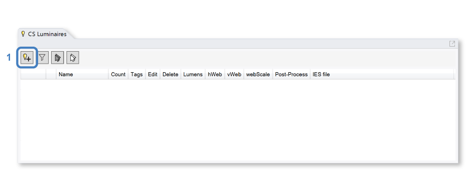
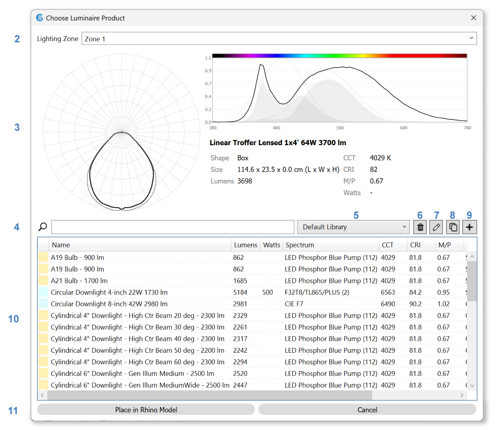
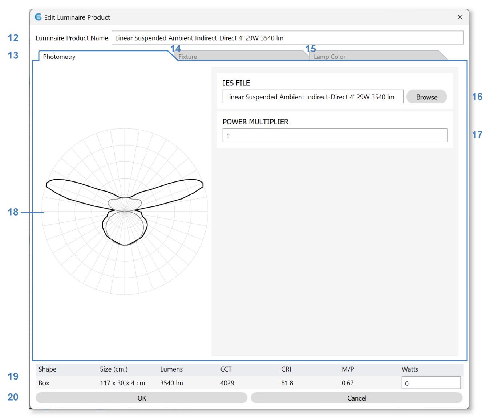
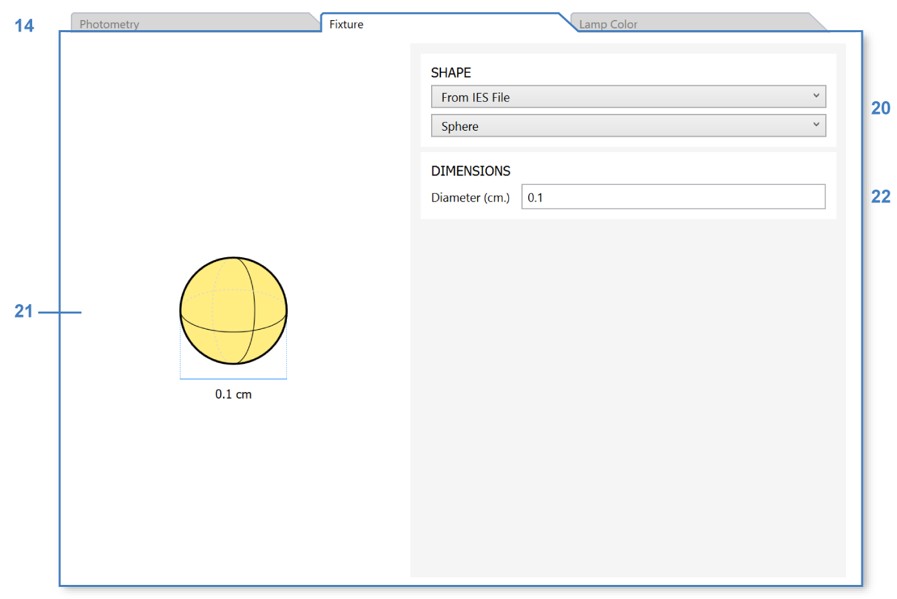
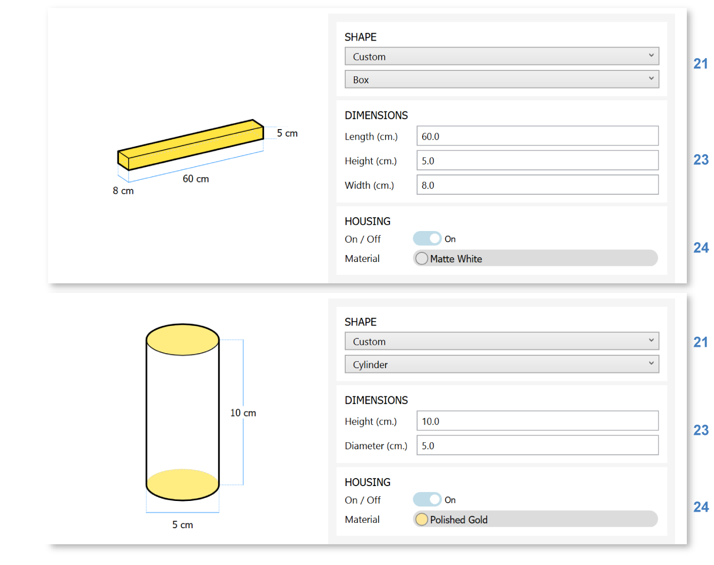
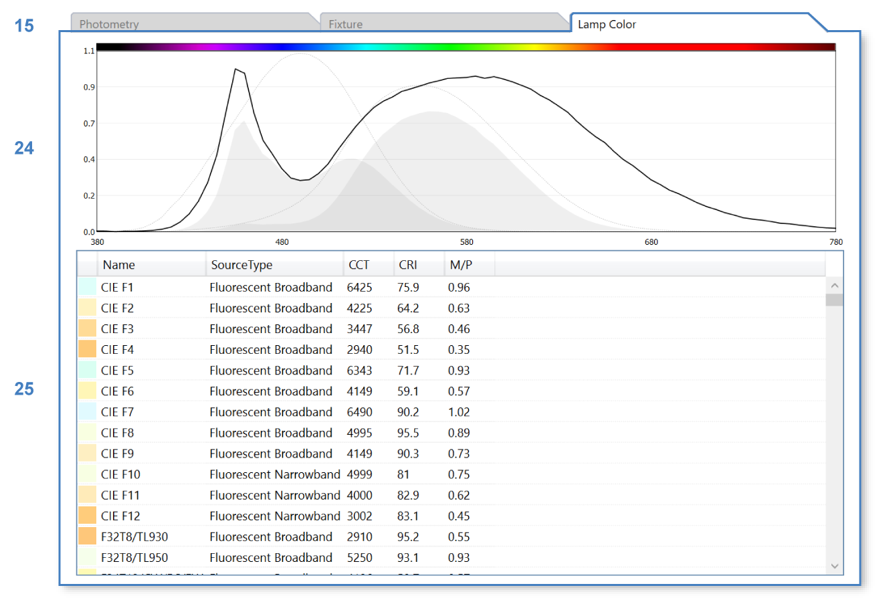
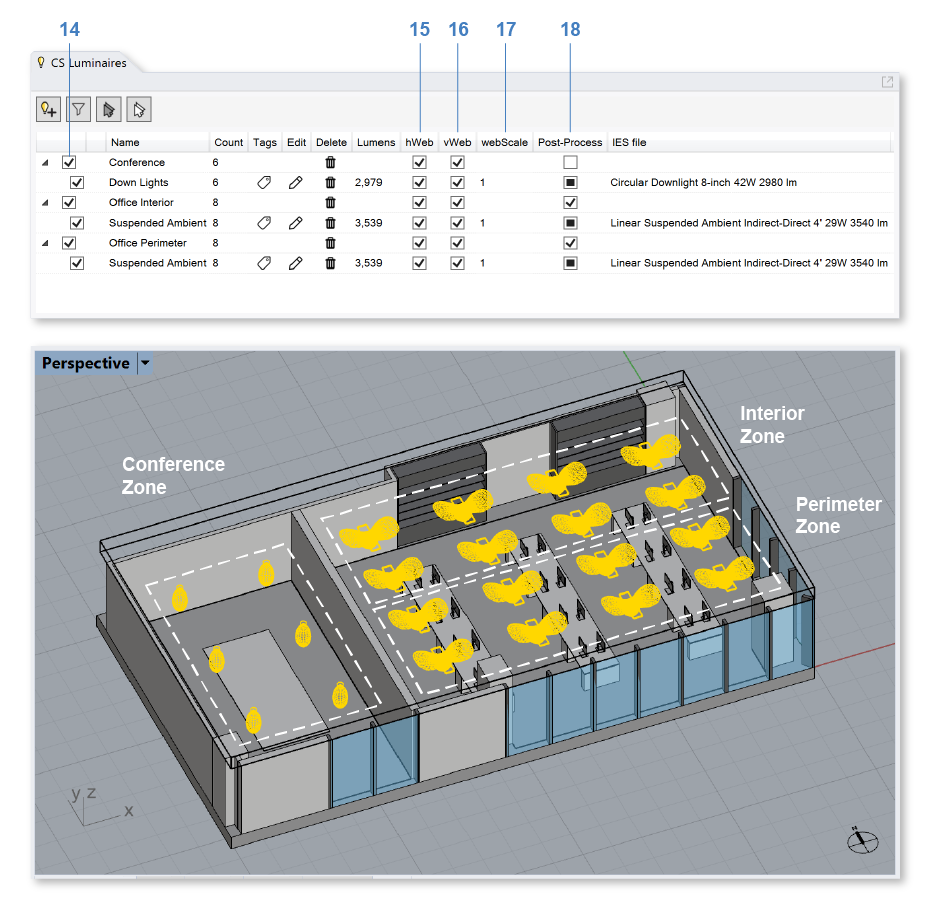

Luminaires
================================================
ClimateStudio supports lighting calculations for daylit and electrically lit scenes. The daylight source is defined in the `Sky panel`_. For electric-lighting-only simulations, the sky can simply be set to nighttime. 

.. _Sky panel: sky.html

The Luminaires panel is used to select real-world luminaire products and place them in the Rhino model, either individually or in groups. To place a luminaire, left-click on the *Add Luminaire* button (**1**).

   
A dialog will appear, allowing the user to browse through a series of Luminaire products in ClimateStudio's library. 

Lighting Zone
<<<<<<<<<<<<<<<<<<<<<<<<<<<<<<<

Luminaires can be assigned to a lighting zone (**7**). Lighting zones are collections of luminaires operated using the same control, 
such as an on/off or dimming switch. In ClimateStudio renderings, lighting zones are eligible for post-process brightness and color adjustment, as described `here`_. 

To assign a luminaire to a lighting zone, enter a zone name or choose an existing zone using the combo box. To create a new zone, simply type in a new lighting zone name. 
To make the zone eligible for post-process adjustments, check the Post-Process box (**30**) in the Luminaires Table (see last section).

.. _here: radianceRender.html#post-processing-of-lighting-zones

Choose a Luminaire Product
----------------------------------------------

The photometric web, color spectrum, and fixture information are displayed at the top (**3**). 

Type in keywords in the **search box (4)** to filter the **lumunaire products table (10)** and click on any product in the table to select it. 

Switch between default and user libraries with the **library dropdown (5)**. 

A selected product can be deleted (**6**), copied (**7**), or edited (**8**). Create a new luminaire product by clicking on the plus button (**9**). 

.. The luminous output is the total, spherically-integrated luminous flux emitted by the luminaire according to the IES file's photometric distribution. This quantity should not be confused with the product's rated lumen value, which may (or may not) be listed in the IES file header. The total flux accounts for interreflection losses within the fixture, and is a more reliable indicator of measured and simulated behavior than rated lumen values (when they exist).

.. The maximum intensity is the luminaire's peak candela value. Both this field and the total luminous output scale with the power multiplier.

Once luminaire selection is complete, click the *Place in Rhino Model* button (**11**), 
which places the luminaire in the Rhino model at a user-specified point.
To create additional copies of the luminaire, simply use the *copy* or *array* commands in Rhino. 
Copying luminaires creates multiple instances of the same object (using block instances), 
allowing the entire set of instances to be edited in concert. 

Edit or Create a Luminaire Product
----------------------------------------------------
The luminaire product editor dialog appears,  allowing the user to select an IES file as the **photometry (13)**, configure the light **fixture (14)**, and select the **lamp color (15)**. 

**Select a IES file (16)** in the **photometry (13)** tab to start creating a new luminaire product. 
This will populate the **product name (12)** with the ies file name and display the **photometric web (18)**, 
populate the **fixture (14)** with the shape and dimensions defined in the IES file, 
and the **lamp color (15)** tab with a default spectrum. 

An IES file is a manufacturer-supplied text file that provides the luminous intensity distribution of a lighting product on a spherical grid. 
This data is usually displayed three-dimensionally as a photometric web or in horizontal and vertical sections. 
The vertical section (**18**) is displayed with photometric section at 0° in gray and photometric section at 90° in black. 
Most lighting manufacturers provide IES files of their products on their websites. 
If you are experiencing difficulty locating an IES file for a specific product, try the `IES library`_. 

Change the **power multiplier** to scale the luminous output of the fixture. This may be useful for setting ballast loss factors, etc. 

Summary of the product are shown on the bottom (**18**). 

Change the fixture **shape (20)** by clicking on the dropdown and choose between a sphere, a box, or a cylinder fixture, 
the **dimensions (22)** of the fixture can be changed by typing in the text boxes. 

Change the **housing (23)** material of box and cylinder fixtures by selecting from the `materials dialog`_, or it can be turned off completely. 

.. _materials dialog: materials.html

Change the **lamp color (15)** by selecting a spectrum from the **spectrum table (25)**, check the **melanopic and photopic actions (24)** in the graph above the table. 

.. _IES library: https://ieslibrary.com/en/home

Luminaires Table
<<<<<<<<<<<<<<<<<<<<<<<<<<<<<<<

The Luminaires Table lists all luminaire objects in the model and controls their display in the viewport. The checkbox in the table's far left column (**26**), along with the visibility of the luminaire blocks in Rhino, 
determines whether a luminaire is included in renderings and point-in-time illuminance calculations. 
**Only luminaires that are visible and enabled at the moment a simulation starts are included in the analysis.**

The **hWeb (27)** and **vWeb (28)** toggles control the visibility of the 3d photometric web preview, while the **webScale (29)** column controls its size. 

The **Post-Process** check box (**30**) determines whether a lighting zone is eligible for post-render adjustments, as described `here`_. Please note that all luminaires in a post-processed lighting zone will emit the same (adjustable) color. 

.. _here: radianceRender.html#post-processing-of-lighting-zones

In the scene above, eight instances of an ambient suspended fixture have been assigned to the perimeter zone of the open office space, and another eight to its interior zone. Six instances of a down light, meanwhile, have been placed in the small meeting room. 

