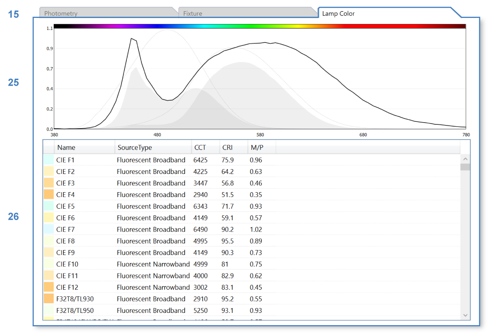

Luminaires
================================================
ClimateStudio supports lighting calculations for daylit and electrically lit scenes. The daylight source is defined in the `Sky panel`_. For electric-lighting-only simulations, the sky can simply be set to nighttime. 

.. _Sky panel: sky.html

The Luminaires panel is used to select real-world luminaire products and place them in the Rhino model, either individually or in groups. To place a luminaire, left-click on the *Add Luminaire* button (**1**).

.. figure:: images/subPanel_luminaires.png
   :width: 900px
   :align: center
   
|

A dialog will appear, allowing the user to browse through a series of Luminaire products in ClimateStudio's library. 

|

Set Lighting Zone
----------------------------------------------------

Luminaires can be assigned to a lighting zone using the dropdown (**2**) at the top of the dialog. Lighting zones are collections of luminaires operated using the same control, such as an on/off or dimming switch. In ClimateStudio renderings, lighting zones are eligible for post-process brightness and color adjustment, as described `here`_. 

To assign a luminaire to a lighting zone, use the dropdown to select an existing zone, or use the dropdown's "New..." item to create a new zone. To make the zone eligible for post-process adjustments, check the Post-Process box (**30**) in the *Luminaires Table* (see `last section`_).

.. _last section: luminaires.html#luminaires-table

.. _here: radianceRender.html#post-processing-of-lighting-zones

Choose Luminaire Product
----------------------------------------------

To choose a luminaire, select a row in the product table (**10**). To narrow your search, type keywords in the search box (**4**), or use the library filter (**5**) to isolate *Default* or *User*-defined products. User-defined products may be created using the New button (**9**), or by copying (**8**) an existing product and then using the Edit button (**7**). Only user-defined products may be deleted (**6**). 

The properties of the selected product, including its luminous power, photometric distribution, color spectrum, and fixture dimensions are displayed above the table (**3**). 

Once luminaire selection is complete, click the *Place in Rhino Model* button (**11**) to place an instance of the luminaire at a user-specified point. To create additional copies of the luminaire, simply use the *copy* or *array* commands in Rhino. Copying a luminaire creates multiple instances of the same object (using block instances), allowing the entire set of instances to be edited in concert. Each time you insert a luminaire using the *Place* button, a new block definition is created, which shows up as single row in the *Luminaires Table* (see `below`_).

.. _below: luminaires.html#luminaires-table

Edit or Create Luminaire Product
----------------------------------------------------
Editing or creating a luminaire (using buttons **7** or **9**) opens the luminaire product editor. This dialog lets you specify the product's photometry (**13**), fixture shape (**14**), and lamp color (**15**). 

|

Photometry
----------------------------------------------------
The product's luminous behavior is set by uploading an IES file (**16**). An IES file is a manufacturer-supplied text file that defines a product's luminous intensity distribution on a spherical grid. Most lighting manufacturers provide IES files on their web sites. If you are experiencing difficulty locating an IES file for a specific product, try the `IES library`_. ClimateStudio supports all IES file formats supported by Radiance.

.. _IES library: https://ieslibrary.com/en/home

Once an IES file is uploaded, the shape of its photometric distribution is drawn in vertical cross section (**18**). Its total luminous power is displayed in the *Lumens* field in table **19**. The total power is the spherically-integrated luminous flux emitted by the luminaire according to the IES file's distribution. This quantity should not be confused with the product's rated lumen value, which may (or may not) be listed in the IES file header. The total flux accounts for interreflection losses within the fixture, and is a more reliable indicator of measured and simulated behavior than the rated lumen value.

The luminous output may be scaled linearly using the power multiplier field (**17**), which is useful for setting ballast loss factors, etc. 

.. The maximum intensity is the luminaire's peak candela value. Both this field and the total luminous output scale with the power multiplier.

Fixture Shape
----------------------------------------------------
By default, ClimateStudio generates scene descriptions of product fixtures using the Radiance subprogram *ies2rad*. This program converts the IES file into a primitive shape that Radiance can understand, such as a box or cylinder. At times, the *ies2rad* output is not satisfactory, either because the shape is improperly defined in the IES file (e.g. a bulb with zero diameter), or because the program itself fails to produce the described dimensions (e.g. a tall direct-indirect pendant converted into a shape with zero height). In such cases, you may wish to redefine the fixture by selecting *Custom* from the shape dropdown (**21**), and/or editing its dimensions (**23**). Changing a luminaire's shape and/or dimensions will not alter its far-field photometry, but it will impact near-field effects, as well as the fixture's appearance and surface luminance under direct viewing (as in renderings).

|

In addition to editing the fixture's shape, you may specify an opaque housing material (**24**) for its non-luminous faces. Whether a face is luminous (shown with a yellow tint in the shape diagram (**22**)), and whether a fixture *has* non-luminous faces, depends on whether the IES file defines flux in the corresponding directions. One exception is the sides of cylinders. These are always non-luminous, as the underlying engine (Radiance 5.4) cannot compute correct photometry otherwise. 

|

Lamp Color
----------------------------------------------------
Most IES files do not include color information. In order to define a color, you must select a spectrum from the *Lamp Color* tab. Its color table (**26**) contains a diverse set of spectral power distributions (SPDs), including CIE standard illuminants as well as product SPDs measured by `Pacific Northwest National Laboratory`_ (PNNL). These spectra are meant to serve as archetypes loosely covering the gamut of extant lighting technologies, including LEDs of various color temperatures. As of ClimateStudio version 2.0, it is not possible to import custom spectra, though this feature is planned in future releases. Color spectra are converted to tristimulus (RGB) values for simulation in Radiance.

.. _Pacific Northwest National Laboratory: https://www.pnnl.gov/

|

Luminaires Table
----------------------------------------------------
Once a product is placed in the Rhino document, it will appear in the *Luminaires Table*, nested below its lighting zone. Each placement (via the *Add Luminaire* button (**1**)) creates in the active document a new luminaire block definition, which appears as a row in the table. Only luminaire blocks with visible instances appear in the table. The number of visible instances (there may be multiple if you have copied or arrayed them in Rhino) is listed in the *Count* column (**28**). You may edit a luminaire in-place, adjusting colors or swapping out the IES file entirely, using the *Edit* column (**29**) (see `editor`_ documentation above). Edits affect all instances of the selected luminaire block.

.. _editor: luminaires.html#edit-or-create-luminaire-product

.. figure:: images/subPanel_luminairesTable.png
   :width: 900px
   :align: center

|

The checkbox in the table's far left column (**27**), along with the visibility of the luminaire instances in Rhino, determine whether a luminaire is included in renderings and point-in-time illuminance calculations. **Only luminaires that are visible and enabled at the moment a simulation starts are included in the analysis.**

The hWeb (**31**) and vWeb (**32**) toggles control the visibility of the 3d photometric web preview in the Rhino viewport, while the webScale column (**33**) controls its size. 

The post-process check box (**34**) determines whether a lighting zone is eligible for post-render adjustments, as described `here`_. Please note that all luminaires in a post-processed lighting zone will emit the same (adjustable) color. 

.. _here: radianceRender.html#post-processing-of-lighting-zones

In the scene above, eight instances of an ambient suspended fixture have been assigned to the perimeter zone of the open office space, and another eight to its interior zone. Six instances of a downlight have been placed in the conference room. 

