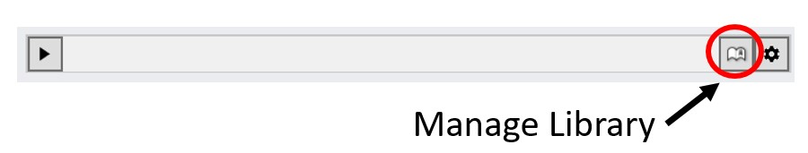
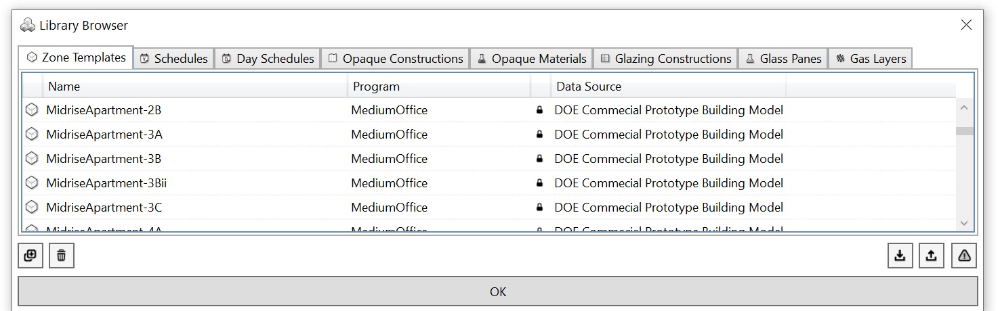

Manage Library
================================================

ClimateStudio comes with an extensive library of pre-defined zone descriptions called zone templates. When a user assigns a zone template to a particular thermal zone, all simulation settings for this zone are populated based on the template information from the library. It is important to note that if a user then changes any of the zone settings, the original template remains unchanged. 
To modify a zone template, the library can be accessed via the manage library button.

The library comes with a series of elements that make up a zone template including the actual templates, schedules, material definitions and construction assemblies. For example, 
an opaque element such as concrete is defined through its material properties including its specfic heat and thermal conductivity. A construction assembly for a wall is then defined
through a series of materials of different thickness that make up the wall.  

   
By default, all elements in the ClimateStudio library are locked. By selecting a given object and "creating a new librabry object" a copy of the object is added to the library which is  
unlocked (editable). The process works well if only a few objects are to be modified. If a large number of objects is to be added, the user may choose to export/import a library 
as a collection of comma seperated value (CSV) files. 
 

