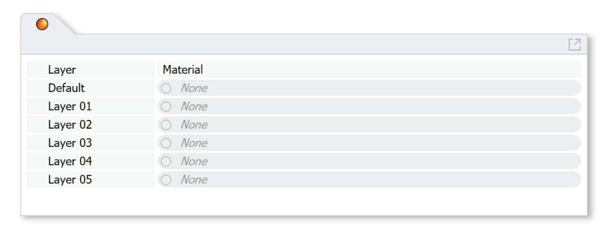
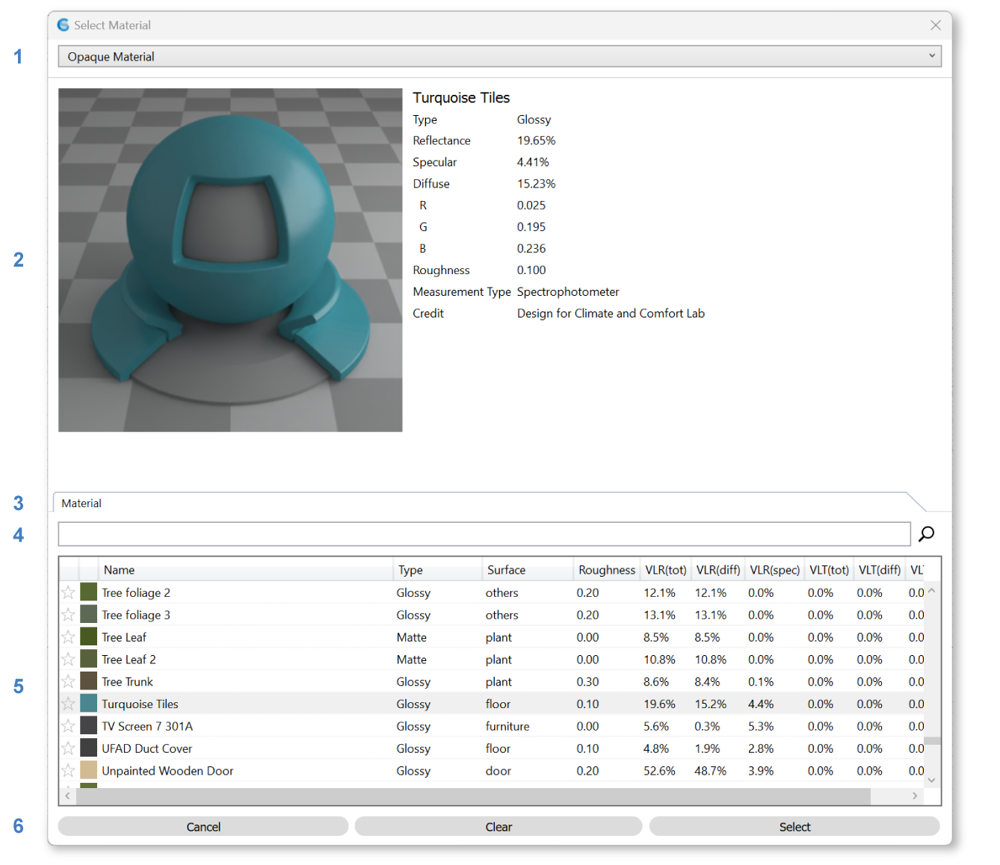

Materials
================================================
The Materials panel is used to assign materials for lighting simulation. Each object in a Rhino model is located on a layer. ClimateStudio uses these layers to assign material properties to scene objects. When setting up a model, objects with different material properties should be placed on different layers, with each layer given an appropriate material. Objects on layers without an assigned material are **ignored** by all lighting simulations. 

To assign a layer material, left-click on the material row next to the layer. A Select Material dialog will appear, letting you browse through ClimateStudio's extensive library of measured materials:

Material Browser
----------------------------------------------------

|
The library is divided into nine material categories: 

- Opaque
- `Exterior Glass (with optional Dynamic Blinds)`_
- `Exterior Glass (Electrochromic)`_
- `Exterior Glass (Translucent Insulating)`_
- `Interior Glass`_
- `Dynamic Leaf`_
- `Dynamic Snow`_
- `Scheduled Material`_
- `Custom Material`_

.. _Exterior Glass (with optional Dynamic Blinds): materials_exteriorGlass.html
.. _Exterior Glass Shades: materials_exteriorGlass.html#shades-control-point-in-time-workflows
.. _Exterior Glass (Electrochromic): materials_exteriorGlassDynamic.html
.. _Exterior Glass (Translucent Insulating): materials_exteriorGlassTranslucent.html
.. _Interior Glass: materials_interiorGlass.html
.. _Dynamic Leaf: materials_dynamicLeaf.html
.. _Dynamic Snow: materials_dynamicSnow.html
.. _Scheduled Material: materials_scheduledMaterial.html
.. _Custom Material: customRadianceMaterials.html

Use the **category dropdown (1)** to switch between categories. 

The **material preview panel (2)** shows the visual and physical characteristics of the selected material, as well as any relevant dynamic controls. 

Below this are the **tabs (3)**, which allow switching between different aspects of a material behavior, where applicable.  

The **search box (4)** allows filtering materials by name, while the (sortable) columns of the **table (5)** allow ordering items by material property. 

Once a selection is made, choose either **"Cancel"** to forgo changes, **"Clear"** to remove materials from all selected layers, or **"Select"** to apply the material to all selected layers **(6)**.   

Dynamic Materials
----------------------------------------------------

Some material categories, including `Exterior Glass`_, `Exterior Glass (Dynamic)`_, `Dynamic Leaf`_, `Dynamic Snow`_, and `Scheduled Material`_, contain materials or systems that change depending on the time of day or year. Exterior glass systems, for example, include (optional) shades that open or close in response to visual comfort conditions. Dynamic leaves, meanwhile, disappear or change color depending on season and latitude. Because these dynamic behaviors are tied to specific moments in time, and because ClimateStudio's lighting workflows have different relationships with time, it follows that the workflows handle dynamic materials differently. Specifically, the workflows divide into three groups:

.. _Exterior Glass: materials_exteriorGlass.html

- **Annual workflows** simulate the scene over an entire year. These workflows assume dynamic materials take on a different state at each hourly timestep, with states determined by a control schedule. Annual workflows include:

  - `Annual Glare`_

  - `Radiation Map`_

  - `Daylight Availability`_

    - LEED Option 1

    - BREEAM (4b)

    - EN 17037

    - Custom

- **Point-in-Time workflows** simulate the scene at one specific date and time (or, in the case of LEED Option 2, two specific dates and times). These workflows assume the same leaf, snow, and scheduled-material control schedules that the annual workflows do, plucking the state from the date/time in question. The exception is the exterior glazing materials, which require a **point-in-time** state to be set by the user. This distinction allows testing different shade positions or electrochromic tints under different sky conditions. (Note that LEED Option 2 overrides this setting, forcing blinds to be open and EC glazings to assume their clearest state.) Point-in-time workflows include:

  - `Point-in-time Illuminance`_

  - `Radiance Render`_
  
  - `Daylight Availability`_

    - LEED Option 2
  
- **Other workflows** include view and daylight-factor assessments, which are neither annual nor tied to a specific date or time. In these workflows, the visibility of leaves, snow, and scheduled materials is simply determined by the visibility of the Rhino layer, with leaves taking on their summer color. Shades are assumed to be open, and dynamic glass takes on its clearest tint.

  - `View Analysis`_ 

  - `Daylight Availability`_

    - BREEAM (4a and 4c)

    - Daylight Factor

.. _custom Radiance materials: customRadianceMaterials.html

.. _Sky: sky.html

.. _Site Analysis: siteAnalysis.html 

.. _Radiation Map: radiationMap.html 

.. _Point-in-time Illuminance: illuminance.html

.. _Daylight Availability: daylightAvailability.html 

.. _Annual Glare: annualGlare.html

.. _Radiance Render: radianceRender.html

.. _Thermal Analysis: thermalAnalysis.html

.. _View Analysis: viewAnalysis.html

.. _Exterior Glass Shades: materials_exteriorGlass.html#shades-control-point-in-time-workflows

.. _Exterior Glass (Dynamic) Tint: materials_exteriorGlassDynamic.html#tint-state-point-in-time-workflows

.. _Exterior Glass Shades (annual): materials_exteriorGlass.html#shades-control-annual-workflows

.. _Exterior Glass (Dynamic) Tint (annual): materials_exteriorGlassDynamic.html#tint-state-annual-workflows