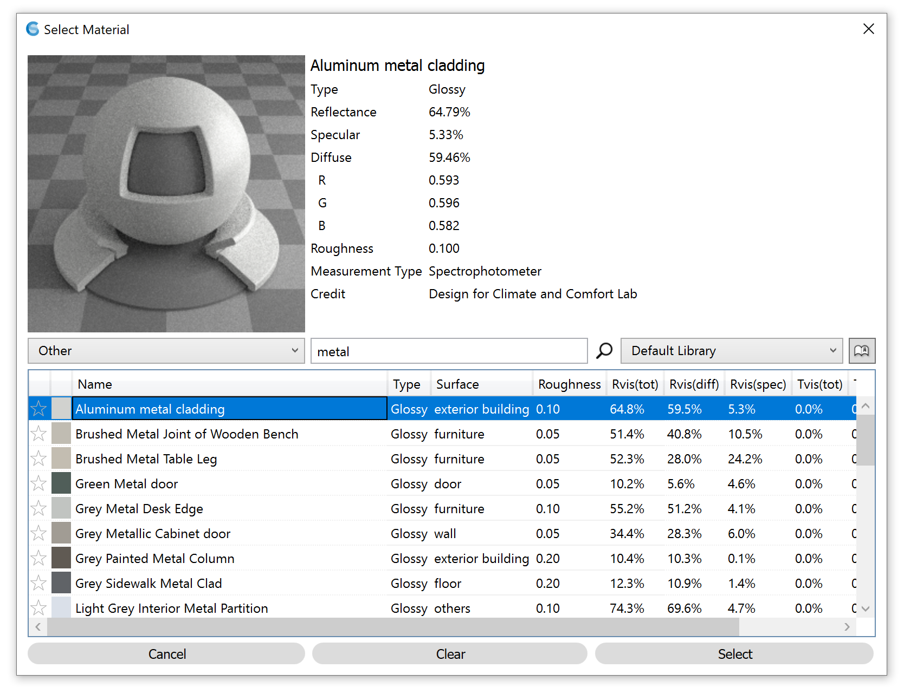
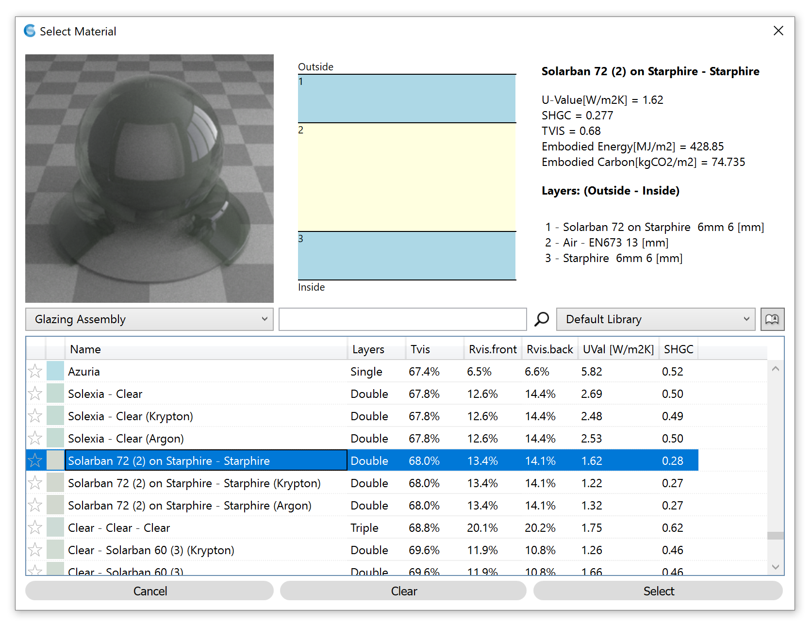

Materials
================================================
The Materials panel is used to assign materials for lighting simulation. Each object in a Rhino model is located on a layer. ClimateStudio uses these layers to assign material properties to scene objects. When setting up a model, objects with different material properties should be placed on different layers, with each layer given an appropriate material. Objects on layers without an assigned material are **ignored** by all lighting simulations. 

.. figure:: images/subPanel_materials.png
   :width: 900px
   :align: center

To assign a layer material, left-click on the material row next to the layer. An Edit Layer Material dialog will appear, letting you browse through ClimateStudio's extensive library of measured materials:

The library is divided into two categories: "Glazing Assembly" and "Other." Use the category dropdown and search box to filter your options. The columns in the table are sortable, which facilitates ordering items by material property. When an item is selected, the upper portion of the dialog shows a visualization of the selected material (left) along with its physical characteristics and source data (right). 

For glazing assemblies, which are sourced from the International Glazing Database (IGDB), the material includes a section diagram of the real-world assembly. Please note that in the 3D Rhino model, **window assemblies must be modeled as single surfaces**. They should not include multiple surfaces (panes), and they should not contain any solids.

Expert users may expand on the default library by adding links to their own `custom Radiance materials.`_ 

.. _custom Radiance materials.: customRadianceMaterials.html

