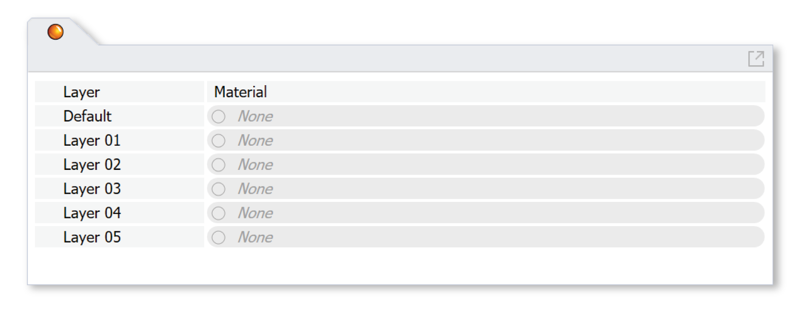

Materials
================================================
The Materials panel is used to assign materials for lighting simulation. Each object in a Rhino model is located on a layer. ClimateStudio uses these layers to assign material properties to scene objects. When setting up a model, objects with different material properties should be placed on different layers, with each layer given an appropriate material. Objects on layers without an assigned material are **ignored** by all lighting simulations. 

To assign a layer material, left-click on the material row next to the layer. A Select Material dialog will appear, letting you browse through ClimateStudio's extensive library of measured materials:

Material Browser
----------------------------------------------------

.. figure:: images/matBrowser.png
   :width: 900px
   :align: center

|
The library is divided into nine material categories: 

- Opaque Material
- `Exterior Glass (with Dynamic Shade (optional))`_
- `Exterior Glass (Electrochromic)`_
- `Exterior Glass (Translucent Insulating)`_
- `Interior Glass`_
- `Dynamic Leaf`_
- `Dynamic Snow`_
- `Scheduled Material`_
- `Custom Material`_

.. _Exterior Glass (with Dynamic Shade (optional)): materials_exteriorGlass.html
.. _Exterior Glass (with Dynamic Shade): materials_exteriorGlass.html
.. _Exterior Glass (Electrochromic): materials_exteriorGlassDynamic.html
.. _Exterior Glass (Translucent Insulating): materials_exteriorGlassTranslucent.html
.. _Interior Glass: materials_interiorGlass.html
.. _Dynamic Leaf: materials_dynamicLeaf.html
.. _Dynamic Snow: materials_dynamicSnow.html
.. _Scheduled Material: materials_scheduledMaterial.html
.. _Custom Material: customRadianceMaterials.html

Use the dropdown (**1**) to switch between categories. Click on a row in the table (**5**) to change the current selection. The table is searchable (**4**) and its columns are sortable. The visual and physical properties of the selected material, as well as any relevant dynamic characteristics, are displayed in the panel (**2**) above the table

Once you are happy with your selection, click the **Select** button to apply the material to all selected layers. The **Clear** button will *remove* materials from all selected layers. Click **Cancel** to forgo any changes. 

Dynamic Materials
----------------------------------------------------

Several material categories, including `Exterior Glass (with Dynamic Shade)`_, `Exterior Glass (Electrochromic)`_, `Dynamic Leaf`_, `Dynamic Snow`_, and `Scheduled Material`_, contain materials or systems that change depending on the time of day or year. Exterior glass systems, for example, include (optional) shades that open or close in response to visual comfort conditions. Dynamic leaves, meanwhile, disappear or change color depending on the season and latitude. 

When conducting annual simulations, ClimateStudio uses *multiversal ray tracing* to capture all of these dynamic conditions in a single run. Generally speaking, the engine computes the dynamic schedules automatically, but some of the systems permit customization (e.g. switching between manual and automated blinds controls). For point-in-time simulations such as renderings, states are either derived from the annual schedule or set by the user. For a detailed description of behavior and control options, follow the links for each type of dynamic material above.

.. _custom Radiance materials: customRadianceMaterials.html

.. _Sky: sky.html

.. _Site Analysis: siteAnalysis.html 

.. _Radiation Map: radiationMap.html 

.. _Point-in-time Illuminance: illuminance.html

.. _Daylight Availability: daylightAvailability.html 

.. _Annual Glare: annualGlare.html

.. _Radiance Render: radianceRender.html

.. _Thermal Analysis: thermalAnalysis.html

.. _View Analysis: viewAnalysis.html

.. _Exterior Glass Shades: materials_exteriorGlass.html#shades-control-point-in-time-workflows

.. _Exterior Glass (Dynamic) Tint: materials_exteriorGlassDynamic.html#tint-state-point-in-time-workflows

.. _Exterior Glass Shades (annual): materials_exteriorGlass.html#shades-control-annual-workflows

.. _Exterior Glass (Dynamic) Tint (annual): materials_exteriorGlassDynamic.html#tint-state-annual-workflows