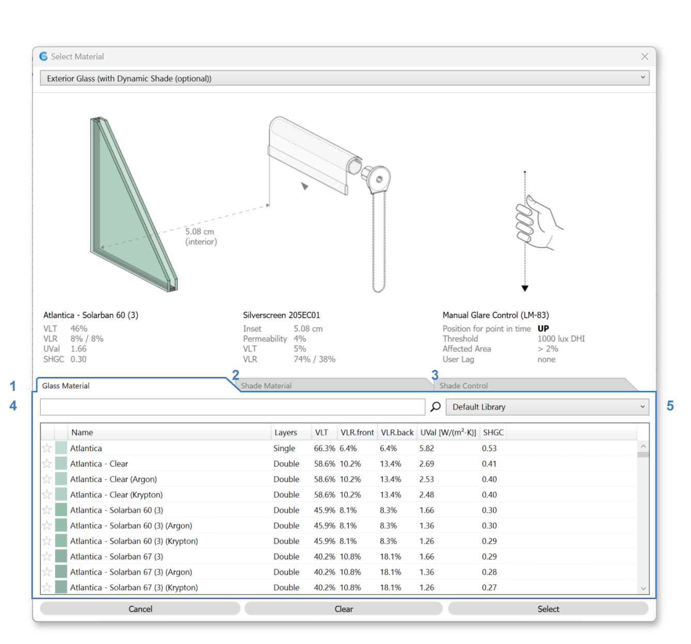
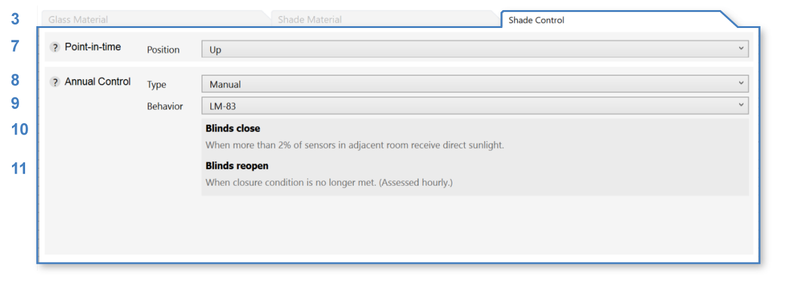
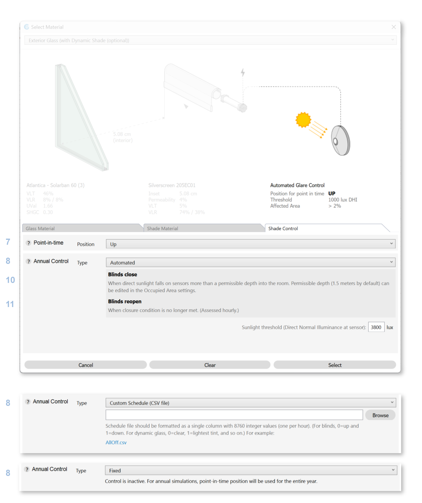
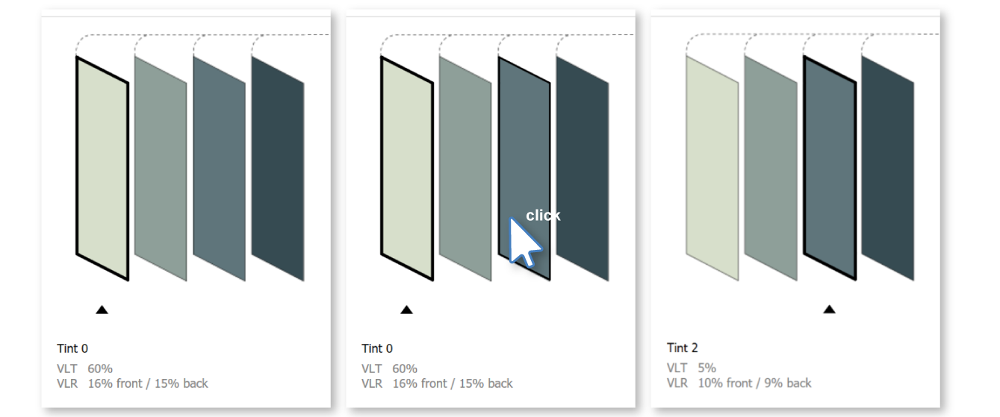

Materials
================================================
The Materials panel is used to assign materials for lighting simulation. Each object in a Rhino model is located on a layer. ClimateStudio uses these layers to assign material properties to scene objects. When setting up a model, objects with different material properties should be placed on different layers, with each layer given an appropriate material. Objects on layers without an assigned material are **ignored** by all lighting simulations. 

.. figure:: images/subPanel_materials.png
   :width: 900px
   :align: center

To assign a layer material, left-click on the material row next to the layer. An Edit Layer Material dialog will appear, letting you browse through ClimateStudio's extensive library of measured materials:

Material Browser
----------------------------------------------------

.. figure:: images/matBrowser.png
   :width: 900px
   :align: center

The library is divided into five categories: "Exterior Glass", "Exterior Glass (Dynamic)", "Exterior Glass (Translucent Insulating)", "Interior Glass", and "Other." Use the category dropdown (1) to switch between types of materials. 

Use library dropdown (2) to choose between different libraries or (for expert users) manage your `custom Radiance materials`_ libraries with the library button (3). 

The top section of this dialog shows visualization, diagrams, and properties (physical characteristics and source data) of the material selected (4). 

Below the preview section are the tabs (5) controlling what is displayed in the table below (7).  

Use the search box (6) to filter your options. The columns in the table (7) are sortable, which facilitates ordering items by material property. 

Once selection is complete, choose either to "Cancel" (will not apply change), "Clear" (removes all material from selected layers), or "Select" (applies selected material to all selected layers) (8) to close the dialog.   

Exterior Glass
----------------------------------------------------

For glazing assemblies, which are sourced from the International Glazing Database (IGDB), the material includes a section diagram of the real-world assembly, a diagram of the roller shade, and a diagram of the control of the roller shade. 

Please note that in the 3D Rhino model, **window assemblies must be modeled as single surfaces**. They should not include multiple surfaces (panes), and they should not contain any solids.

Exterior glazing consists of three components, use tabs to edit each component: 

| 9 -  Glazing Materials
| 10 -  Shade Materials
| 11 -  Shade Control

.. figure:: images/matBrowser_ex_shade.png
   :width: 900px
   :align: center

Click on a material in the table to select that material. 

**Shade Control** (11) dictates the behavior of shades throughout the year. This will affect all **annual simulations**. 

There are four Types for Shade Control (12): 

- Manual

  - Behavior (13)

    - Default  

    - LM83  
 
  - Blinds reopen (14)

    - The following morning 

    - Custom number of days  

- Automated  

- Custom Schedule (CSV File)  

- Fixed - current point-in-time state

Both Manual and Automated uses 2000 lux as sunlight threshold (15) for engaging the blinds by default. 

The state of the shade in **point-in-time simulations** is shown on the diagram. Click on the shade to change it's point-in-time state. 

.. figure:: images/matBrowser_ex_click.png
   :width: 600px
   :align: center

Exterior Glass (Dynamic)
----------------------------------------------------

Dynamic Exterior Glazing assemblies represent `SageGlass`_ electrochromic glass products. Each material has several "tint states" to control glare while maximizing daylight. 

Please note that in the 3D Rhino model, **window assemblies must be modeled as single surfaces**. They should not include multiple surfaces (panes), and they should not contain any solids.

.. figure:: images/matBrowser_dy.png
   :width: 900px
   :align: center

**Tint states** in **annual simulations** are usually controlled by a sensor (Automated) but this can be changed in the "Tint Control" tab. "Tint Control" has similar options as the "Shade Control" tab mentioned above (11).  

The state of the tint in **point-in-time simulations** is shown on the diagram with a black outline and arrow pointing to the selected tint. Click on another tint to change it's point-in-time state. 

Exterior Glass (Translucent Insulating)
----------------------------------------------------

Translucent Insulating Glazing assemblies represent `Kalwall`_ facade glazing unit products with both light diffusing and heat insulating properties. 

Please note that in the 3D Rhino model, **window assemblies must be modeled as single surfaces**. They should not include multiple surfaces (panes), and they should not contain any solids.

Choose from the table below to apply material. 

.. figure:: images/matBrowser_tr.png
   :width: 900px
   :align: center

Interior Glass
----------------------------------------------------

Interior glazing assemblies are also sourced from the International Glazing Database (IGDB). 

Please note that in the 3D Rhino model, **window assemblies must be modeled as single surfaces**. They should not include multiple surfaces (panes), and they should not contain any solids.

Choose from the table below to apply material. 

.. figure:: images/matBrowser_in.png
   :width: 900px
   :align: center

Dynamic Leaf
----------------------------------------------------

Dynamic Leaf materials are created from species specific measured data provided in `Simulating the Impact of Deciduous Trees on Energy, Daylight, and Visual Comfort`_. 

.. figure:: images/matBrowser_leaf.png
   :width: 900px
   :align: center
   
With the measured data for **leaf colors in summer and fall**, we interpolate by hue for a transition gradient between the two colors through the seasons. 

**Leaf Schedule** (17) is calculated based on project location's length of day (latitude) and determines when the leaves change color and size. 

The preview of a dynamic leaf material is a graph of leaf color throughout the year on the x-axis with leaf size from none to full size on the y-axis. Leaf mesh triangles are scaled based on leaf size to achieve gradual changes in density from leaf growth to leaf fall. 

If a point-in-time workflow is selected, the arrow on the x-axis shows the **point-in-time state** selected. This can be changed by selecting a different date in the `Sky`_ Sub-panel. 

This material's behavior varies slightly based on the workflow selected. See details below. 

This material's `behavior varies slightly based on the workflow selected`_. See details below. 

Dynamic Snow
----------------------------------------------------

Dynamic Snow material mimics the reflectivity of snow in winter. 

**Snow Schedule** is calculated based on project location's dry-bulb temperature. Snow will start to appear for consecutive days of below freezing and disappear for consecutive days of warmer temperature. 

The preview of a dynamic snow material is a graph of the snow throughout the year on the x-axis and fraction of snow coverage in the y-axis. Currently the fraction represent the alpha transparency of the snow material in each day of the year. 

If a point-in-time workflow is selected, the arrow on the x-axis shows the **point-in-time state** selected. This can be changed by selecting a different date in the `Sky`_ Sub-panel. 

This material's `behavior varies slightly based on the workflow selected`_. See details below. 

Scheduled Material
----------------------------------------------------

Scheduled material takes any non-dynamic material as input and changes it's behavior based on a hourly year-long schedule. 

The preview of a scheduled material is a hourly heat map of the material's schedule with every day of the year on the x-axis and every hour of the day on the y-axis. The color of the graph is based on the material's color and the transparency represents the presence / or lack there of based on the schedule. 

If a point-in-time workflow is selected, the arrow on the x-axis and the box highlighting the hour shows the **point-in-time state** selected. This can be changed by selecting a different date and time in the `Sky`_ Sub-panel. 

Select any material from the "Material" tab by clicking on the materials table. 

To change the schedule and the transparency fraction behavior, use the "Dynamic Behavior" tab: 

  | 19 - Three options are provided for controlling the **Transparency Type**: 

    - **Alpha Transparency** uses the fraction as alpha transparency of the material, where 0 is transparent and 1 is opaque. 

    - **BinaryOnOff** rounds the fraction to 0 or 1 and shows the material only on 1. 

    - **MeshFaceScaling** renders the material as is while using the fraction to scale all mesh faces around their first vertex to achieve the global transparent effect. 0 means no mesh faces (scaled by 0 to nonexistent) and 1 means full (original) sized mesh faces. 

  | 20 - Click on the **Schedule button** to change schedules in the `schedule editor`_. 

This material's `behavior varies slightly based on the workflow selected`_. See details below. 

Dynamic Material Behavior Based on Workflow
----------------------------------------------------

Dynamic Materials like Leaf, Snow, and Scheduled Material's behavior differs slightly depending on the workflow. 

There are three types of workflows: 

- **Point-In-Time workflows**

  - Point-in-time illuminance

  - Radiance Rendering

- **Annual workflows**

  - Annual glare

  - Radiation map

  - Daylight availability

    - all LEED (v4.1 Option 1, v4.0 Option 1, v4 Option 2)

    - BREEAM UK 4.b

    - BREEAM International 4b

    - EN 17037

    - Custom

- **Other workflows**

  - View analysis

  - Daylight availability

    - BREEAM UK 4.a, 4.c (Healthcare only)

    - BREEAM International 4.a

    - Daylight Factor

For **Point-In-Time workflows**, material will behave based on the current schedule and the specific date and or time selected in the `Sky`_ Sub-panel. 

For **Annual workflows**, material will behave based on the schedule and simulation timestep. 

For **Other workflows**, material state is set only by layer visibility. The schedule is completely ignored. 

.. _custom Radiance materials: customRadianceMaterials.html

.. _SageGlass: https://www.sageglass.com/

.. _Kalwall: https://www.kalwall.com/

.. _Simulating the Impact of Deciduous Trees on Energy, Daylight, and Visual Comfort: https://publications.ibpsa.org/proceedings/esim/2022/papers/esim2022_251.pdf

.. _Sky: sky.html

.. _schedule editor: scheduleEditor.html

.. _behavior varies slightly based on the workflow selected: materials.html#dynamic-material-behavior-based-on-workflow