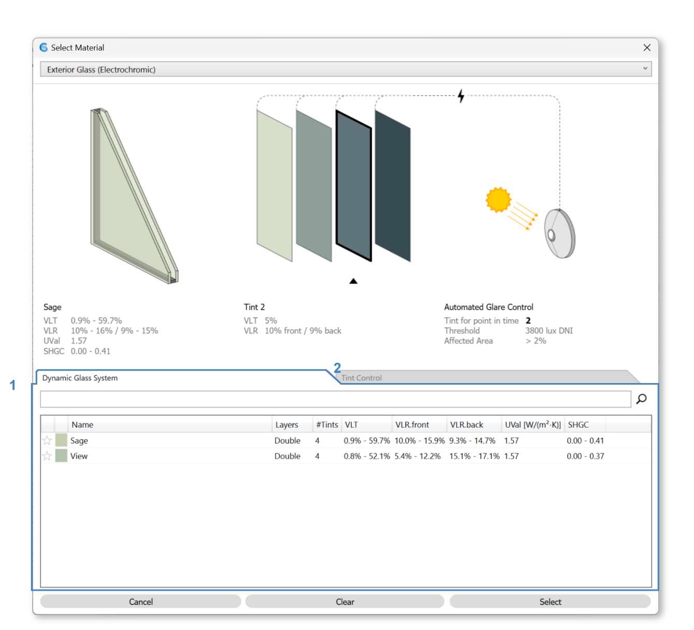

Materials
================================================
The Materials panel is used to assign materials for lighting simulation. Each object in a Rhino model is located on a layer. ClimateStudio uses these layers to assign material properties to scene objects. When setting up a model, objects with different material properties should be placed on different layers, with each layer given an appropriate material. Objects on layers without an assigned material are **ignored** by all lighting simulations. 

.. figure:: images/subPanel_materials.png
   :width: 900px
   :align: center

To assign a layer material, left-click on the material row next to the layer. An Edit Layer Material dialog will appear, letting you browse through ClimateStudio's extensive library of measured materials:

Material Browser
----------------------------------------------------

.. figure:: images/matBrowser.png
   :width: 900px
   :align: center

The library is divided into five categories: "Exterior Glass", "Exterior Glass (Dynamic)", "Exterior Glass (Translucent Insulating)", "Interior Glass", and "Other." Use the category dropdown (1) to switch between types of materials. 

Use library dropdown (2) to choose between different libraries or (for expert users) manage your `custom Radiance materials`_ libraries with the library button (3). 

The top section of this dialog shows visualization, diagrams, and properties (physical characteristics and source data) of the material selected (4). 

Below the preview section are the tabs (5) controlling what is displayed in the table below (7).  

Use the search box (6) to filter your options. The columns in the table (7) are sortable, which facilitates ordering items by material property. 

Once selection is complete, choose either to "Cancel" (will not apply change), "Clear" (removes all material from selected layers), or "Select" (applies selected material to all selected layers) (8) to close the dialog.   

Exterior Glass
----------------------------------------------------

For glazing assemblies, which are sourced from the International Glazing Database (IGDB), the material includes a section diagram of the real-world assembly, a diagram of the roller shade, and a diagram of the control of the roller shade. 

Please note that in the 3D Rhino model, **window assemblies must be modeled as single surfaces**. They should not include multiple surfaces (panes), and they should not contain any solids.

.. figure:: images/matBrowser_ex_glass.png
   :width: 900px
   :align: center

Exterior glazing consists of three components, use tabs to edit each component: 

| 9 -  Glazing Materials
| 10 -  Shade Materials
| 11 -  Shade Control

.. figure:: images/matBrowser_ex_shade.png
   :width: 900px
   :align: center

Click on a material in the table to select that material. 

.. figure:: images/matBrowser_ex_Control.png
   :width: 900px
   :align: center

**Shade Control** dictates the behavior of shades throughout the year. This will affect all **annual simulations**. 

There are four Types for Shade Control (12): 

- Manual

  - Behavior (13)

    - Default  

    - LM83  
 
  - Blinds reopen (14)

    - The following morning 

    - Custom number of days  

- Automated  

- Custom Schedule (CSV File)  

- Fixed - current point-in-time state

.. figure:: images/matBrowser_ex_auto.png
   :width: 900px
   :align: center

Both Manual and Automated uses 2000 lux as sunlight threshold (15) for engaging the blinds by default. 

The state of the shade in **point-in-time simulations** is shown on the diagram. Click on the shade to change it's point-in-time state. 

.. figure:: images/matBrowser_ex_click.png
   :width: 600px
   :align: center

Exterior Glass (Dynamic)
----------------------------------------------------

Dynamic Exterior Glazing assemblies represent `SageGlass`_ electrochromic glass products. Each material has several "tint states" to control glare while maximizing daylight. 

Please note that in the 3D Rhino model, **window assemblies must be modeled as single surfaces**. They should not include multiple surfaces (panes), and they should not contain any solids.

**Tint states** in **annual simulations** are usually controlled by a sensor (Automated) but this can be changed in the "Tint Control" tab. "Tint Control" has of similar options as the "Shade Control" tab above (11).  

The state of the tint in **point-in-time simulations** is shown on the diagram with a black outline and arrow pointing to the selected tint. Click on another tint to change it's point-in-time state. 

.. figure:: images/matBrowser_dy_click.png
   :width: 600px
   :align: center

Exterior Glass (Translucent Insulating)
----------------------------------------------------

Translucent Insulating Glazing assemblies represent `Kalwall`_ facade glazing unit products with both light diffusing and heat insulating properties. 

Please note that in the 3D Rhino model, **window assemblies must be modeled as single surfaces**. They should not include multiple surfaces (panes), and they should not contain any solids.

Choose from the table below to apply material. 

.. figure:: images/matBrowser_tr.png
   :width: 900px
   :align: center

Interior Glass
----------------------------------------------------

Interior glazing assemblies are also sourced from the International Glazing Database (IGDB). 

Please note that in the 3D Rhino model, **window assemblies must be modeled as single surfaces**. They should not include multiple surfaces (panes), and they should not contain any solids.

Choose from the table below to apply material. 

.. figure:: images/matBrowser_in.png
   :width: 900px
   :align: center

.. _custom Radiance materials: customRadianceMaterials.html

.. _SageGlass: https://www.sageglass.com/

.. _Kalwall: https://www.kalwall.com/