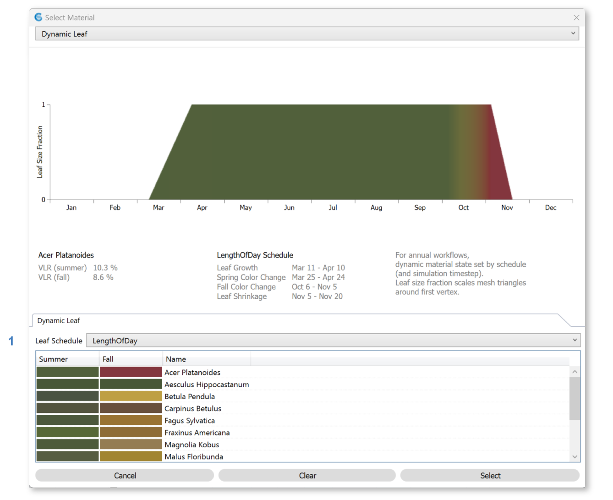

Dynamic Leaf
================================================

Dynamic leaf materials are species-specific foliage materials that change throughout the year. Their data are sourced from measurements provided by `"Simulating the Impact of Deciduous Trees on Energy, Daylight, and Visual Comfort," Pan and Jakubiec (2022)`_. To select a species, click a row in the table at the bottom of the dialog:

   
|

**Annual Simulations**

During annual simulations (`Annual Glare`_, `Radiation Maps`_, and *LEED Option 1* / *Custom* / *EN 17037* / *BREEAM 4b* `Daylight Availability`_ runs), a **leaf schedule** is calculated using the `project location`_'s latitude. The schedule determines how leaves change size and color throughout the year. 

The schedule is plotted at the top of the dialog, with the day of year on the x-axis and leaf size on the y-axis (0 indicating no leaf, and 1 indicating a leaf at full size). Intermediate sizes are achieved by scaling each leaf face about its first vertex, to represent partial states of growth or fall. The leaf color on each day is rendered in the area under the curve. Note that the autumn color gradient is achieved by interpolation between measured summer and fall colors. The interpolated hues may or may not correspond to the species' actual color sequence.

As of ClimateStudio v2.0, schedules for the Dynamic Leaf material cannot be customized. However, you can use an *Opaque Material* to model evergreen behavior, or a `Scheduled Material`_ to model changes in size based on a custom schedule.

**Point-in-time Simulations**

In `Renderings`_ and `Point-in-Time Illuminance`_ simulations, the state of the leaves is derived from the annual schedule above. When these workflows are active, an arrow on the plot's x-axis indicates the current day. To change the date, use the `Sky`_ panel. 

*LEED Option 2* daylight simulations also derive leaf states from the annual schedule, based on the states at the Spring and Autumnal equinoxes. In `View`_, *Daylight Factor*, and *BREEAM 4a/c* daylight simulations, the leaves assume their summer color and largest size.

 
.. _Annual Glare: annualGlare.html
.. _Daylight Availability: daylightAvailability.html
.. _Radiation Maps: radiationMap.html
.. _View: viewAnalysis.html
.. _Renderings: radianceRender.html
.. _Point-in-Time Illuminance: illuminance.html
.. _Scheduled Material: materials_scheduledMaterial.html

.. _"Simulating the Impact of Deciduous Trees on Energy, Daylight, and Visual Comfort," Pan and Jakubiec (2022): https://publications.ibpsa.org/proceedings/esim/2022/papers/esim2022_251.pdf

|
Back to `Materials`_

.. _Materials: materials.html

.. _point-in-time workflow: materials.html#dynamic-materials

.. _Annual workflows: materials.html#dynamic-materials

.. _project location: location.html

.. _Sky: sky.html
