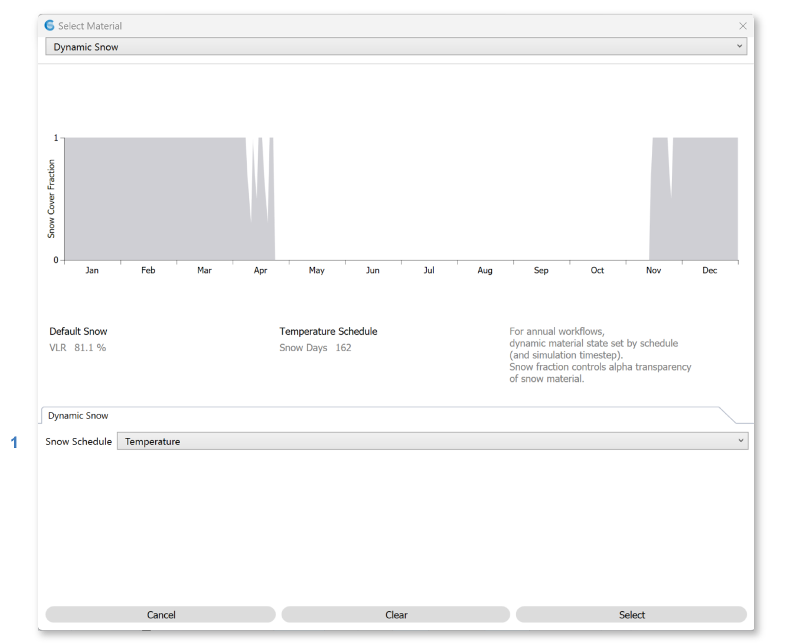

Dynamic Snow
================================================

Dynamic snow materials mimic the reflectivity of snow in winter. 

   
|
**Annual Simulations**

During annual simulations (`Annual Glare`_, `Radiation Maps`_, and *LEED Option 1* / *Custom* / *EN 17037* / *BREEAM 4b* `Daylight Availability`_ runs), surfaces assigned a dynamic snow material will appear or disappear according to a **snow schedule**. The schedule is calculated based on the `project location`_'s weather file. The algorithm uses Dry Bulb Temperature (DBT) -- with snow beginning to accumulate on consecutive days with below-freezing temperatures, and beginning melt on consecutive days with above-freezing temperatures. Precipitation data are not currently considered.

The schedule is plotted at the top of the dialog, with the day of year on the x-axis and snow coverage on the y-axis. Coverage fractions between 0 and 1 are interpreted using the material's alpha channel (with 0 being fully transparent, at 1 fully opaque).

As of ClimateStudio v2.0, schedules for the Dynamic Snow material cannot be customized. However, you can use an *Opaque Material* to model snow that  is always present, or a `Scheduled Material`_ to implement a custom schedule.

**Point-in-time Simulations**

In `Renderings`_ and `Point-in-Time Illuminance`_ simulations, the snow condition is derived from the annual schedule above. When these workflows are active, an arrow on the plot's x-axis indicates the current day. To change the date, use the `Sky`_ panel.

*LEED Option 2* daylight simulations also derive snow conditions from the annual schedule, based on the conditions at Spring and Autumnal equinoxes. In `View`_, *Daylight Factor*, and *BREEAM 4a/c* daylight simulations, the snow is assumed to be visible if the Rhino layer is on.

**A Note on Geometry**

Because Rhino layers assigned a dynamic snow material will fully disappear in summer, it is important that snow be modeled using a different set of surfaces from those the snow falls on, such as the ground or a roof. Practically speaking, this means offsetting the ground or roof surface a few inches, or however deep you expect the snow to be, and placing the offset surface on the snow layer. Snow surfaces should NOT be perfectly coincident with the surfaces the snow falls on, as this will create ambiguity in the ray trace regarding what is visible.

Back to `Materials`_

.. _Materials: materials.html

.. _Sky: sky.html

.. _material: materials.html

.. _project location: location.html

.. _View: viewAnalysis.html
.. _Annual Glare: annualGlare.html
.. _Daylight Availability: daylightAvailability.html
.. _Radiation Maps: radiationMap.html
.. _Renderings: radianceRender.html
.. _Point-in-Time Illuminance: illuminance.html
.. _Scheduled Material: materials_scheduledMaterial.html