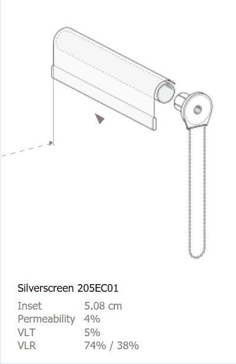

Exterior Glass (with Dynamic Shade (optional))
================================================

Exterior glass systems are glazing units with (optional) operable shades. 

Please note that in the 3D Rhino model, **glazing systems must be modeled as single surfaces**. They should not include multiple surfaces (e.g. multiple glass panes), and they should not contain any solids. The single surface is typically placed at the outside face of glass. When a shade is specified, ClimateStudio generates a shading surface automatically -- inset from the glass. This applies to all surfaces on the Rhino layer. The three components of the system may be edited using the corresponding tabs (**1-3** below).

| **1 -  Glass Material**
| **2 -  Shade Material** (optional)
| **3 -  Shade Control**  (optional)

.. figure:: images/matBrowser_ex_glass.png
   :width: 900px
   :align: center

|
Glass Material
----------------------------------------------------
Glass materials (typically IGUs) are sourced from Lawrence Berkeley National Laboratory's (LBNL's) `International Glazing Database`_ (IGDB). ClimateStudio's default library contains a collection of hundreds of units, spanning a range of performance characteristics. Click on a row in the glazing table to change the current selection. You can sort the table by clicking on column headers, or narrow your search by typing keywords in the search box (**4**). If you have created custom glass materials (see `here`_), you may access them via the library dropdown (**5**). 

.. _International Glazing Database: https://windows.lbl.gov/igdb-downloads
.. _here: customRadianceMaterials.html  

Shade Material
----------------------------------------------------
Shading systems and their operation are simulated by the `Daylight Availability`_ and `Annual Glare`_ workflows when calculating hourly (il)luminance distributions. In many cases, the inclusion of dynamic shading is not optional. Per ANSI/IES LM-83, **the calculation of Spatial Daylight Autonomy (sDA) and eligibility for the LEED v4 Daylight credit (Option 1) require dynamic shading to be modeled on all exterior windows**. 

ClimateStudio's material library includes a collection of over one hundred measured fabric shades, sourced from LBNL's `Complex Glazing Database`_ (CGDB). To select a material, navigate to the *Shade Material* tab (**2**) and select a product from the table. Each product is accompanied by a *glare control classification* according the European Standard EN 14501, which characterizes the product's ability to attenuate sunlight and protect against glare. Custom shades with measured or simulated BSDF xml data may be imported via the *Add XML file* button. Windows without shades (e.g. storefront glazing) may be modeled by selecting the *No Shade* option.

.. _Complex Glazing Database: https://windows.lbl.gov/cgdb-downloads

.. figure:: images/matBrowser_ex_shade.png
   :width: 900px
   :align: center

|

When simulating a glazing system, ClimateStudio automatically generates a separate surface representing the shade, inset from the glass by a default distance of two inches. To change this distance, type a different value into the inset field (**6**). A negative inset will *offset* the shade in the direction of the glazing surface normal (i.e., toward the exterior if your window normals are facing out).

If you wish to model a shade on its own, without an associated glazing unit, you may select the *No Glass* option from the `Glass Material tab`_'s library dropdown (**5**). This may be useful if the shade and glass have different geometries, as when a shade spans multiple panes of glass separated by mullions. In this case, you'll want to place the shading and glazing surfaces on different Rhino layers, with the shades assigned a glass-less material and the glass assigned a shade-less material. Note that you may want to use a shade inset of zero in this case, so the shades appear exactly where you modeled them.
   
.. _Glass Material tab: materials_exteriorGlass.html#glass-material

Shade Control
----------------------------------------------------
The shade control tab (**3**) provides options for controlling the shade's position during point-in-time and annual simulations. As of ClimateStudio v2.0, shades cannot be partially drawn. They must be either fully open or fully closed.

.. figure:: images/matBrowser_ex_Control.png
   :width: 900px
   :align: center

|
**Point-In-Time Position**

To set the shades's position in `Renderings`_ and `Point-in-Time Illuminance`_ simulations, use the point-in-time position dropdown (**7**) or click directly on the shade in the interactive diagram above the tab: 

.. _Renderings: radianceRender.html
.. _Point-in-Time Illuminance: illuminance.html

|
**Annual Control**

In `Annual Glare`_  and `Daylight Availability`_ simulations (*LEED Option 1*, *BREEAM 4b*, *EN 17037*, *Custom*), the shade's position changes from timestep to timestep. For these workflows, you may choose between four types of control logic (**8**):

.. _Annual Glare: annualGlare.html
.. _Daylight Availability: daylightAvailability.html

- **Fixed** control sets the shade to a fixed position for all hours of the year. The position is assumed to be the point-in-time position, which is set using the position dropdown (**7**) or interactive diagram (see above).

- **Automated** control mimics the behavior of motorized blinds driven by sunlight sensors. Its logic matches that of the *Semi-Active User* model below, except without a latency period. I.e., blinds are reopened immediately once the trigger condition is no longer met.

- **Manual** control mimics the behavior of shades operated by building occupants. ClimateStudio offers two types of manual control, which can be set using the *Behavior Model* dropdown (**9**):

    - **LM-83** follows the strictures of blind operation according to the IES-NA LM-83 standard. Specifically, blinds close when more than 2% of sensors in a room receive direct sunlight (defined as direct horizontal illuminance in excess of 1000 lux). Blinds reopen immediately once the condition is no longer met. Note that ClimateStudio's engine knows which blinds groups are responsible for transmitting sunlight to a sensor, and closes only responsible groups until the 2% criterion is met. 

    - **Semi-Active User** differs from LM-83 in three important respects. First, the trigger is direct *normal* (rather than *horizontal*) illuminance, with an editable threshold defaulting to 2000 lux. Second, triggering sensors are limited to portions of the workplane beyond a *permissible depth* into a room.  The default value of 5 feet allows a swath of permissible sun penetration along facade-facing room edges. Any sunlit sensor *not* in this swath will cause the responsible blinds group to close. Finally, unlike the LM-83 model, the default control assumes a *latency period* before the blinds reopen (**11**). The default reopening occurs the following morning, but the user may specify a longer period of days or weeks.
 
- **Custom Schedule (CSV File)** allows specification of a custom blinds schedule via a comma-separated value file. The format is a single column of 8760 hourly values with no header. The values indicate the position of the shade at each hour, with 0 for open and 1 for closed.

Note that in *LEED Option 2*, *Daylight Factor*, and *BREEAM 4a/c* simulations, the shades are always assumed to be open.

**Window Grouping**

When *automated* or *manual* control is selected, the annual simulation engine organizes window surfaces in the Rhino layer into *window groups*. A window group is a collection of windows whose shades operate according to the same schedule. The grouping algorithm is straightforward, with window surfaces binned by surface normal (every 22.5 degrees) and nearest occupied area. This means that, for a given room, windows facing the same direction will operate as a single group. If you want further subdivision (as between vision and clerestory windows), you should place the surfaces on separate Rhino layers. Windows that have no impact on the insolation of shading sensors for a given simulation are left out of the window groups entirely.

|
Back to `Materials`_.

.. _annual workflows: materials.html#dynamic-materials

.. _point-in-time workflows: materials.html#dynamic-materials

.. _Materials: materials.html

.. _Daylight Availability: daylightAvailability.html

.. _Annual Glare: annualGlare.html

.. _occupied area's property panel: occupiedAreas.html

.. _above: materials_exteriorGlass.html#shade-control-point-in-time-workflows