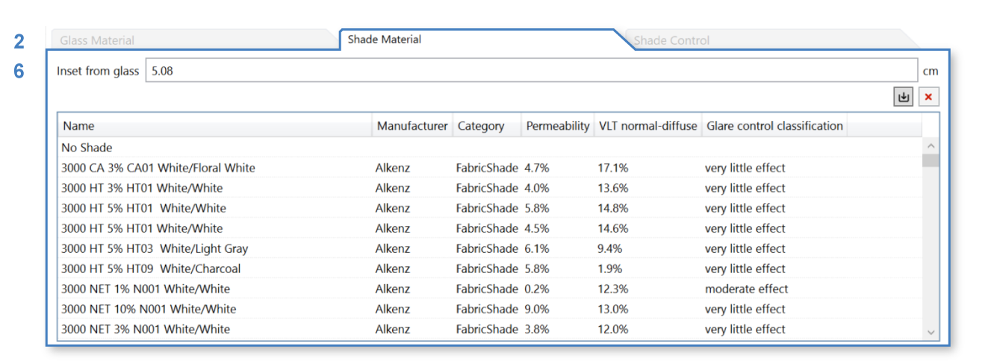

Exterior Glass
================================================

Glazing assemblies are sourced from the International Glazing Database (IGDB), the `material`_ includes a section diagram of the real-world assembly, a diagram of the roller shade, and a diagram of the control of the roller shade. 

Please note that in the 3D Rhino model, **window assemblies must be modeled as single surfaces**. They should not include multiple surfaces (panes), and they should not contain any solids.

.. figure:: images/matBrowser_ex_glass.png
   :width: 900px
   :align: center

Exterior glazing consists of three components, use tabs to edit each component: 

| **1 -  Glazing Materials**
| **2 -  Shade Materials**
| **3 -  Shade Control**

Click on a material in the table to select glass material. 

Shades Material
----------------------------------------------------
Shading systems and their operation are simulated by the `Daylight Availability`_ workflow when calculating hourly illuminance distributions. In many cases, the inclusion of dynamic shading is not optional. The calculation of Spatial Daylight Autonomy (sDA) and eligibility for the LEED v4 Daylight credit (Option 1) require dynamic shading to be modeled on all exterior windows. 

This shade system will be applied to all surfaces in the Rhino layer this exterior glazing assembly is applied to. 

Click on **Shade Materials tab (2)**  to open shade materials table. 

Click on a material in the table to select that material. 

Shades Control (Annual Workflows)
----------------------------------------------------
**Shade Control tab (3)** controls the behavior of shades throughout the year. This will affect all `annual workflows`_. 

.. figure:: images/matBrowser_ex_Control.png
   :width: 900px
   :align: center

There are four **Types of Shade Controls (4)**: 

- Manual

  - **Behavior (5)**

    - Default

    - LM83  
 
  - **Blinds reopen (6)**

    - The following morning 

    - Custom number of days  

- Automated  

- Custom Schedule (CSV File)  (comma separated value) file with 8760 values for every hour of the year. The file format is single column. The dynamic shading state is 0 for wide open and an integer depending on the number of shading states supported, i.e. 1 for blinds drawn or 1, 2 and 3 for dynamic glass with one clear and three tint states.

- Fixed - current point-in-time state - will affect `other workflows`_

.. figure:: images/matBrowser_ex_auto.png
   :width: 900px
   :align: center

Both Manual and Automated uses 2000 lux as **sunlight threshold (7)** for engaging the blinds by default. 

Shades Control (Point-In-Time Workflows)
----------------------------------------------------

The state of the shade in `point-in-time workflows`_ is shown on the diagram. 

Click on the shade to change it's point-in-time state. 

.. _other workflows: materials.html#dynamic-material-behavior-based-on-workflow

.. _annual workflows: materials.html#dynamic-material-behavior-based-on-workflow

.. _point-in-time workflows: materials.html#dynamic-material-behavior-based-on-workflow

.. _material: materials.html

.. _Daylight Availability: daylightAvailability.html
