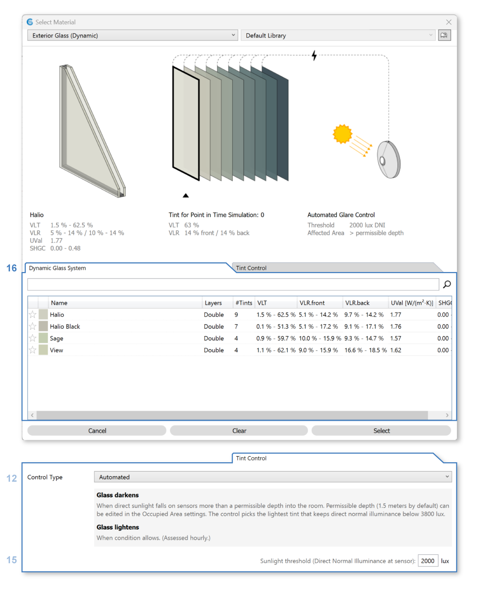
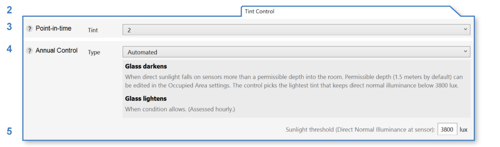
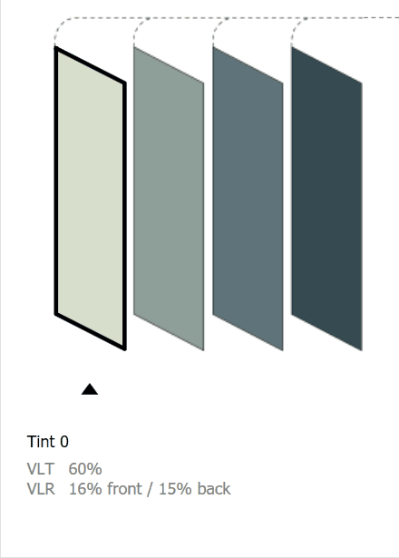

Exterior Glass (Electrochromic)
================================================

Electrochromic (EC) glass systems are switchable glazing products that change tint to control glare while maintaining views to the outside. 

Please note that in the 3D Rhino model, **glazing systems must be modeled as single surfaces**. They should not include multiple surfaces (e.g. multiple glass panes), and they should not contain any solids. The single surface is typically placed at the outside face of glass. The two components of the EC system may be edited using the corresponding tabs (**1-2** below).

| **1 -  Dynamic Glass System**
| **2 -  Tint Control**

   
|
Dynamic Glass System
----------------------------------------------------
The dynamic glass system is the EC product, which can take on one of several tint states based on the application of an electrical current. The table (**1**) includes a selection of products defined using measured manufacturer data. Click on a row in the table to change the current selection.

Tint Control
----------------------------------------------------
The tint control tab (**2**) provides options for controlling the system's tint during point-in-time and annual simulations.

   
|
**Point-in-Time Tint**

To set the tint state in `Renderings`_ and `Point-in-Time Illuminance`_ simulations, use the point-in-time tint dropdown (**3**) or click directly on the desired tint in the interactive diagram above the tab: 

.. _Renderings: radianceRender.html
.. _Point-in-Time Illuminance: illuminance.html

|
**Annual Control**

In `Annual Glare`_  and `Daylight Availability`_ simulations (*LEED Option 1*, *BREEAM 4b*, *EN 17037*, *Custom*), the tint state changes from timestep to timestep. For these workflows, you may choose between four types of control logic (**4**):

.. _Annual Glare: annualGlare.html
.. _Daylight Availability: daylightAvailability.html

- **Fixed** control sets a fixed tint for all hours of the year. The tint is assumed to be the point-in-time tint, which is set using the dropdown (**3**) or interactive diagram (see above).

- **Automated** control mimics the behavior of switchable glazings driven by sunlight sensors. Its logic matches that of the *Semi-Active User* model below, except without a latency period. I.e., the glass tint is lightened immediately once conditions allow.

- **Manual** control mimics the behavior of dynamic glazings operated by building occupants using manual switches. Note that, apart from override features, dynamic glazing systems are typically automated, making manual control an atypical selection. ClimateStudio offers two types of manual control, which can be set using the *Behavior Model* dropdown:

    - **LM-83** follows the strictures of dynamic glazing operation according to the IES-NA LM-83 standard. Specifically, dynamic glazings darken when more than 2% of sensors in a room receive direct sunlight (defined as direct horizontal illuminance in excess of 1000 lux). The tint selected is always the lightest one that brings DHI below the threshold. Tints lighten again the instant conditions allow. Note that ClimateStudio's engine knows which window groups are responsible for transmitting sunlight to a sensor, and darkens only responsible groups until the 2% criterion is met

    - **Semi-Active User** differs from LM-83 in three important respects. First, the trigger is direct *normal* (rather than *horizontal*) illuminance, with an editable threshold defaulting to 2000 lux. Second, triggering sensors are limited to portions of the workplane beyond a *permissible depth* into a room.  The default value of 5 feet allows a swath of permissible sun penetration along facade-facing room edges. Any sunlit sensor *not* in this swath will cause the responsible window group to darken. Finally, unlike the LM-83 model, the default control assumes a *latency period* before the glass can lighten again. The default reopening occurs the following morning, but the user may specify a longer period of days or weeks.
 
- **Custom Schedule (CSV File)** control allows specification of a custom tint schedule via comma-separated value file. The format is a single column of 8760 hourly values with no header. The values indicate the tint state of the glass at each hour, with 0 representing the clearest tint, 1 the next lightest, and so on.

Note that in *LEED Option 2*, *Daylight Factor*, and *BREEAM 4a/c* simulations, switchable glazings are always assumed to be in their clearest state.

**Window Grouping**

When *automated* or *manual* control is selected, the annual simulation engine organizes window surfaces in the Rhino layer into *window groups*. A window group is a collection of windows that operate according to the same schedule. The grouping algorithm is straightforward, with window surfaces binned by surface normal (every 22.5 degrees) and nearest occupied area. This means that, for a given room, windows facing the same direction will operate as a single group. If you want further subdivision (as between vision and clerestory windows), you should place the surfaces on separate Rhino layers. Windows that have no impact on the insolation of shading sensors for a given simulation are left out of the window groups entirely.
   
|   
Back to `Materials`_

.. _Materials: materials.html

.. _annual workflows: materials.html#dynamic-materials

.. _point-in-time workflows: materials.html#dynamic-materials

.. _occupied area's property panel: occupiedAreas.html

.. _above: materials_exteriorGlassDynamic.html#tint-control-point-in-time-workflows