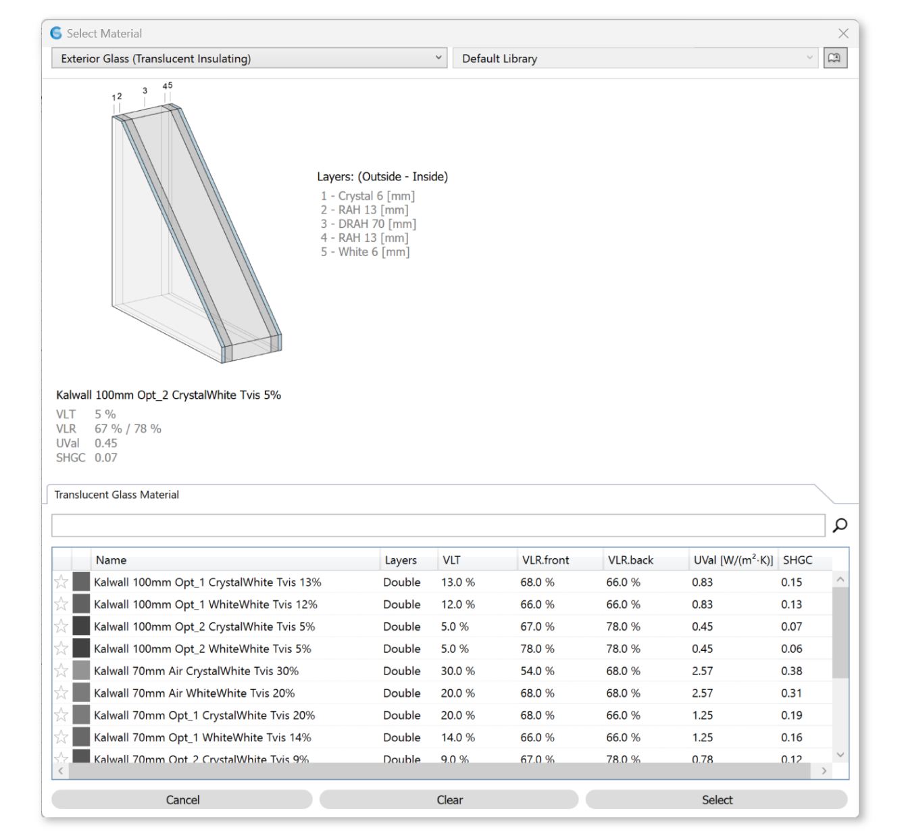

Exterior Glass (Translucent Insulating)
================================================

Translucent Insulating Glazing assemblies represent `Kalwall`_ facade glazing unit products with both light diffusing and heat insulating properties, and is a `material`_ that can be applied to a Rhino layer. 

Please note that in the 3D Rhino model, **window assemblies must be modeled as single surfaces**. They should not include multiple surfaces (panes), and they should not contain any solids.

Choose from the table below to apply material. 

.. _Kalwall: https://www.kalwall.com/

.. _material: materials.html