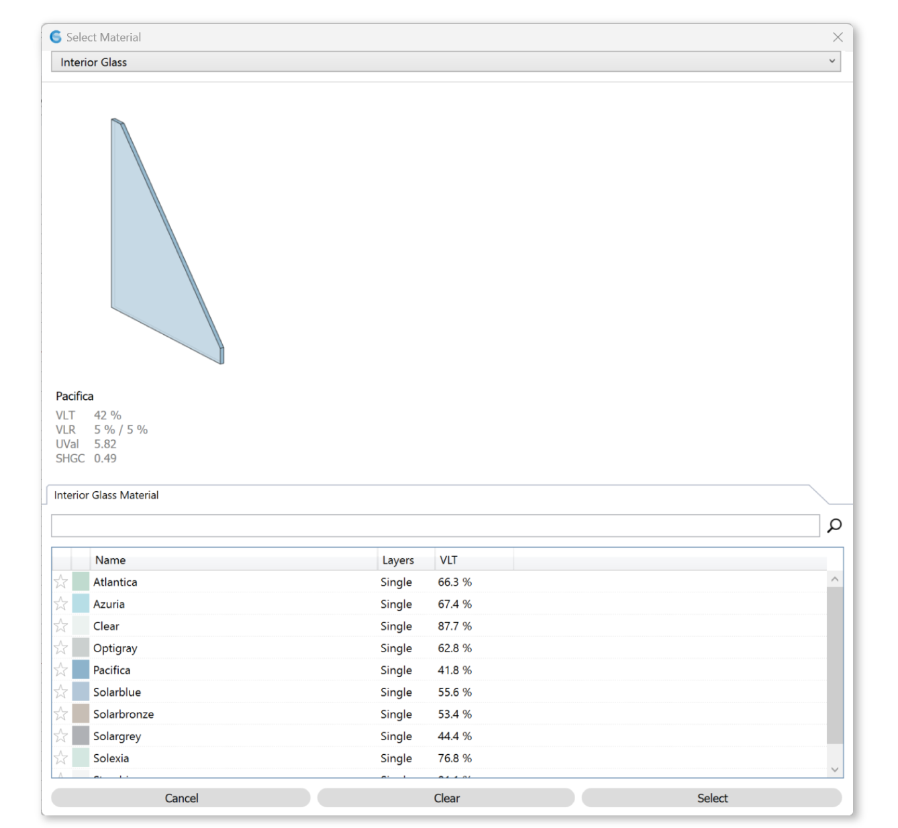

Interior Glass
================================================

Interior glazing assemblies are also sourced from the International Glazing Database (IGDB), and is a `material`_ that can be applied to a Rhino layer. 

Please note that in the 3D Rhino model, **window assemblies must be modeled as single surfaces**. They should not include multiple surfaces (panes), and they should not contain any solids.

Choose from the table below to apply material. 

.. _material: materials.html