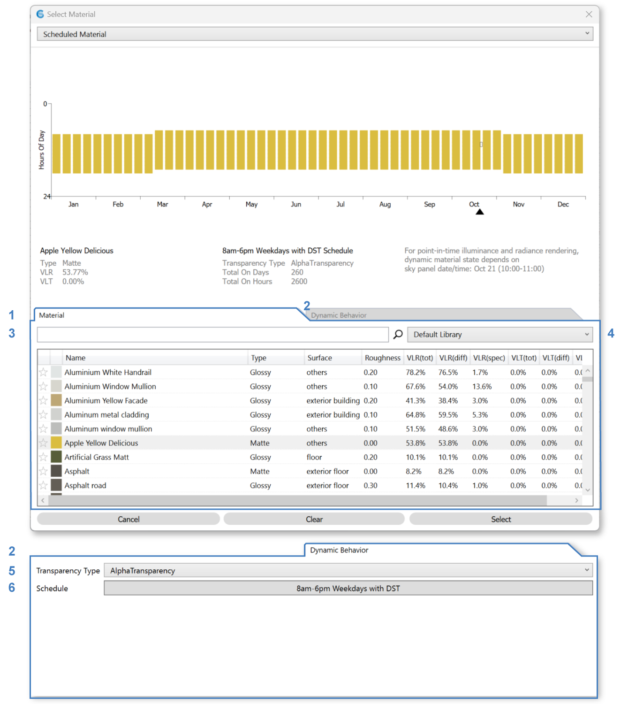

Scheduled Material
================================================

Scheduled materials are materials that appear or disappear based on an annual schedule.

To select a base material, use the **"Material" tab (1)** and select an item in the table.

To select a schedule, use the **"Dynamic Behavior" tab (2)** and browse for a schedule using the **Schedule button (4)**, which opens a `schedule editor`_.

The preview shows an hourly map of the material's schedule, with days of the year on the x-axis and hours of the day on the y-axis. The color of the graph is based on the material's reflection color, while the transparency represents its presence (or lack thereof) according to the schedule. If a `point-in-time workflow`_ is selected, the arrow on the x-axis and the box highlighting the hour indicates the **point-in-time state** used by the simulation. This depends on the date and time in the `Sky`_ sub-panel. `Annual workflows`_ use the schedule to set the behavior of the material at each hourly timestep. 

When the schedule's value is 0, the material is absent. When the schedule's value is 1, and material is present. Fractional values between 0 and 1 are interpreted according to the **Transparency Type (3)** dropdown: 

  - **Alpha Transparency** uses the fraction as the material's alpha channel, with 0 being fully transparent and 1 fully opaque. 

  - **BinaryOnOff** assumes full opacity whenever the fraction is greater than 0. 

  - **MeshFaceScaling** uses the fraction to scale each mesh face about its first vertex. For example, a value of 0.5 shrinks faces by a factor of 2, while a value of 0 causes faces to disappear completely. The maximum fraction is 1, meaning elements cannot grow beyond their modeled size. MeshFaceScaling may be useful for dynamic elements like deciduous leaves that grow or shrink throughout the year. 

Back to `Materials`_

.. _Materials: materials.html

.. _Sky: sky.html

.. _behavior varies slightly based on the workflow selected: materials.html#dynamic-material-behavior-based-on-workflow

.. _schedule editor: scheduleEditor.html

.. _Annual workflows: materials.html#dynamic-materials

.. _point-in-time workflow: materials.html#dynamic-materials
