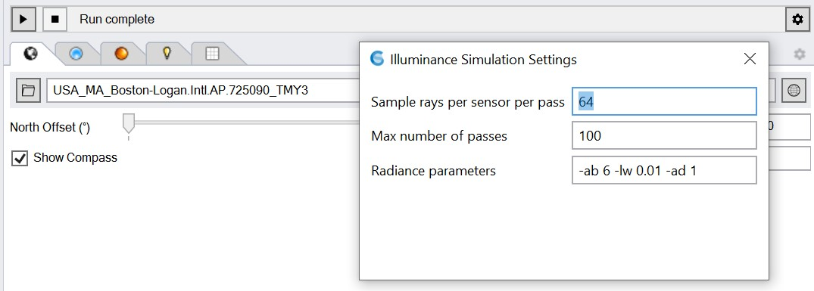

Path-tracing Settings
================================================

   
Under settings, the following parameters can be specified. For most simulations, these parameters can be left untouched.

**Sample rays per sensor per pass:** Number of rays emitted for each sensor at each pass. Increasing this number may reduce the number of passes required before a simulation converges but also increase the time required for each pass.

**Maximum number of passes:** While the simulation can be stopped by the users at any moment by using the stop button, this parameters provides a hard stop for a simulation run. 

**Radiance parameters:** By default ClimateStudio considers up to 6 ambient bounces before discarding a ray. If you want to adjust these parameters,  you should familiarize yourself with the `Radiance rtrace parameter.`_ 

.. _Radiance rtrace parameter.: https://floyd.lbl.gov/radiance/man_html/rtrace.1.html

