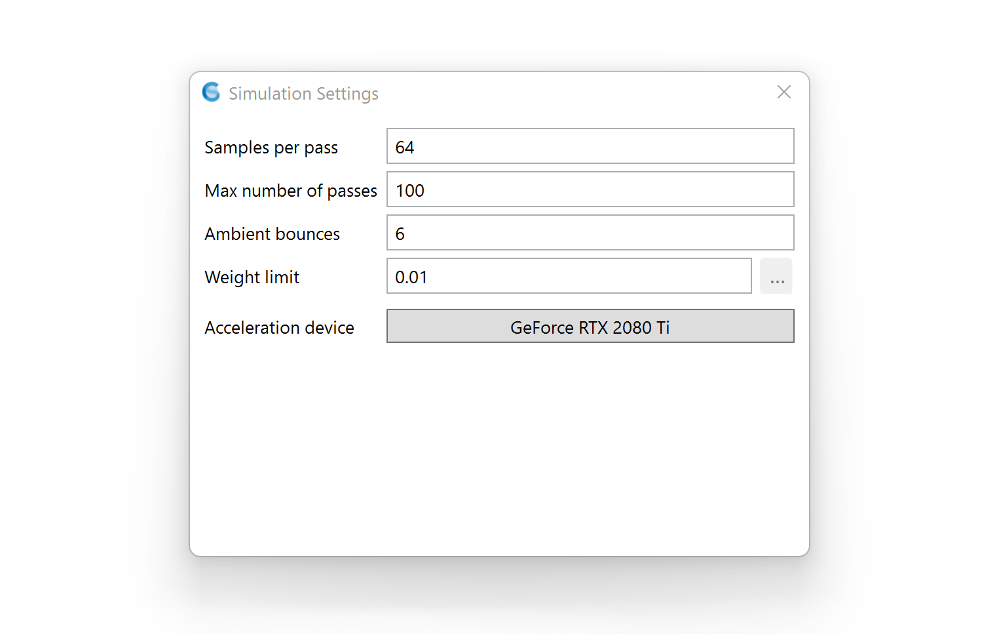

Path-tracing Settings
================================================

   
Under settings, the following parameters can be specified. For most simulations, these parameters can be left untouched.

**Sample per pass:** Number of ambient samples per sensor per pass. Samples accrue with each pass. (Total = SamplesPerPass x NumberOfPasses)

**Maximum number of passes:** Number of passes before simulation stops. (You may also halt the simulation using the Stop button.)

**Ambient bounces:** Maximum number of ambient bounces before a light path terminates. Note that this number does NOT include primary samples. E.g. a value of 6 here is equivalent to -ab 7 in a traditional rtrace +I run.

**Weight limit:** Weight below which a light path switches to Russian roulette (as opposed to continuing automatically). Note that weights are evaluated *per path*, not for an entire ray tree as in classical Radiance.

**Acceleration Device:** The hardware device used by ClimateStudio for matrix multiplication. (All ray tracing takes place on the CPU.)

Note to experienced Radiance users: ClimateStudio uses Radiance in a cacheless stochastic path tracing mode, which obviates parameters related to sampling density (-ad, -d*, -s*) or irradiance caching (-aa, -as, -ar). To control simulation quality, simply adjust the total number of samples.

