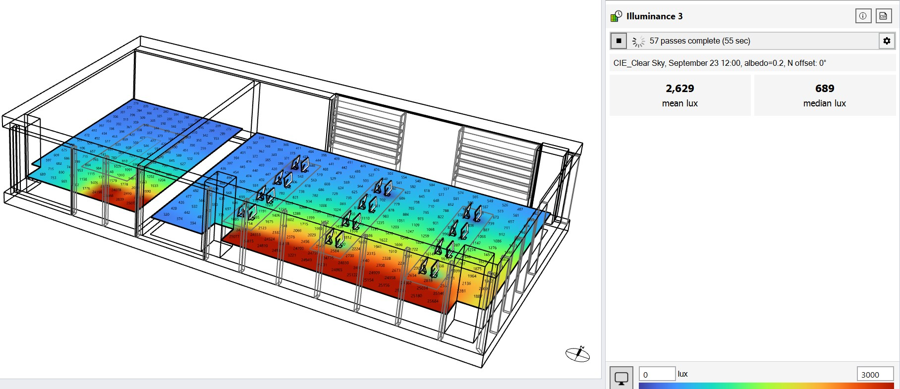

Point-in-Time Illuminance
================================================
This workflow supports the calculation of illuminance distributions for electric lighting and/or daylight at specific moments in time.

.. figure:: images/Point-in-TimeIlluminace_GUI.jpg
   :width: 900px
   :align: center

The workflow relies on five subpanels: 

- `Location`_ 
- `Sky`_
- `Assign Materials`_
- `Add Luminaires`_
- `Add Areas`_ 

.. _Location: Location.html

.. _Sky: sky.html

.. _Assign Materials: assignMaterials.html

.. _Add Luminaires: addLuminaires.html

.. _Add Areas: addAreas.html

If you have not done any lighting simulations in ClimateStudio, it is recommended that you initially go through the `Lighting Model Setup`_ video tutorial (5 minutes). 
The Rhino file used in the tutorial is available for `download`_.

.. _Lighting Model Setup: https://vimeo.com/392379928 
.. _download: https://climatestudiodocs.com/ExampleFiles/CS_Two_Zone_Office.3dm
 

Once all required input subpanels have been populated, a simulation is invoked by pressing the start button. 

.. figure:: images/StartButton.jpg
   :width: 300px
   :align: center

ClimateStudio uses a `progressive path-tracing`_ version of the Radiance raytracer to simulate illuminance distributions. While a simulation is in progress, traced light paths accumulate until the user-specified number of passes has been reached. Details on the simulation settings can be found in the `Path-tracing Settings Subpanel`_.
 
.. _progressive path-tracing: https://www.solemma.com/Speed.html
.. _Path-tracing Settings Subpanel: path-tracingSettings.html

Simulation Results
------------------------
Upon completion of the first pass, the simulation automatically switches into the ClimateStudio results panel. 
An overview of the results panel is provided `here`_. The image below shows the point-in-time illuminance results panel with an illuminance distribution 
shown in the Rhino viewport to the left and overall statistics (mean and median illuminances) displayed on the right. The Rhino viewport results can be modified 
using the `Viewport Display`_ editor. 

.. _here: results.html
.. _Viewport Display: ViewportDisplay.html

