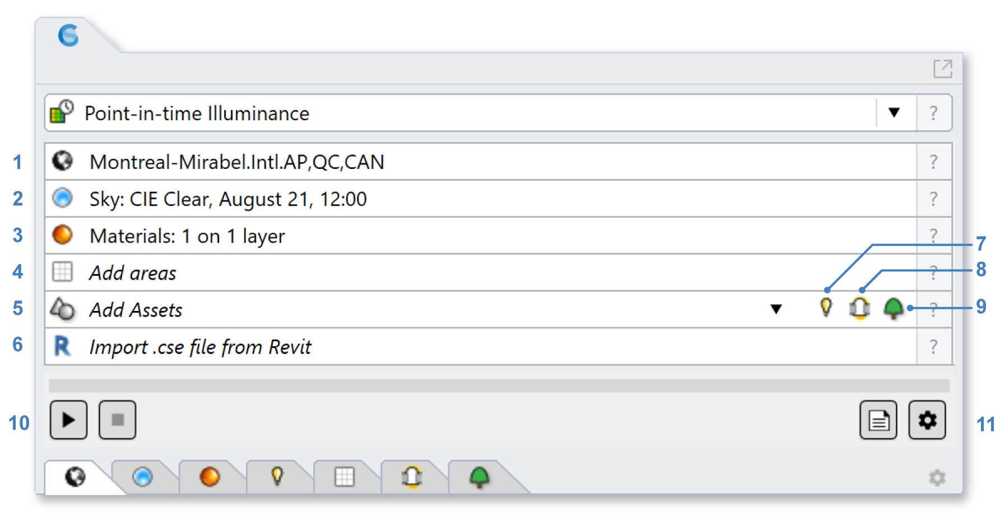

Point-in-Time Illuminance
================================================
This workflow supports the calculation of illuminance distributions for electric lighting and/or daylight at specific moments in time.

Simulation Setup
-----------------------

To prepare a model for simulation, work your way through the six subpanels labeled 1-6 in the figure above.

| 1 - `Location`_
| 2 - `Sky`_
| 3 - `Materials`_
| 4 - `Luminaires`_ (optional)
| 5 - `Occupied Areas`_ 
| 6 - `Tubular Daylighting Devices`_ (optional)

.. _Location: Location.html

.. _Sky: sky.html

.. _Materials: assignMaterials.html

.. _Luminaires: addLuminaires.html

.. _Occupied Areas: addAreas.html

.. _Tubular Daylighting Devices: addTDDs.html

If you have not done any lighting simulations in ClimateStudio, it is recommended that you initially go through the `Lighting Model Setup`_ video tutorial (5 minutes). 
The Rhino file used in the tutorial is available for `download`_.

.. _Lighting Model Setup: https://vimeo.com/392379928 
.. _download: https://climatestudiodocs.com/ExampleFiles/CS_Two_Zone_Office.3dm
 

Once all required inputs have been populated, a simulation is invoked by pressing the start button (7). ClimateStudio uses a `progressive path-tracing`_ version of the Radiance raytracer to simulate illuminance distributions. While a simulation is in progress, traced light paths accumulate until the user-specified number of passes has been reached. Details on the simulation settings can be found by opening the `settings dialog`_ (8).
 
.. _progressive path-tracing: https://www.solemma.com/blog/why-is-climatestudio-so-fast
.. _settings dialog: path-tracingSettings.html

Simulation Results
------------------------
Upon completion of the first pass, the ClimateStudio `results panel`_ will open. The image below shows a point-in-time illuminance result, with an illuminance distribution 
shown in the Rhino viewport to the left and overall statistics (mean and median illuminances) displayed in the panel to the right. The Rhino viewport results can be modified 
using the `Viewport Display`_ editor. 

.. figure:: images/IlluminanceResults.jpg
   :width: 900px
   :align: center

.. _here: results.html
.. _Viewport Display: ViewportDisplay.html

