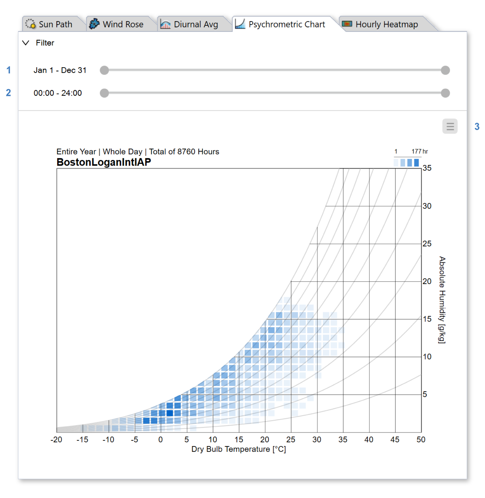

Psychrometric Chart
================================================
The Psychrometric Chart tab shows the frequency of weather conditions by temperature and humidity. 

To isolate time periods in the weather file, use the range sliders at the top of the panel, which constrain the data by date (1) and hour (2). The sliders are *wrappable*, meaning the start and end anchors can be dragged past one another to select winter or nighttime periods. Use the menu (3) to change units or `export`_ the plot to PNG or PDF.

.. _export: exportPlots.html