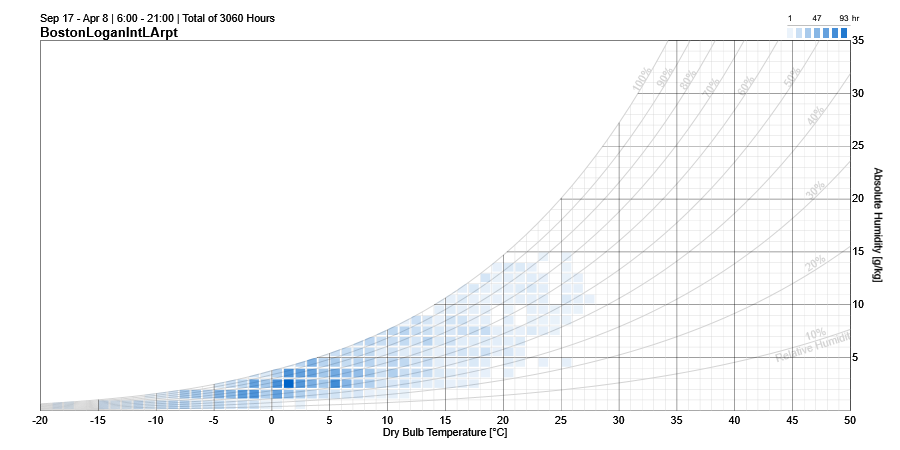

Psychrometric Chart
================================================

The Psychrometric Chart shows the distribution of hours in terms of both humidity and temperature. 

2 `filters`_ may be applied to the Psychrometric chart: 

- **Days** of the year as a range (wraps around)
- **Hours** of the day as a range (wraps around)

.. _filters: doubleSliderFilters.html
