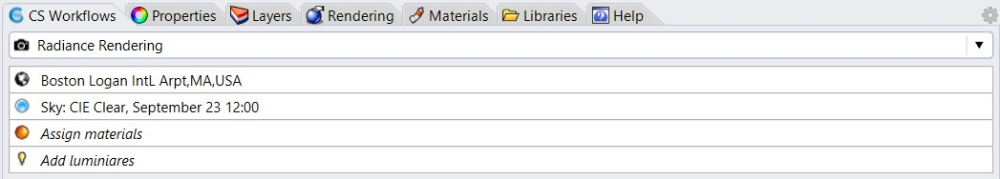
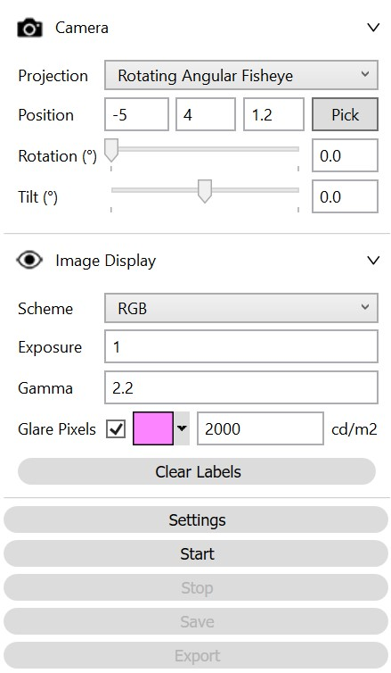

Radiance Render
================================================

The ClimateStudio Radiance Render workflow supports the creation of physically based renderings using a path tracing version of the `Radiance`_ light backwards raytracer. The workflow relies on four subpanels: 

.. _Radiance: https://www.radiance-online.org/

- `Location`_ 

- `Sky`_

- `Assign Materials`_

- `Add Luminaires`_

.. _Location: Location.html

.. _Sky: sky.html

.. _Assign Materials: assignMaterials.html

.. _Add Luminaires: addLuminaires.html

If you have not done any lighting simulations in ClimateStudio, it is recommended that you go through the `Lighting Model Setup video tutorial`_ (5 minutes). The Rhino file used in the tutorial is available for `download.`_

.. _Lighting Model Setup video tutorial: https://vimeo.com/392379928

.. _download.: https://solemma.com/tutorial/CS%20Two%20Zone%20Office.3dm

Once all required input subpanels have been populated, the rendering panel is invoked via the “Render Window” button. The panel consists of a render view on the left and the control settings on the right.

The camera settings offer a series of input parameters.

**Projection:** Radiance supports a series of camera models that determine how a rendering of the surrounding scene is projected onto a two-dimensional image. For more details consult the `Radiance rpict manual pages.`_ The “Rotating Angular Fisheye” projection is the default camera setting. It displays a camera view with a 180 degree opening angle while simulating a 360 degree view. This allows users to rotate the view while the rendering is being generated.

.. _Radiance rpict manual pages.: https://floyd.lbl.gov/radiance/man_html/rpict.1.html

**Position:** Corresponds to the location of the camera in the scene. 

**Rotation and Tilt:** Controls the direction in which the camera is facing.

**Width/ Height (pixels):** Sets the pixel resolution of the rendering.

**Lens Length (mm):** Only applies to select projections and sets the opening angle of the camera, which in turn determines the extent of the scene shown on the rendering.

Radiance renderings are in so-called high dynamic range (HDR) format. An HDR image contains the regular red, green and blue color channels for each pixel as any regular image format plus an absolute luminance level per pixel that determines its absolute brightness. The benefit of HDR images is that exposure levels can be re-adjusted to highlight different regions of an image. The scheme input displays images either in full color (RGB) or in grayscale. A falsecolor display mode is also supported. 

In order to identify pixels that may act as glare sources, all pixels above a user defined value (by default 2000 cd/m2) can be colored separately.    

Start Rendering
---------------------
Once all required input subpanels have been populated, a simulation is invoked by pressing the start button. ClimateStudio uses a `progressive path-tracing`_ version of Radiance so the viewport rendering is updated after each simulation pass. Details on the simulation settings can be found in the `Path-tracing Settings Subpanel.`_

.. _progressive path-tracing: https://www.solemma.com/Speed.html

.. _Path-tracing Settings Subpanel.: path-tracingSettings.html

While the simulation is running, the user may adjust rendering Exposure, Gamma correction and Scheme. For the rotating fisheye projection, ClimateStudio calculates the daylight glare probability (DGP) for the current view and classifies it as either imperceptible, perceptible, disturbing or intolerable glare. Details can be found under the `Annual Glare`_ workflow.

.. _Annual Glare: annualGlare.html

Once the simulation has been stopped, the resulting rendering can be saved within the ClimateStudio project or exported in a variety of formats.

