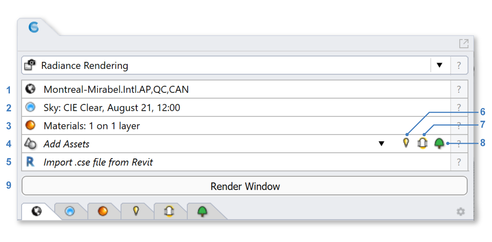

Radiance Render
================================================
The ClimateStudio Radiance Render workflow supports the creation of physically-based renderings using a path tracing version of the `Radiance`_ raytracer.

.. _Radiance: https://www.radiance-online.org/

Simulation Setup
-----------------------

To prepare a model for rendering, work your way through the six subpanels labeled 1-6 in the figure above.

| 1 - `Location`_
| 2 - `Sky`_
| 3 - `Materials`_
| 4 - `Luminaires`_ (optional)
| 5 - `Tubular Daylighting Devices`_ (optional)
| 6 - `Import .cse file from Revit`_ (optional)

.. _Location: location.html

.. _Sky: sky.html

.. _Materials: materials.html

.. _Luminaires: luminaires.html

.. _Tubular Daylighting Devices: TDDs.html

.. _Import .cse file from Revit: revitImporter.html

If you have not done any lighting simulations in ClimateStudio, it is recommended that you go through the `Lighting Model Setup video tutorial`_ (5 minutes). The Rhino file used in the tutorial is available for `download.`_

.. _Lighting Model Setup video tutorial: https://vimeo.com/392379928

.. _download.: https://climatestudiodocs.com/ExampleFiles/CS_Two_Zone_Office.3dm

Once all required inputs have been populated, click the Render Window button (7), which opens a form with a camera viewport on the left and camera settings on the right.

Camera Setup
-----------------------

.. figure:: images/CameraSetup.gif
   :width: 900px
   :align: center

- **Metric:** ClimateStudio supports the creation of both luminance and illuminance images. The luminance option shows the photometric intensity of light arriving at the viewing position (per solid angle), as a theoretical physical camera would. The illuminance option shows the total photometric flux falling on surfaces visible in the scene. This is not something a camera (or human eye) could see from the stated vantage -- but is useful for displaying light levels falling onto task surfaces, e.g. when placing luminaires. 

.. _Radiance: https://www.radiance-online.org/

- **View:** The View dropdown contains a list of standard Rhino views, as well as several non-perspective/non-parallel lens types supported by Radiance.

.. _Radiance: https://www.radiance-online.org/

  - **Rhino Views:** Includes standard views (Perspective, Top, Front, etc.) as well as any `named views`_ that are part of the document. Views are shown in a navigable viewport control, which supports pan (left-click) and rotate (right-click) actions. The control is limited vis-a-vis the native Rhino viewport in two important respects. First, it does not support ghosted display modes, so all surfaces are previewed as opaque. And second, the mouse-wheel does not dolly the camera location as you might expect. As a result, you may find it more convenient to drive the camera using the native Rhino viewport. To do so, select the **Active Rhino view (one way sync)** option.
  
  .. _Radiance: https://www.radiance-online.org/
  
  - **Radiance Projections:** In addition to perspective and parallel views, ClimateStudio supports several Radiance-style fisheye and panorama projections, including cylindrical (soup-can) and equirectangular (lat-lon) maps. For more details consult the `Radiance rpict manual pages.`_ When selecting one of these options, a non-navigable preview will appear for the current camera location and target.
  
  .. _Radiance: https://www.radiance-online.org/
  
  - **Fisheye (rotating):** Available only in ClimateStudio, the rotating fisheye generates a 360-degree panorama that is remapped onto an oriented 180-degree angular fisheye in real time. This allows changes in view direction without having to start a new rendering.

.. _named views: https://floyd.lbl.gov/radiance/man_html/rpict.1.html
.. _Radiance rpict manual pages.: https://floyd.lbl.gov/radiance/man_html/rpict.1.html

- **Location and Target:** For all views, the camera location and target can be altered manually by setting XYZ coordinates or picking points in the native Rhino viewport. 

.. _Radiance: https://www.radiance-online.org/

- **Width/ Height (pixels):** Sets the pixel resolution of the image.

.. _Radiance: https://www.radiance-online.org/

- **Lens Length (mm):** Applies only to perspective projections. Sets the opening angle of the camera along the image's shortest edge, which in turn determines the extent of the scene shown in the rendering.

Once the camera is set, a rendering is invoked by pressing the Start button. ClimateStudio uses a `progressive path-tracing`_ version of the Radiance raytracer. While a rendering is in progress, pixels are sampled until the user-specified number of samples has been reached, or the Stop button is pressed. Details on the simulation settings can be found by clicking the `Settings`_ button.
 
.. _progressive path-tracing: https://www.solemma.com/blog/why-is-climatestudio-so-fast
.. _Settings: pathTracingSettings.html

Simulation Results
------------------------

.. figure:: images/Render.gif
   :width: 900px
   :align: center

Radiance renderings are high dynamic range (HDR) images. For each pixel, an HDR image contains red, green, and blue color channels similar to a traditional bitmap, plus a luminance value that determines the pixel's absolute brightness. Because it contains absolute luminances, an HDR image can record physical lighting conditions and serve as the basis for predicting human visual comfort responses, which low-dynamic range (LDR) images cannot. Another benefit of HDR images is that exposure levels can be re-adjusted to highlight different regions of the image in post-processing. 

The **Image Display** section contains settings responsible for converting the HDR image into the LDR representation that appears on the screen:

- **Channel** determines the type data displayed. Options include RGB and Greyscale, which mimic the response of a traditional photographic film, or Falsecolor, which maps luminance values onto a color scale. Also available are two auxiliary images (Albedo and Normal), which are used by the AI denoiser.

.. _Settings: pathTracingSettings.html

- **Exposure** and **Gamma** work in concert to determine the brightness of pixels under RGB or Greyscale mapping. Exposure is a scalar that adjusts the overall brightness of the displayed image, while Gamma is a parameter that describes the nonlinearity of the tone scale. A gamma of 2.2 is a reasonable default for mimicking the power responses of photographic film and the human eye.

.. _Settings: pathTracingSettings.html

- **Glare Pixels** may be enabled to flag all pixels above a user-defined luminance (by default 2000 cd/m2) with a distinctive color.

Luminance values for individual pixels or rectangular regions may be tagged by clicking or clicking-and-dragging (respectively) over the image. For rotating fisheye projections, *right* clicks are used (to distinguish from rotation); otherwise, left clicks are used.

For the rotating fisheye projection, ClimateStudio calculates the daylight glare probability (DGP) for the current view and classifies it as either imperceptible, perceptible, disturbing or intolerable. Details can be found under the `Annual Glare`_ workflow.

.. _Annual Glare: annualGlare.html

.. figure:: images/RotatingRender.gif
   :width: 900px
   :align: center

Once the simulation has been stopped, the rendering can be saved as a ClimateStudio result file and/or exported to HDR or LDR image formats.

Denoising
^^^^^^^^^^^^^^^^^^^

ClimateStudio uses Intel's `Open Image Denoise (OIDN)`_ technology to remove noise from the raw HDR rendering, dramatically reducing the number of samples required to converge on a smooth result. The technology is built on a deep-learning convolutional neural network (CNN) trained to handle a wide range of images generated through stochastic ray tracing.

.. _Open Image Denoise (OIDN): https://www.openimagedenoise.org/

The denoiser engages after the rendering has reached one sample per pixel, and re-runs periodically while the ray trace is ongoing. ClimateStudio saves both the raw and denoised images. You can toggle between them using the **Denoising checkbox** during or after the run.

   Unfiltered Radiance rendering @ 5 samples/pixel
   

   Result after OIDN filtering

Luminaire Group Post-Processing
--------------------------------

