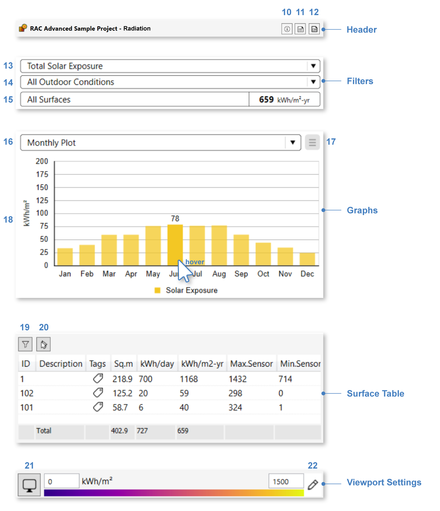

Radiation Map
================================================
ClimateStudio supports the calculation of annual, monthly, and hourly solar radiation falling on select surfaces in the scene. The simulation uses sun and sky radiances derived from weather-file data, which represent historically typical meteorological conditions. The purpose of a solar radiation calculation varies from identifying suitable positions for placing solar cells to designing a static shading system. These simulations complement `Direct Shading`_ studies. 

.. _Grasshopper Workflows: grasshopperTemplates.html
.. _Direct Shading: sunPath.html

Simulation Setup
-----------------------
.. figure:: images/workflowPanel_radmap.png
   :width: 900px
   :align: center
   
To prepare a model for simulation, work your way through the six subpanels labeled 1-6 in the figure above.

| 1 - `Location`_
| 2 - `Time Range`_ (optional)
| 3 - `Materials`_
| 4 - `Analysis Surfaces`_ 
| 5 - `Scene Assets`_ (optional): `Trees`_ (7)
| 6 - `Import .cse file from Revit`_ (optional)

.. _Location: location.html

.. _Time Range: timerange.html

.. _Materials: materials.html

.. _Analysis Surfaces: analysisSurfaces.html

.. _Import .cse file from Revit: revitImporter.html

.. _Trees: tree.html

.. _Scene Assets: sceneObjects.html

Once all required inputs have been populated, a simulation is invoked by pressing the **start button (8)**. 
ClimateStudio uses a `progressive path-tracing`_ version of the Radiance raytracer to simulate irradiance distributions. 
While a simulation is in progress, traced light paths accumulate until the user-specified number of passes has been reached. 
Details on the simulation settings can be found by opening the `settings dialog`_  **(9)**. 
For radiation maps, the dialog includes **low/high outdoor temperature thresholds**, 
which can be used to bin radiation occurring during hot or cold hours throughout the year.

.. _progressive path-tracing: https://www.solemma.com/blog/why-is-climatestudio-so-fast
.. _settings dialog: pathTracingSettings.html	

Simulation Results
-------------------------
Upon completion of the first simulation pass, or upon loading a saved result, a falsecolor preview will appear in the Rhino viewport, 
showing cumulative radiation values for the selected analysis surfaces:

.. figure:: images/result_viewportRadMap.png
   :width: 900px
   :align: center

The `results panel`_ will show a monthly (by default) data plot, table, and viewport legend, as follows:

.. _results panel: results.html

The **Header** includes the result name, a **run log (11)**, a **CSV export (12)**, and a **run parameters spreadsheet (10)** which provides an accounting of simulation inputs.

The **Filters** allow binning radiation by type or temperature. 

  - The **Radiation Type Filter (13)** lets you toggle between *total*, *direct*, or *indirect* solar exposure. Direct radiation is that coming directly from the sun, without scattering or reflection. 

  - The **Temperature Filter (14)** lets you isolate hours where the outdoor temperature is above or below the high and low temperature thresholds set prior to the run. The filters determine the data displayed in both the viewport and the graph.

  - The **Surface Filter (15)** is set using the **Surface Table** or by hovering over a sensor in the viewport. 

The **Graph (18)** shows mean cumulative exposure data for each month of the year. If *"save sensor data"* is set to hourly in the `Time Range`_ sub-panel, use **(16)** to switch between **monthly, daily, and hourly** graphs. 

  - By default these are area-weighted averages for all analysis surfaces, but a subset of surfaces can be isolated using the **Surface Table**. 

  - Data for an individual sensor can be displayed by hovering over the sensor in the viewport. 

  - **Hover** over the graph to show the actual value of each data point.  

  - Use the **dropdown menu (17)** to export graph to PNG, switch unit system, or change the draw settings. 

  - Clicking on the Y-Axis or the falsecolor of the graph to edit the max value of the Y-Axis and the min, max value, and gradient of the flasecolor. 

The **Surface Table** lists the mean total and normalized solar exposure, as well as min and max sensor values, for each analysis surface. 

  - Selecting surfaces by **filtration (19)** or row selection isolates their preview in the monthly graph and the Rhino viewport, and updates the statistics in the "Totals" row at the bottom of the table.

  - **Deselect all (20)** to go back to the default display of area-weighted averages for all analysis surfaces. 

The **Viewport Settings** bar contains a viewport preview legend and **viewport settings menu (21)**, which provides options for customizing the falsecolor display. **Edit falsecolor (22)** to change its gradient, steps, and threshold colors. 
