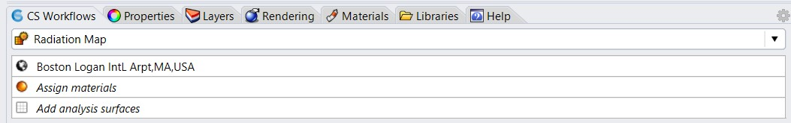
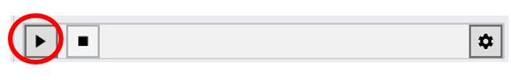

Radiation Map
================================================
ClimateStudio supports the calculation of annual or monthly solar radiation falling on select surfaces in the scene. The simulation uses direct and diffuse irradiation values from the EPW weather file (selected under location) and bins solar radiation coming from different parts of the sky for every month of the year. The underlying monthly cumulative skies are then used as the reference sky under which solar radiation levels are being calculated. The purpose of a solar radiation calculation varies from identifying suitable positions for placing solar cells or to design a static shading system. These simulations complement `Direct Shading`_ studies. 

.. _Direct Shading: sunPath.html

To set up a radiation map, the following subpanel inputs are required:

- `Location`_ 

- `Assign Materials`_

- `Add Analysis Surfaces`_

.. _Location: Location.html

.. _Assign Materials: assignMaterials.html

.. _Add Analysis Surfaces: addAnalysisSurfaces.html 

Once all required input subpanels have been populated, a simulation is invoked by pressing the start button. 

ClimateStudio uses a `progressive path-tracing`_ version of the Radiance raytracer to simulate radiation maps distributions. While a simulation is in progress, new iterations are added to the simulation results until the user-specified number of passes has been reached.  

.. _progressive path-tracing: https://www.solemma.com/Speed.html

Simulation Results
-------------------------
Upon completion of the first pass, the simulation automatically switches into the `ClimateStudio results panel.`_ 

.. _ClimateStudio results panel.: results.html

The image below shows a radiation map analysis of an urban setting. All scene elements have been selected as analysis surfaces and are colored according to the annual solar radiation that they are exposed to in the viewport to the left. On the right, monthly radiation values for the sensor selected in the viewport are shown. The table on the lower right provides summary statistics for all selected surfaces. 

Tip:
	In order to get radiation values for individual roof surfaces, the building breps have to be “exploded” in Rhino and roof surfaces have to be defined as individual surfaces.    

