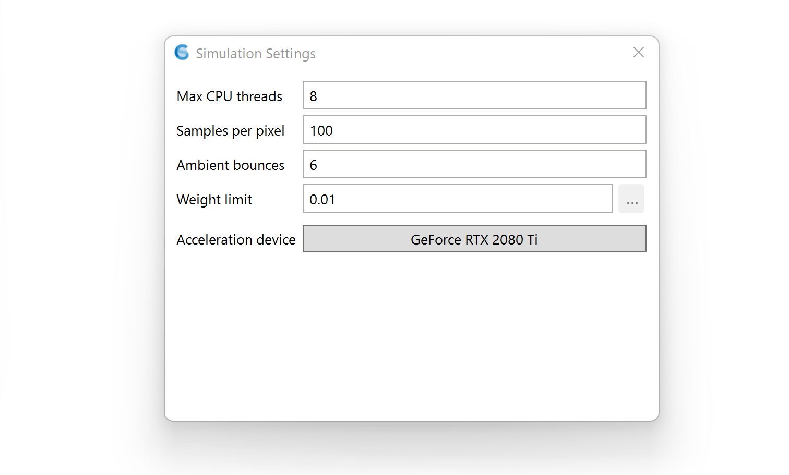

Path-tracing Settings
================================================

Under settings, the following parameters can be specified. For most simulations, these parameters can be left untouched.

**Max CPU Threads:** The maximum number of CPU threads used by Radiance.

**Samples per pixel:** Number of samples per pixel before the rendering stops. You may also stop the rendering at any time by pressing the Stop button.

**Ambient bounces:** Maximum number of ambient bounces before a light path terminates.

**Weight limit:** Weight below which a light path switches to Russian roulette (as opposed to continuing automatically). Note that weights are evaluated *per path*, not for an entire ray tree as in classical Radiance.

**Acceleration Device:** The hardware device used by ClimateStudio for image post-processing. (All ray tracing takes place on the CPU.)

Note to experienced Radiance users: ClimateStudio uses Radiance in a cacheless stochastic path tracing mode, which obviates parameters related to sampling density (-ad, -d*, -s*) or irradiance caching (-aa, -as, -ar). To control simulation quality, simply adjust the samples per pixel.