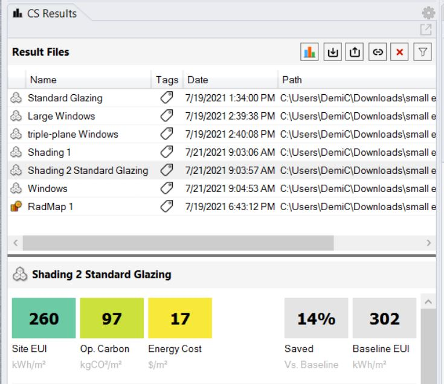

Results Panel
================================================
.. figure:: images/Results.jpg
   :width: 300px
   :align: center

The results panel is activated once a simulation is in progress (finished its first pass) or complete. The top part of the results panel shows previously run ClimateStudio simulations for the current project in a table. ClimateStudio saves all simulation results in a sub directory located in the same directory as the Rhino file called ``Rhino file name - CS.`` Results can be loaded or unloaded from the Results panel overview table. When a result is selected (by left-clicking on it), it is displayed in the lower part of the results panel as well as the Rhino viewport, if applicable. 

Results Organization
-------------------------
Results should be named according to their main design feature such as the glazing type, if that has been modified. While results are stored in a binary format, their content can be exported in CSV or other formats.  

Results Comparison
-------------------------
Clicking on the Icon with the colored bar chart on top of the result files table will bring up the Result Comparison window. 

Currently only Energy results are supported for comparing. 

Comparison uses the first (left most) result as the baseline. 

Results can also be re-ordered by dragging and dropping in the graph and the table. 

.. figure:: images/compareInput.jpg
   :width: 900px
   :align: center

On the upper left corner, You may save the current comparison or open a old already saved comparison file, or add, remove results files, or re-order the result files. 

.. figure:: images/selectResults.jpg
   :width: 150px
   :align: center

Several graphs are available. 

.. figure:: images/DataToGraph.jpg
   :width: 150px
   :align: center

Both the graph and the inputs table can be exported as both png and pdf. In the case of the table, a multi-page pdf will be created with a selected page size, additionally, it can also be copied as a csv file. 

.. figure:: images/exporttablepdf.jpg
   :width: 600px
   :align: center