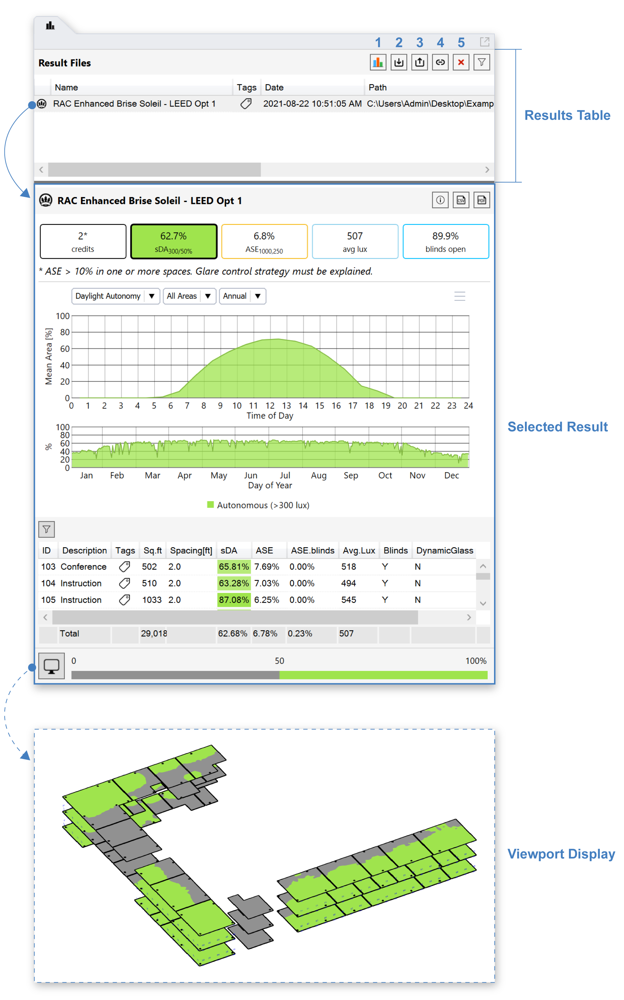

Results Panel
================================================
Simulation results in ClimateStudio are saved as files with the extension **CSR**. The Results Panel provides an interface for loading CSR files and displaying their contents. When a file is loaded into the table and selected, its contents are shown in the Selected Result region below (and, if applicable, the Rhino viewport):

Any CSR file may be loaded (2) or unloaded (3) from the results table of any Rhino document. Deleting a file (5) permanently erases the source file from disk. CSR files contain binary data, but the UI generally supports export to CSV, HDR, and other open file formats.

When a simulation is in progress, its result file is automatically loaded into the table of the active Rhino document and selected. By default, result files are saved in the same directory as the Rhino doc, in a subdirectory called ``Rhino file name - CS``.

**Tips**: 
  Result files should be given names that invoke the design options being studied (e.g. *Daylight 40% VLT* or *Daylight 60% VLT*). Listing the simulation type is good practice when conducting multiple types of analysis.

Results Comparison
~~~~~~~~~~~~~~~~~~~~~~~~~~~~~
The results table makes it convenient to flip between several design options with the simple use of up and down arrow keys. For thermal analysis results, ClimateStudio also supports the generation of performance plots comparing multiple files. To access this feature (available as of version 1.5), select multiple thermal results in the table and then click the results comparison button (1). This will launch a graphing window whose features are detailed in the link below.

.. toctree::
   :maxdepth: 1 
   :titlesonly:
   
   Results Comparison<resultComparison.rst>