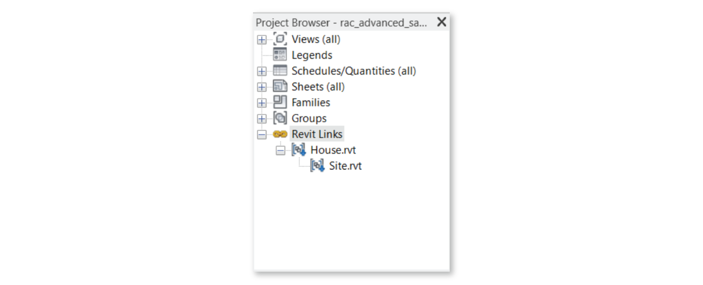
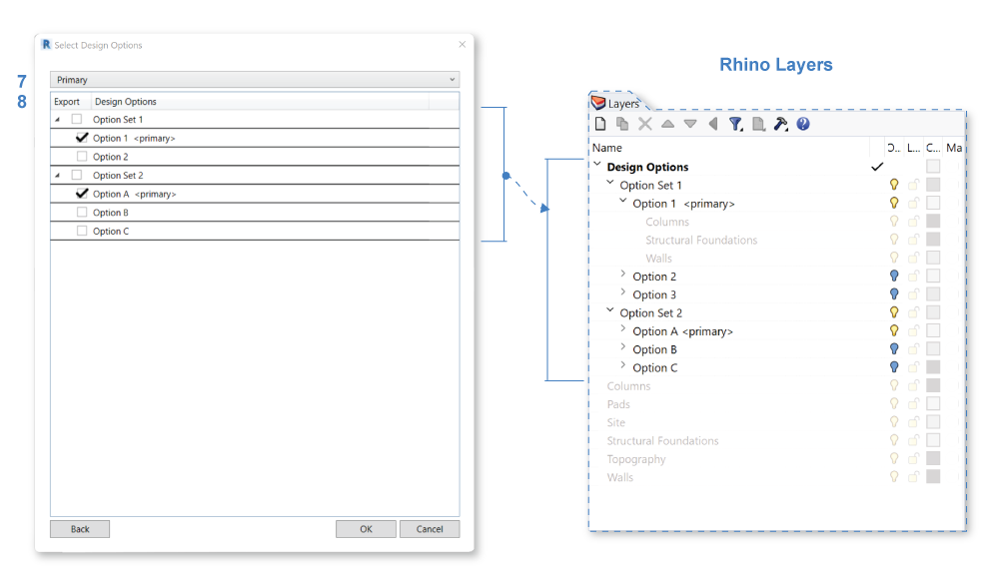

Revit Daylight Model Export
----------------------------
This workflow facilitates the transfer of Revit models to Rhino for ClimateStudio daylighting analysis. The workflow automates several previously-cumbersome aspects of daylight-model exchange, including the filtering of model categories, the generation of analysis surfaces, and the conversion of glazing solids to single surfaces (as required for Radiance-based simulations). This document breaks the process into two steps. Revit export is described below, while `import into Rhino is covered here`_. An easy-to-follow `video tutorial`_ is also available.

.. _import into Rhino is covered here: revitImporter.html
.. _video tutorial: https://www.youtube.com/watch?v=kfx9iVHueD8

The workflow requires ClimateStudio v1.7. Please contact the ClimateStudio support team if you encounter issues. Revit modeling practices vary widely, so sharing examples is helpful for improving the software.

Export Revit Model
~~~~~~~~~~~~~~~~~~~~~~~~~~~~~
In Revit, open your model and navigate to the **ClimateStudio Tab** (**1**). Then click the **Export Daylight Model** button (**2**):

.. figure:: images/revit_toolbar.png
   :width: 900px
   :align: center
   

A dialog appears with export settings: 

.. figure:: images/revit_viewfilter.png
   :width: 900px
   :align: center

Export Scope
<<<<<<<<<<<<<<<<<<<<<<<<<<<<<<<

**Entire Model** (**3**) scans all 3D model elements in this model. 

**Active View Elements (this document)** considers only those visible in the active view. You must set a 3D view as your active view for this option to work. If using this option in conjunction with a Section Box, please note that elements partially intersecting the box will be exported in full.

Linked Documents
<<<<<<<<<<<<<<<<<<<<<<<<<<<<<<<

This option appears only if there are linked files. When an active view filter is selected (**3**), only elements from the current document are exported. 

**All Linked Files** (**4**) scans all linked documents in the Revit Project Browser: 

Both "overlay" and "attached" linked documents, and only "attached" nested-linked documents are included. 

If linked documents contain multiple design options, the primary option will be imported as part of the main model. 

**This Document Only** (**4**) scans the current active document only. 

NURBS Geometries
<<<<<<<<<<<<<<<<<<<<<<<<<<<<<<<

**NURBS When Available** (**5**) exports as both NURBS (if available) and meshes. **Mesh Only** exports only meshes. The NURBS option will produce larger .cse files than the mesh-only option.  

Glazing Identification
<<<<<<<<<<<<<<<<<<<<<<<<<<<<<<<

**Glazing** is identified (**6**) with **Material Class is "Glass"** (and other equivalents depending on language) by default, and will be converted into single plane geometry on import. 
Additionally, glazing can be identified with **Material Transparency Greater than 10%**, or with **Material NameCcontaining the text "glass"** (case insensitive). 
If multiple glazing identification methods are selected, satisfying any of the selected conditions will qualify the geometry as glazing. 

Upon clicking **OK**, if document contains multiple design options, the Design Options table will appear, else the Categories table will appear.  

Design Options
<<<<<<<<<<<<<<<<<<<<<<<<<<<<<<<

The **Design Options table** lists all Design Option Sets and their children Design Options. 
Check the **Export** Column (**8**) to select the options to export. 
"Primary" design options are selected by default, use the drop down bar above the table (**7**) to switch between selecting **Primary** options, **All** options, and **None**. 

Geometries from selected Options will be exported into nested Rhino Layers maintaining inheritance structure from their Option Sets for easy switching in Rhino. 
In this example, 
*Option 1 <primary>* is exported into layer *Option 1 <primary>* nested inside *Option Set 1* which is further nested inside *Design Options* layer. 
Categories and Types will be further nested under their respective option layers as shown under *Option 1 <primary>* layer. 

Upon clicking **OK**, a Categories table will appear: 

Categories and Types
<<<<<<<<<<<<<<<<<<<<<<<<<<<<<<<

.. figure:: images/revit_categoriestable.png
   :width: 900px
   :align: center

The **Categories table** lists all the model's elements by category. 
Use the **Export** column (**9**) to specify the categories you'd like to export. 
*Default* selection includes Categories likely to be relevant. 
Use the Drop Down above the table (**12**) to switch between **Default**, **All**, and **None** selected to export. 

Note that simulation speed depends, in part, on the number of elements in the exported model. 
The default pre-selection aims to exclude details (like railings) that tend to have minimal impact on overall light levels. 
However, models and their categorization vary, so discretion should be used to include the relevant components.

Layers
<<<<<<<<<<<<<<<<<<<<<<<<<<<<<<<

By default, each exported category becomes a single layer in the daylight model. 
However, if you enable **Explode Types** (**10**), 
a sub-layer will be created for each family type within the category. 
Once in Rhino, ClimateStudio uses layers for material assignment 
-- so resolving types is useful if you intend to assign different finishes to different families. 
A list of types for each category can be found by clicking the ellipses in the **See Types** column (**11**).

Rooms
<<<<<<<<<<<<<<<<<<<<<<<<<<<<<<<

The **Export Rooms** option (**13**) should be enabled except in rare cases. ClimateStudio uses rooms in Revit to automatically generate analysis surfaces for daylight simulation. It also uses room boundaries to guess whether windows are interior or exterior, and to set their surface normals. (These distinctions may prove useful when assigning materials or blinds.) Disable this option only if the model's room data are unreliable.

Phases
<<<<<<<<<<<<<<<<<<<<<<<<<<<<<<<

Revit elements with a “Demolished Phase” tag will NOT be exported unless the **Export Demolished** option (**14**) is enabled. Exporting demolished geometries may result in overlapping geometries in the Rhino model, requiring manual clean-up.  

Click **OK** to export the model.

.. figure:: images/revit_exporting.png
   :width: 900px
   :align: center

Once elements are finished exporting, select a location to save the file. The resulting **ClimateStudio Exchange (.cse)** file can be imported to Rhino as described here:

- `Import .cse file to ClimateStudio Rhino`_

.. _Import .cse file to ClimateStudio Rhino: revitImporter.html
