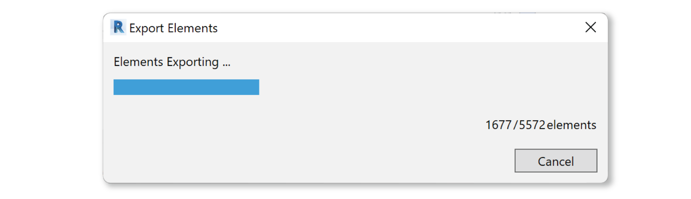

Revit Daylight Model Export
----------------------------
This workflow facilitates the transfer of Revit models to Rhino for ClimateStudio daylighting analysis. The workflow automates several previously-cumbersome aspects of daylight-model exchange, including the filtering of model categories, the generation of analysis surfaces, and the conversion of glazing solids to single surfaces (as required for Radiance-based simulations). This document breaks the process into two steps. Revit export is described below, while `import into Rhino is covered here`_. An easy-to-follow `video tutorial`_ is also available.

.. _import into Rhino is covered here: revitImporter.html
.. _video tutorial: https://www.youtube.com/watch?v=bwuYouLKxn0

The workflow is currently in beta, and requires ClimateStudio Service Release Candidate v1.7. Please contact the ClimateStudio support team if you encounter issues. Revit modeling practices vary widely, so sharing examples is helpful for improving the software.

Export Revit Model
~~~~~~~~~~~~~~~~~~~~~~~~~~~~~
In Revit, open your model and navigate to the **ClimateStudio Tab** (**1**). Then click the **Export Daylight Model** button (**2**):

.. figure:: images/revit_toolbar.png
   :width: 900px
   :align: center
   
A dialog will appear with two options:

.. figure:: images/revit_viewfilter.png
   :width: 900px
   :align: center

- **Export Entire Model** scans all 3D elements in the Revit document. 
- **Export Visible Elements** considers only those visible in the active view. You must set a 3D view as your active view for this option to work. If using this option in conjunction with a Section Box, please note that elements partially intersecting the box will be exported in full.  

Upon clicking **OK**, a Categories table will appear: 

The **Categories table** lists all the model's elements by category. Use the **Export** column (**3**) to specify the categories you'd like to export. Note that simulation speed depends, in part, on the number of elements in the exported model. The default pre-selection aims to exclude details (like railings) that tend to have minimal impact on overall light levels. However, models and their categorization vary, so discretion should be used to include the relevant components.

Layers
<<<<<<<<

By default, each exported category becomes a single layer in the daylight model. However, if you enable **Explode Types** (**4**), a sub-layer will be created for each family type within the category. Once in Rhino, ClimateStudio uses layers for material assignment -- so resolving types is useful if you intend to assign different finishes to different families. A list of types for each category can be found by clicking the ellipses in the **See Types** column (**5**).

Rooms
<<<<<<<<

The **Export Rooms** option (**6**) should be enabled except in rare cases. ClimateStudio uses rooms in Revit to automatically generate analysis surfaces for daylight simulation. It also uses room boundaries to guess whether windows are interior or exterior, and to set their surface normals. (These distinctions may prove useful when assigning assigning materials or blinds.) Disable this option only if the model's room data are unreliable.

Phases
<<<<<<<<

Revit elements with a “Demolished Phase” tag will NOT be exported unless the **Export Demolished** option (**7**) is enabled. Exporting demolished geometries may result in overlapping geometries in the Rhino model, requiring manual clean-up.  

Click **OK** to export the model.

Once elements are finished exporting, select a location to save the file. The resulting **ClimateStudio Exchange (.cse)** file can be imported to Rhino as described here:

- `Import .cse file to ClimateStudio Rhino`_

.. _Import .cse file to ClimateStudio Rhino: revitImporter.html
