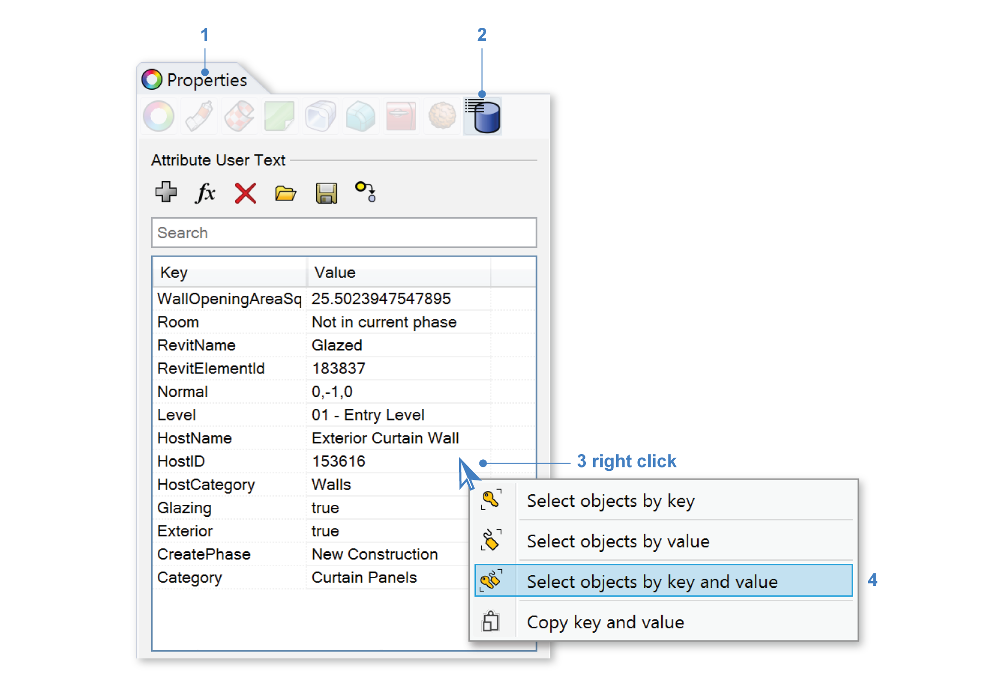
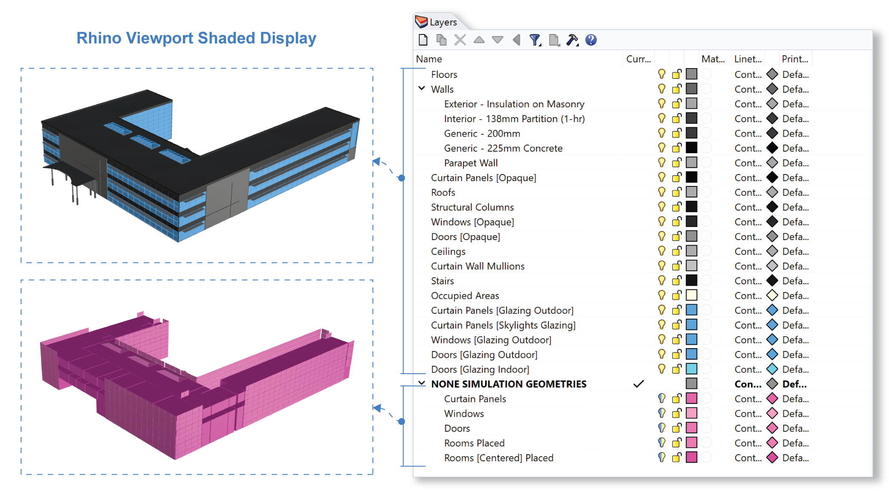

Revit Import Trouble Shoot
-----------------------------------

Checking Imported Model
~~~~~~~~~~~~~~~~~~~~~~~~~~~~~
- Check all glazing geometries are single plane meshes. 
- Check all exterior windows are on the exterior window layer. 
- Check all exterior windows with blinds have normals that point outside. 
- Check all occupied areas have normals that point up. 
- Each layer in Rhino will be assigned a material, so make sure geometries in the same layer have the same material. Move them into different layers or create new layers if needed. These changes are remembered when running a overwrite import. 

Tips on Filtering Objects in Rhino
~~~~~~~~~~~~~~~~~~~~~~~~~~~~~~~~~~~~~~~~

Open Properties panel (**1**) in Rhino and open (**2**) **Attribute User Text** Panel. Rhino Objects are tagged with **Attribute User Text** based on data exported from Revit. 

Right click (**3**) to select objects with the same Key and Value (**4**). 

This is a good way to filter objects for reorganization. For example: select objects created in the same phase or objects on the same level. 

**Attribute User Text** tags: 

- **RevitType** - the Revit Family name appended with Revit Type name
- **RevitName**
- **RevitElementID** - used to identify objects on overwrite import
- **DesignOption**
- **Category** - the Revit Category
- **Normal**
- **Level** - the Revit Level this objects is in
- **CreatePhase**
- **DemolishPhase**
- **Glazing** - set by the revitImporter depending on the opacity of the material
- **Exterior** - if the object is a "Exterior Wall Type" wall or the object is hosted by a "Exterior Wall Type" wall
- **Room**
- **HostID**
- **HostName**
- **HostCategory**
- **RoomArea** - room area in sqft
- **GeometryIndex** - used to identify objects on overwrite import when one Revit Element is imported as multiple Rhino Objects

Cleaning Exported Model
~~~~~~~~~~~~~~~~~~~~~~~~~~~~~

During a regular import, 3D windows and Rooms are not baked into Rhino since only their single-plane representations are needed for daylight simulations. 

To retrieve these 3D windows and rooms, run `CSImportRevitDiscardedGeometries` command will import those 3D Windows and Rooms. Use this if single plane windows or occupied areas are not created correctly. 

Window Glazing Imported as Solids
~~~~~~~~~~~~~~~~~~~~~~~~~~~~~

Only geometry applied with a Revit material with material class "Glass" will be recognized and converted to single plane geometries. 

This property can be set in Revit by going into the "Manage" tab (**1**) and then "Materials" (**2**). The Revit Material Browser will open. Select the material used on your glazing and go to "Identity" tab (**3**) and set the "Class" of material to "Glass" (**4**). Click "OK" or "Apply" to commit your changes. Run the export again.  

Deprecated Room Geometries
~~~~~~~~~~~~~~~~~~~~~~~~~~~~~

Make sure your Room Boundaries are set up correctly in your Plan and Section views. 

Rooms are used only to create Occupied Areas for simulation, and for identifying exterior windows. They are not strictly required for export.