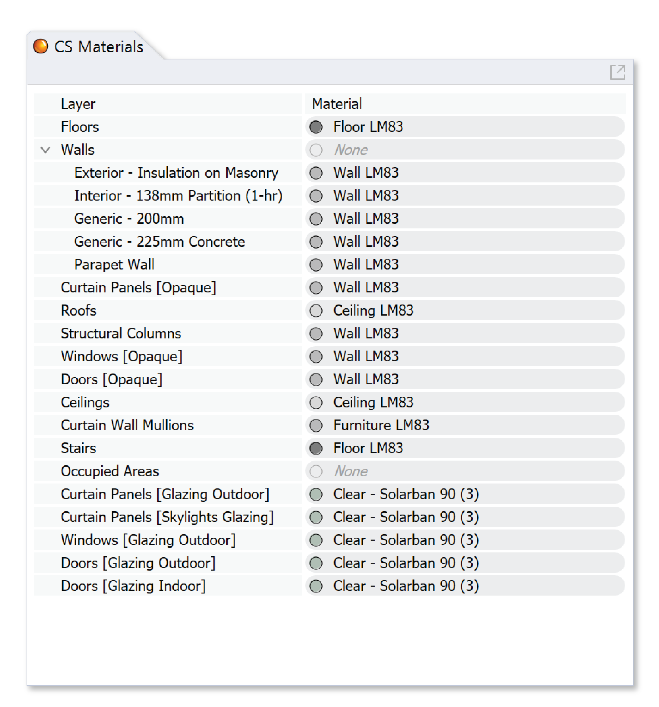

Revit Daylight Model Import 
-------------------------
This workflow imports a .cse file created by Climate Studio `Revit Exporter Plug-in`_ in order to run Daylight simulations with Climate Studio. 

.. _Revit Exporter Plug-in: revitExporter.html

Currently the Revit Export workflow is still in Beta release, please email us if you run into any issues. This feature is only available in Climate Studio v1.7 or newer.  

Import .cse file from Revit
~~~~~~~~~~~~~~~~~~~~~~~~~~~~~
Start with an **Empty File**.

.. figure:: images/revit_importbutton.png
   :width: 900px
   :align: center

| 1 - Click button on workflow panel or Type Command `CSImportRevitCommand`. 

Select a .cse file to import. 

This pops up if Rhino file contains Objects with RevitElementID attached. 

| 2 - **Overwrite** deletes all current Objects with Revit ElementIDs attached. Importer will remember Revit ElementID and their layer placement. Later, the plug-in will place newly imported Element with same ID into the remembered Layer. 

| 3 - **Keep** keeps current Rhino Objects and import new model. 

.. figure:: images/revit_importing.png
   :width: 900px
   :align: center

**Window** Geometries are reduced to **single plane geometry**. Windows are separated into “interior” or “exterior” layers depending on the host wall and Rooms information provided in the Revit model. Exterior windows have normals facing outside. 

**Rooms** from Revit are used to define **Occupied Areas** which can be turned into **Simulation Grids**. The names and IDs of the grids will be populated with the respective Room name and Room ID. 

.. figure:: images/revit_model.png
   :width: 900px
   :align: center

Elements from Revit are placed into different Rhino layers depending on their **Demolished Phases, Design Option, Category, and Family Type.** In the example above there is neither Design Option nor Phases information so Categories like "Walls" "Floors" are the top-most layers. Sub-layers like "Exterior - Insulation on Masonry" are family-types. By exploding a category into sub-layers, sub-types can have different materials. 

Below is an abstract example of how nesting works with Phases and Design Option information. 

.. figure:: images/revit_exampleLayers.png
   :width: 900px
   :align: center

`Check your model`_ if Rooms are Not Imported, multiple phases exist in this model, complex window geometry exists, or you are overwriting the current model. 

.. _Check your model: revitImportTroubleShoot.html

Set up Daylight Simulation
~~~~~~~~~~~~~~~~~~~~~~~~~~~~~

In the `Materials`_ panel Default LM83 materials are assigned on Import. 

.. figure:: images/revit_occupiedareas.png
   :width: 900px
   :align: center

Populate the `Occupied Areas`_ panel with surfaces from Rhino Layer "Occupied Areas", the ID and Name of each grid will be auto-assigned based on the Room ID and Room Name in Revit.  

The Imported Revit Model can be used to run the following analysis:

| `Daylight Availability`_
| `Annual Glare`_
| `Radiance Render`_
| `Radiation Map`_
| `View Analysis`_

.. _Daylight Availability: daylightAvailability.html
.. _Annual Glare: annualGlare.html
.. _Radiance Render: radianceRender.html
.. _Radiation Map: radiationMap.html
.. _View Analysis: viewAnalysis.html

.. _Materials: materials.html
.. _Occupied Areas: occupiedAreas.html

Combining Multiple Revit Models
~~~~~~~~~~~~~~~~~~~~~~~~~~~~~
Import each Revit model in their own Rhino file, make changes to layer organization as needed, then combine the Rhino Files. This way, when re-importing (overwriting) each Revit file to their own Rhino file, the manual layer organization will be remembered. 

Alternatively you may Import another .cse file and select **Keep Current Model** when asked. The combined Rhino file CANNOT run a overwrite import as multiple Rhino Objects are identified with the same Revit Element ID. 

Trouble Shoot Your Import
~~~~~~~~~~~~~~~~~~~~~~~~~~~~~

Here are some tips and stricks to `trouble shoot your model`_. 

.. _trouble shoot your model: revitImportTroubleShoot.html
