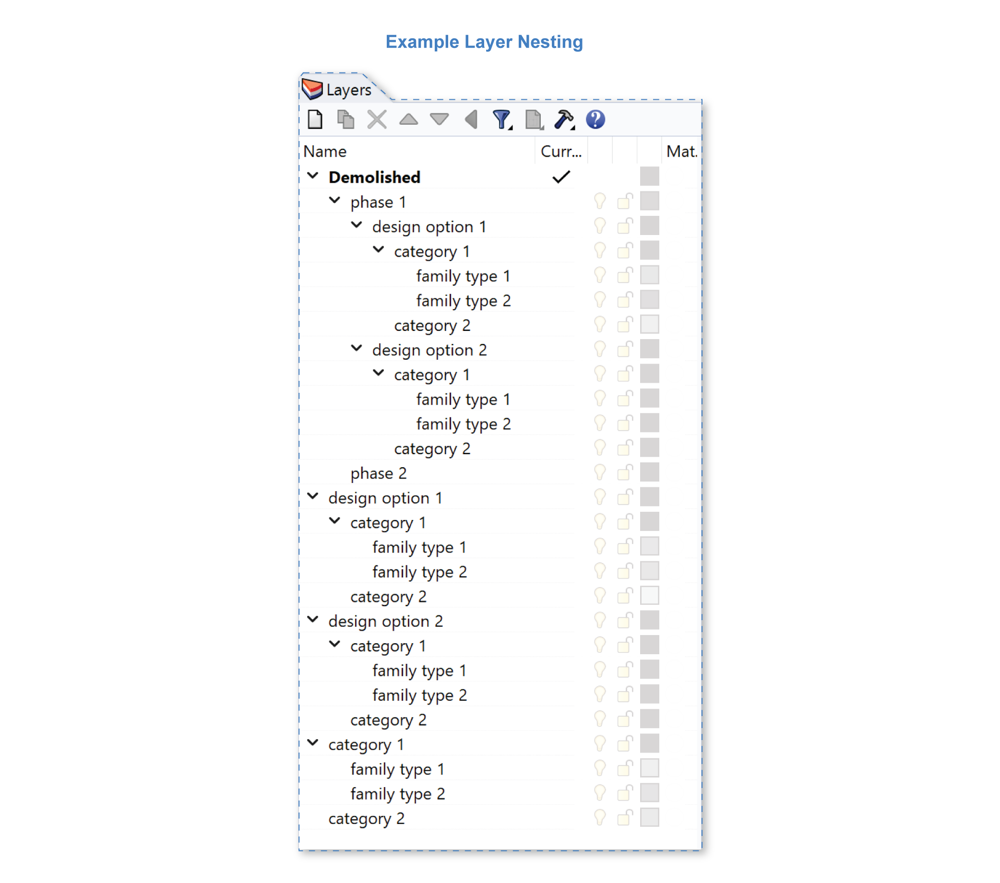

Revit Daylight Model Import 
-------------------------
This button imports a daylight model created by ClimateStudio's `Revit Exporter`_. 

.. _Revit Exporter: revitExporter.html

The Revit-to-Rhino workflow is currently in beta, and requires ClimateStudio Service Release Candidate v1.7. Please contact the ClimateStudio support team if you encounter issues. Revit modeling practices vary widely, so sharing examples is helpful for improving the software.

Import .cse file from Revit
~~~~~~~~~~~~~~~~~~~~~~~~~~~~~
Start with an **empty Rhino file**. Click the **Import .cse file from Revit** button (**1**), which is available from the setup panel of all daylight simulation workflows:

.. figure:: images/revit_importbutton.png
   :width: 900px
   :align: center

Select a .cse file to import. If your Rhino model already contains Revit elements from a previous ClimateStudio import, you will be presented with a choice:

.. figure:: images/revit_overwrite.png
   :width: 900px
   :align: center 

- **Overwrite** deletes or replaces all objects from previous ClimateStudio Revit import(s). ClimateStudio tracks each Revit element and remembers its layer placement in Rhino. If you have changed an element's Rhino layer, the layer change will be preserved when the element is overwritten.
- **Keep** retains all current Rhino objects and imports the new model. 
  
.. _Revit Exporter Plug-in: revitExporter.html

If your .cse file contains NURBS geometry, you will be presented with: 

.. figure:: images/revit_importnurbs.png
   :width: 900px
   :align: center

- **Import NURBS** imports NURBS Geometry when available, mesh geometry is created otherwise. 
- **Mesh Only** imports only mesh geometires. This will result in a lighter model. 

.. figure:: images/revit_importing.png
   :width: 900px
   :align: center

**Window** solids are reduced to **single plane surfaces** during import. Windows are separated into “interior” or “exterior” layers depending on the host wall and room data provided in the Revit model. Exterior windows have normals facing outside, which is required when `assigning blinds`_ for annual daylight simulation. 

.. _assigning blinds: blinds.html

**Rooms** from Revit are used to define **Occupied Areas** in ClimateStudio. During import, floor surfaces representing each room are placed on the "Occupied Areas" layer in Rhino. To prepare these areas for simulation, simply select the surfaces and add them to the `Occupied Areas table`_. The room names and IDs from Revit are retained.

.. _Occupied Areas table: occupiedAreas.html

.. figure:: images/revit_model.png
   :width: 900px
   :align: center

Elements from Revit are placed into different Rhino layers depending on their **Demolished Phase, Design Option, Category, and Family Type.** In the example above there is neither Design Option nor Phase information, so categories like "Walls" and "Floors" are the top-most layers. Sub-layers like "Exterior - Insulation on Masonry" are family types, which can be itemized during `export`_. 

.. _export: revitExporter.html

Below is an abstract example of how nesting works with Phases and Design Option information. 

Take care to `check your model`_ if rooms are not imported, multiple phases exist in the model, complex window geometry exists, or you are overwriting a previous model. 

.. _check your model: revitImportTroubleShoot.html

Set up Daylight Simulation
~~~~~~~~~~~~~~~~~~~~~~~~~~~~~

In the `Materials`_ panel, you will find that LM83 materials are assigned by default based on element category. Changes to layer materials in Rhino will be preserved when importing new Revit models to the existing Rhino document. 

.. figure:: images/revit_materials.png
   :width: 900px
   :align: center

To select rooms for analysis, navigate to the `Occupied Areas`_ panel and select surfaces from the "Occupied Areas" layer in Rhino. The ID and description of each area will be auto-assigned using Revit room data.

.. _Occupied Areas: occupiedAreas.html

.. figure:: images/revit_occupiedareas.png
   :width: 900px
   :align: center

The imported Revit model can be used to run the following types of analysis:

- `Point-in-time Illuminance`_
- `Daylight Availability`_
- `Annual Glare`_
- `Radiance Render`_
- `Radiation Map`_
- `View Analysis`_

.. _Point-in-time Illuminance: illuminance.html
.. _Daylight Availability: daylightAvailability.html
.. _Annual Glare: annualGlare.html
.. _Radiance Render: radianceRender.html
.. _Radiation Map: radiationMap.html
.. _View Analysis: viewAnalysis.html

.. _Materials: materials.html
.. _Occupied Areas: occupiedAreas.html

Combining Multiple Revit Models
~~~~~~~~~~~~~~~~~~~~~~~~~~~~~
Import each Revit model into its own Rhino file, make changes to layer organization as needed, and then combine the Rhino files using links. This way, if you need to re-import (overwrite) one of the files, its manual layer organization can be preserved. 

Alternatively you may import multiple .cse files into the same Rhino document by selecting the **Keep Current Model** option when asked. However, this option will not accommodate re-importing (overwriting), as all elements derived from Revit models besides the one being imported will be wiped. 

Troubleshoot Your Import
~~~~~~~~~~~~~~~~~~~~~~~~~~~~~

Here are some tips and tricks to `troubleshoot your model`_. 

.. _troubleshoot your model: revitImportTroubleShoot.html
