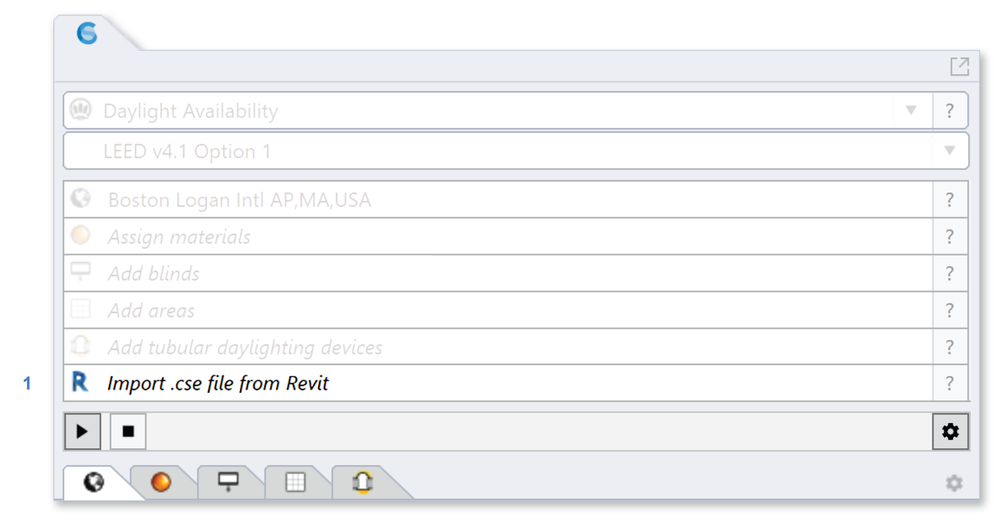
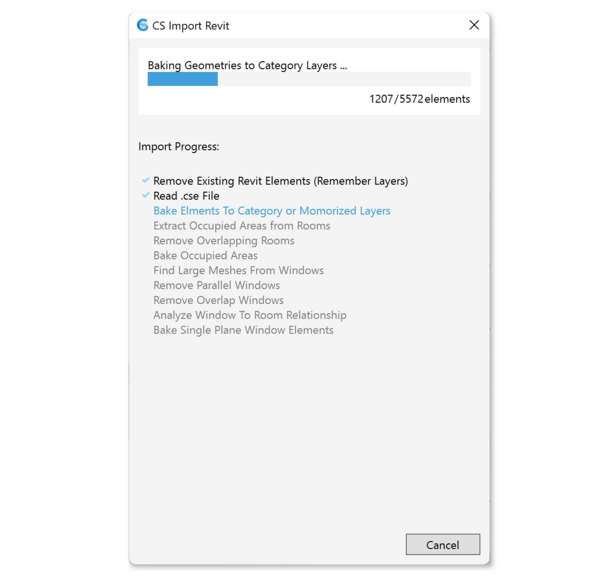
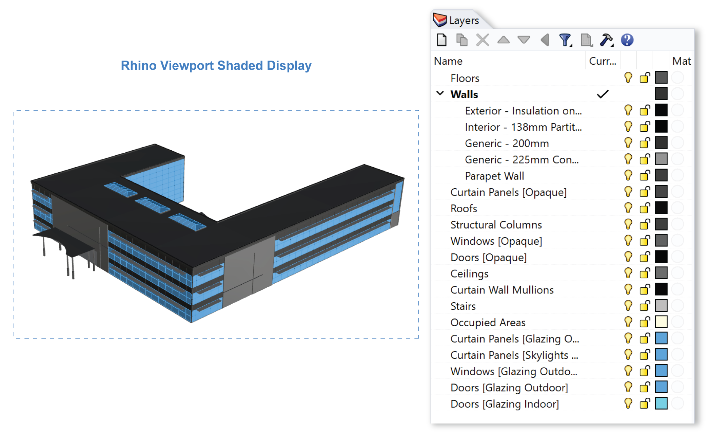
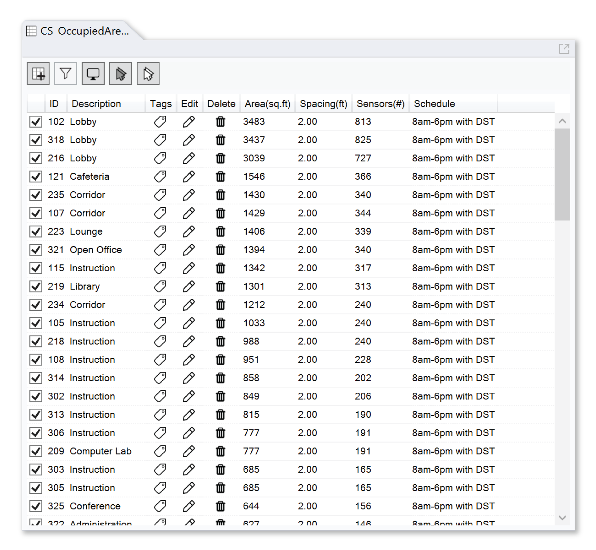

Revit Daylight Model Import 
-------------------------
This workflow imports a .cse file created by Climate Studio `Revit Exporter Plug-in`_ in order to run Daylight simulations with Climate Studio. 

.. _Revit Exporter Plug-in: revitExporter.html

Import .cse file from Revit
~~~~~~~~~~~~~~~~~~~~~~~~~~~~~
We recommend starting with an **Empty File**.

| 1 - Click button on workflow panel or Type Command `CSImportRevitCommand`. 

Select a .cse file to import. 

.. figure:: images/revit_overwrite.png
   :width: 900px
   :align: center

If this Rhino file contains Rhino Objects with RevitElementID attached, this dialog will pop up to ask if you want to overwrite the existing import. 

| 2 - Selecting **Overwrite** will Delete all Rhino Objects with Revit ElementIDs attached as a user-dictionary. It will remember the Rhino Layer each Revit Element is placed in. Later, the plug-in will place newly imported Revit Element with the same ID into the remembered Rhino Layer. 

| 3 - Selecting **Keep** will keep current Rhino Objects and Import the new model. 

**Window** Geometries are reduced to **single plane geometry**. Windows are separated into “interior” or “exterior” layers depending on the host wall and Rooms information provided in the Revit model. Exterior windows have normals facing outside. 

**Rooms** from Revit are used to define **Occupied Areas** which can be turned into **Simulation Grids**. The names and IDs of the grids will be populated with the respective Room name and Room ID. 

Elements from Revit are placed into different Rhino layers depending on their **Demolished Phases, Design Option, Category, and Family Type.** In the example above there is neither Design Option nor Phases information so Categories like "Walls" "Floors" are the top-most layers. Sub-layers like "Exterior - Insulation on Masonry" are family-types. By exploding a category into sub-layers, we can assign different materials to each sub-type. 

Below is an abstract example of how layers nesting works with Phases and Design Option information. 

.. figure:: images/revit_exampleLayers.png
   :width: 300px
   :align: center

We especially recommend `checking your model`_ if Rooms are Not Imported, multiple phases exist in this model, complex window geometries exist, or you are overwriting the current model. 

.. _checking your model: revitImportTroubleShoot.html

Set up Daylight Simulation
~~~~~~~~~~~~~~~~~~~~~~~~~~~~~

.. figure:: images/revit_materials.png
   :width: 900px
   :align: center

In the `Materials`_ panel Default LM83 materials are assigned on Import (to a fresh Rhino file). 

Populate the `Occupied Areas`_ panel with surfaces from Rhino Layer "Occupied Areas", the ID and Name of each grid will be auto-assigned based on the Room ID and Room Name in Revit.  

The Imported Revit Model can be used to run the following analysis:

| `Daylight Availability`_
| `Annual Glare`_
| `Radiance Render`_
| `Radiation Map`_
| `View Analysis`_

.. _Daylight Availability: daylightAvailability.html
.. _Annual Glare: annualGlare.html
.. _Radiance Render: radianceRender.html
.. _Radiation Map: radiationMap.html
.. _View Analysis: viewAnalysis.html

.. _Materials: materials.html
.. _Occupied Areas: occupiedAreas.html

Combining Multiple Revit Models
~~~~~~~~~~~~~~~~~~~~~~~~~~~~~
We Recommend Import each Revit model in their own Rhino file, make changes to layer organization as needed, then combine the Rhino Files. This way, when re-importing (overwriting) each Revit file to their own Rhino file, the manual layer organization will be remembered. 

Alternatively you may Import another .cse file and select **Keep Current Model** when asked. The combined Rhino file CANNOT run a overwrite import as multiple Rhino Objects are attached with the same Revit Element IDs. 

Trouble Shoot Your Import
~~~~~~~~~~~~~~~~~~~~~~~~~~~~~

Here are some tips and stricks to `trouble shoot your model`_. 

.. _trouble shoot your model: revitImportTroubleShoot.html
