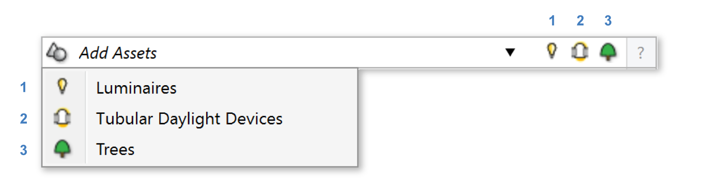

Scene Assets
================================================

Scene assets are geometries that can be placed in Rhino model as a Rhino block. These objects can be picked up by ClimateStudio when running simulations.  

As of v2.0 there are three different scene assets that can be placed: 

| 1 - `Luminaires`_ (optional)
| 2 - `Tubular Daylighting Devices`_ (optional)
| 3 - `Trees`_ (optional)

`Luminaires`_ are available for the following workflows: 

- `Point-in-time Illuminance`_
- `Radiance Render`_

`Tubular Daylighting Devices`_ are available for the following workflows: 

- `Point-in-time Illuminance`_
- `Daylight Availability`_
- `Annual Glare`_
- `Radiance Render`_

`Trees`_ are available for the following workflows: 

- `Point-in-time Illuminance`_
- `Daylight Availability`_
- `Annual Glare`_
- `Radiance Render`_
- `Radiation Map`_
- `View Analysis`_ 

.. _Trees: tree.html

.. _Luminaires: luminaires.html

.. _Tubular Daylighting Devices: TDDs.html

.. _Site Analysis: siteAnalysis.html 

.. _Radiation Map: radiationMap.html 

.. _Point-in-time Illuminance: illuminance.html

.. _Daylight Availability: daylightAvailability.html 

.. _Annual Glare: annualGlare.html

.. _Radiance Render: radianceRender.html

.. _Thermal Analysis: thermalAnalysis.html

.. _View Analysis: viewAnalysis.html