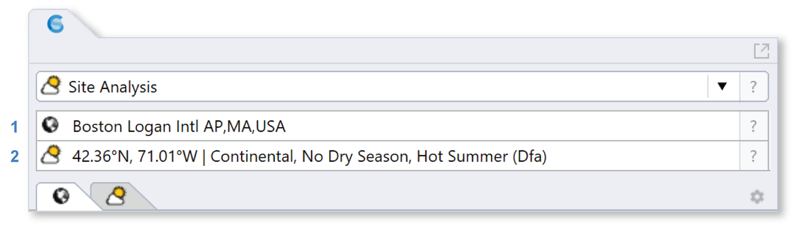
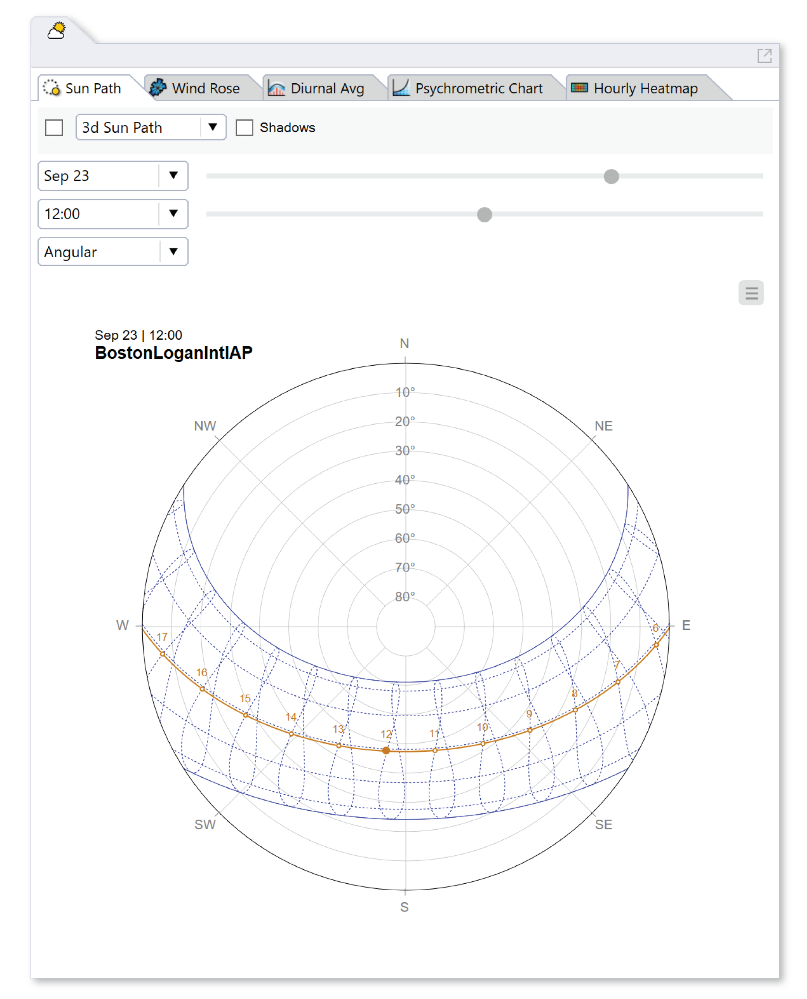

Site Analysis
================================================

This workflow supports several types of site and climate analysis, including sun path and wind diagrams, shadow studies, psychrometric charts, and hourly/diurnal plots of weather data. The workflow relies on two subpanels:

1. The `Location`_ subpanel, which is used to select a weather file and summarize its climate zone and heating and cooling design conditions.

.. _Location: location.html

2. The **Site Analysis** subpanel, which is described below:

The Site Analysis subpanel contains five tabs that help with visualizing, comprehending, and analyzing the local site and climate. 

.. toctree::
   :maxdepth: 1
   
   Sun Path<sunPath.rst>
   Wind Rose<windRose.rst>
   Diurnal Averages<diurnalAverages.rst>
   Psychrometric Chart<psychrometricChart.rst>
   Hourly Heatmap<hourlyHeatmap.rst>

The plots associated with each tab are also available as `grasshopper components`_. 

.. _grasshopper components: climateChartsGrasshopper.html
