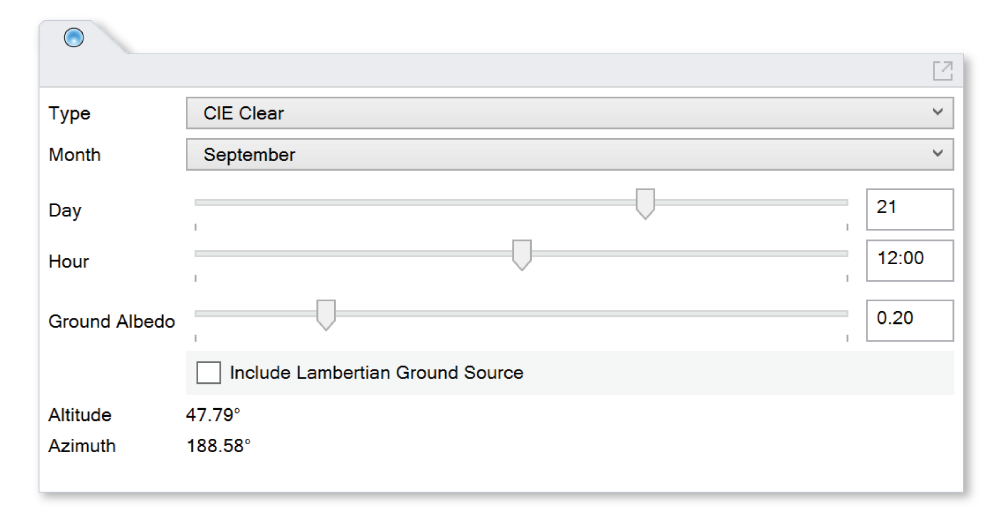

Sky
================================================

The Sky panel sets the sky luminance distribution for `point-in-time illuminance`_ calculations and `Radiance renderings`_. The sky condition can be set as follows:
	
	**Type:** Determines the sky model being used, such as the CIE Standard Clear, Intermediate or Overcast sky. In the case of the Perez all-weather sky model, direct and diffuse irradiances are drawn from the weather file based on the date and time selected.
	
	**Month, Day and Hour:** Sets the date and time of day for which the sky luminance distribution is calculated.
	
	**Ground Albedo:** Sets the diffuse reflectance of the lower hemisphere. If a ray exits the scene through the lower hemisphere without hitting a scene object, this value is used to estimate the luminance of the ground under the given sky condition.  A typical ground albedo is 20%. The user is encouraged to explicitly model any nearby ground surfaces, such as sidewalks, roads, and lawns, and to assign appropriate materials to these layers.
	
	**Include Lambertian Ground Source:** This option enforces a constant luminance over the lower hemisphere based on the ground albedo and sky condition. It creates a distinctive horizon line (appropriate for an observer near the ground), and improves the lower-hemisphere luminances returned by the native sky models, which are sometimes inaccurate. Enabling this option is recommended.
	
.. _point-in-time illuminance: illuminance.html
.. _Radiance renderings: radianceRender.html