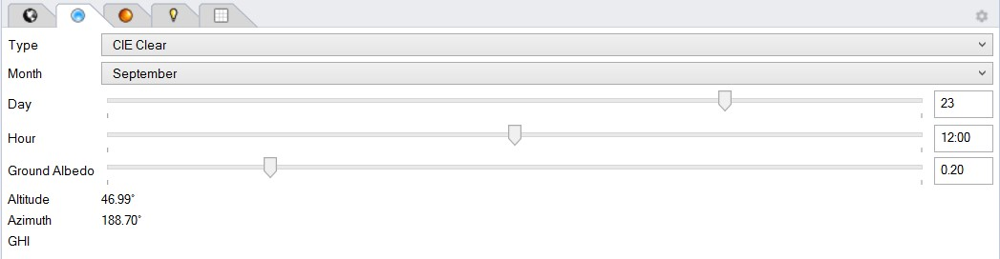

Sky
================================================

The sky subpanel facilitates the specification of a single sky luminance distribution for either a `point-in-time illuminance`_
calculation or a `Radiance Rendering`_. The sky condition can be set as follows:
	
	**Type:** The sky type determines the sky model being used such as the CIE clear, intermediate or overcast skies. For the Perez all weather sky 
	model direct and diffuse irradiances for the date and time of day  selected are taken for the EPW weather files specified under `Location.`_
	
	**Month, Day and Hour:** Set the date and time of day for which the sky luminance distribution should be calculated.
	
	**Ground Albedo:** Sets the diffuse reflectance of the lower hemisphere in the scene. If a ray leaves the scene through the lower hemisphere without hitting an explicitly model ground object, 
	this value is being used to estimate the luminance of the ground which will vary with the prevailing sky condition.  A typical ground albedo 
	is 20%. The user is encouraged to explicitly model any relevant nearby ground objects such as a streert or lawn and to assign a specific material to these ground objects.
	
.. _Location.: Location.html
.. _point-in-time illuminance: point-in-timeIlluminance.html
.. _Radiance Rendering: radianceRender.html