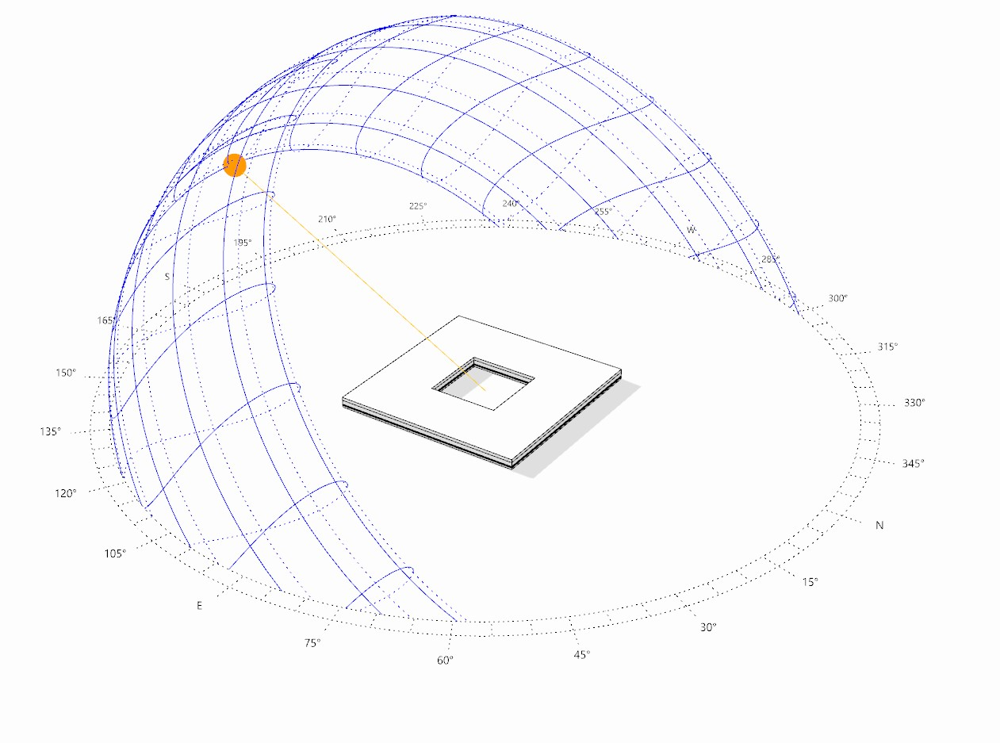

Sun Path
================================================
The sun path subpanel controls how the current sun position and how the sun path diagram is displayed in the Rhino viewport. 

.. figure:: images/SunPath.jpg
   :scale: 80 %
   :align: center

3D Sun Path
----------------
The toggle changes the Rhino viewport from its current setting to a ClimateStudio specific render model that shows the different 3D Sun Path elements as well as the shade of any objects.

*Example 3D Sun Path on winter solstice at noon in Boston*

The 3D Sun Path is highly customizable:

- Show annual sun: Shows the position of the sun on  key ways in the year such was winter/summer solstice and equinox days.
- Show annual sun path analemmas: Shows the position of the sun at the same time of day throughout the year.
- Show compass: Toggles the compass on the ground plane.
- Show sun position: Shows the current sun position in the 3D Sun Path.
- Show sun ray: Displays a rays from the current sun position to the center of the 3D Sun Path.
- Show day sun path: Shows the position of the sun for the current day.
- Render ground plane: Display shadows of scene objects on the ground plane (z-coordinate=0)

**Position:** Sets the center of the 3D Sun Path

**Radius:** Sets the radius of the 3D Sun Path in model units

Date and time of day can be set using the slider option, using presets dates and times or by manually entering the Julian date or time of day.