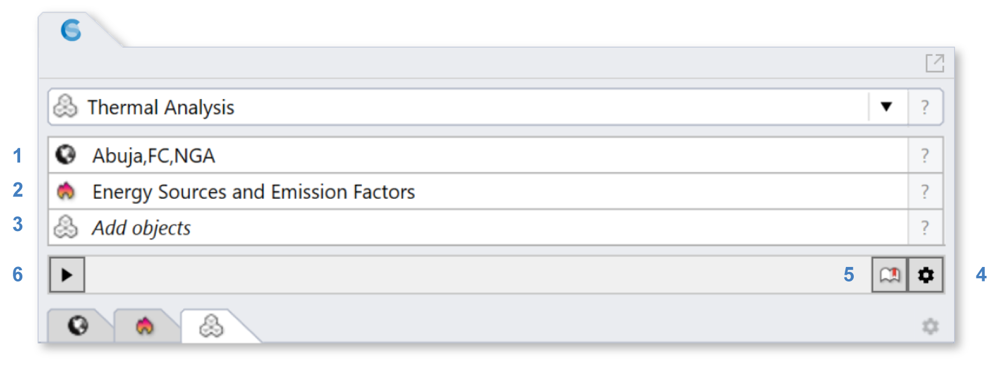

Thermal Analysis
================================================
ClimateStudio supports multi zone thermal simulations using the US Department of Energy's `EnergyPlus`_ whole building simulation program.

.. _EnergyPlus: https://energyplus.net/

   
To prepare a model for simulation, work your way through the following subpanels:

| 1 - `Location`_
| 2 - `Energy Sources and Emission Factors`_
| 3 - `Thermal Model`_
Output variables and other simulation settings may be adjusted prior to the run using the `settings dialog`_ (4). The `library manager`_ (5) facilitates browsing and/or modifying various library assets, including templates, constructions, and schedules -- all of which are also accessible when editing the Thermal Model. Once all inputs have been populated, a simulation is invoked by pressing the start button (6). A DOS window should appear, showing the progress of the EnergyPlus simulation. The run may take several minutes. 

.. _Location: location.html

.. _Thermal Model: thermalModel.html

.. _library manager: manageLibrary.html 

.. _settings dialog: energyPlus.html 

.. _Energy Sources and Emission Factors: emissionFactors.html 

.. figure:: images/result_eplusWindow.png
   :width: 900px
   :align: center

Simulation Results
------------------------
Upon completion of the simulation, the DOS window disappears and ClimateStudio automatically opens the `results panel.`_ The top of the panel shows summary results for the whole building, including the site energy use intensity (EUI) as well as annual carbon emissions and costs from operational energy use. 

.. _results panel.: results.html

   
   
The results below are organized at the whole building and zone level.

Building
--------------
- **Energy Use Intensity** shows monthly EUI levels for the whole building for heating, cooling, lighting and equipment.

- **Energy Use** shows total monthly energy use for the whole building for heating, cooling, lighting and equipment.

.. _results panel.: results.html

- **Zone Temperature Curves** show the number of hours for each zone that the operative temperature is below (red) or above (blue) a given temperature. In the example below, the operative temperature of the Open Office zone is 673h per year above 26 degrees Celsius, indicating a propensity of the space for overheating. 

.. figure:: images/result_thermalZoneTemp.png
   :width: 900px
   :align: center   
   
- **Energy Flow** indicates the monthly sum of heat flows in and out of a zone. Heat from equipment, people and electric lighting is always positive. System loads may be positive (heating) or negative (cooling).    

   
Zone
---------
At the zone level, ClimateStudio reports hourly dry bulb, mean radiant and operative temperature as well as relative humidity at the center of a zone.

   
Export
---------
The bottom of the panel contains multiple options for exporting data, including uploading results directly to the AIA 2030 Design Data Exchange.
   

   
   
   
   
   
   
   
   