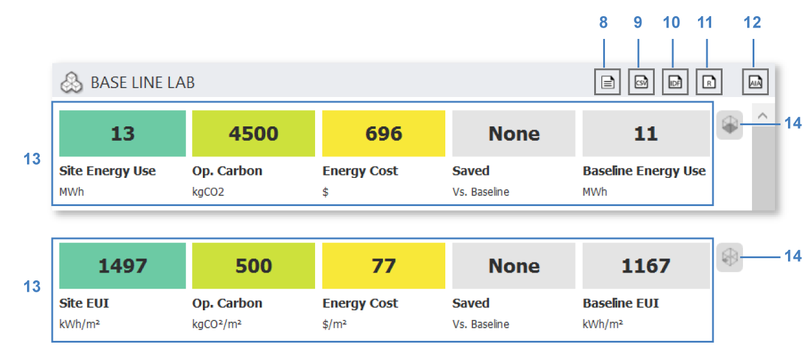
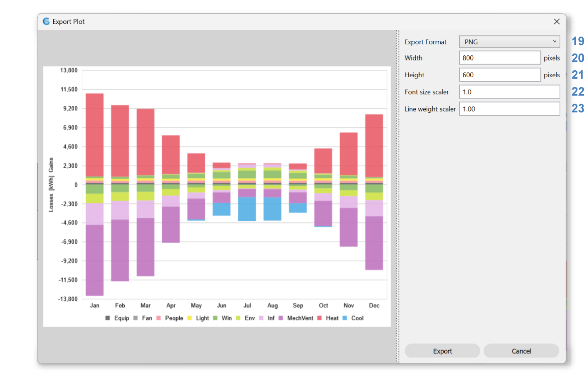

Thermal Analysis
================================================
ClimateStudio supports multi-zone thermal simulations using the US Department of Energy's `building simulation program`_. 

.. _building simulation program: https://energyplus.net/

Simulation Setup
-----------------------

.. figure:: images/thermal_workflowPanel_thermal.png
   :width: 900px
   :align: center
   
To prepare a model for simulation, work your way through the following subpanels:

| 1 - `Location`_
| 2 - `Energy Sources and Emission Factors`_
| 3 - `Thermal Model`_
| 4 - `Systems`_

Output variables and other simulation settings may be adjusted prior to the run using the `settings dialog`_ (**6**). 
The `library manager`_ (**7**) facilitates browsing and/or modifying various library assets, 
including templates, constructions, and schedules – all of which are also accessible when editing the `Thermal Model`_. 
Once all inputs have been populated, a simulation is invoked by pressing the **start button** (**5**). 
A DOS window should appear to show the progress of the EnergyPlus simulation. The run may take several minutes.

.. _Location: location.html

.. _Thermal Model: thermalModel.html

.. _Systems: thermal_system.html

.. _library manager: manageLibrary.html 

.. _settings dialog: energyPlus.html 

.. _Energy Sources and Emission Factors: emissionFactors.html 

Simulation Results
------------------------
Upon completion of the simulation, the DOS window disappears and ClimateStudio automatically opens the `results panel`_. 

.. _results panel: results.html

   
The simulation **run log** (**8**), **export data** (**9**), **pdf export** (**10**), 
and **generate report** (**11**) are located on the top right of the result. 
A dedicated button for **AIA DDX Reporting** (**12**) is on the very right. 
Clicking on it will show a dialog that helps to submit to AIA 2030 Design Data Exchange: 

The top of the result panel (**13**) shows summary results for the whole building, 
including the **site energy use** or **energy use intensity (EUI)** as well as **annual carbon 
emissions and costs** from operational energy use. Click the **normalized/total** (**14**) button to switch the summary between normalized and whole building modes.  

The rest of the results are organized at the whole building and zone level. 

Building
~~~~~~~~~~

Use dropdown (**15**) to switch between 9 different graphs: 

-	**Energy Use Intensity** shows monthly EUI levels for the whole building for heating, cooling, fans, pumps, lighting, hot water, humidification, heat rejection, and equipment. 

-	**Energy Use** shows the total monthly energy use for the whole building for heating, cooling, fans, pumps, lighting, hot water, humidification, heat rejection, and equipment. 

-	**Zone Temperature Curves** show the number of hours for each zone in which the operative temperature is below (red) or above (blue) a given temperature. In the example below, the operative temperature of the Open Office zone is 673h per year above 26 degrees Celsius, indicating a propensity of the space for overheating.

-	**Energy Flow**     indicates the monthly sum of heat flows in and out of a zone. The heat from equipment, people, and electric lighting is always positive. System loads may be positive (heating) or negative (cooling). 

-	**Fuel Use** indicates the monthly consumption (kWh or kBtu) of each Fuel type. This depends on the PE set in the  `Energy Sources and Emission Factors`_ panel. 

-	**CO2 Emissions by Fuel** shows the monthly CO2 emission for each Fuel Type, also affected by the CO2 set in the  `Energy Sources and Emission Factors`_ panel.

-	**Load Duration** graphs the number of hours the system's loads are at a certain level in descending order. This is a good way to see if there are outlier hours that have much higher loads than the rest of the year and can be easily optimized. Since the size of the system components depends on the greatest load it needs to handle, lowering the outlier maximum load will qualify the building to be equipped with a smaller system component and save cost.  

-	**Peak Heating Week** shows the week around the hour with the maximum heating load. This is another good way to target the week with the most heating demand with other design strategies so that the heating system can be smaller. 

-	**Peak Cooling Week** shows the week around the hour with the minimum cooling load. 

All graphs can be shown in **SI unit or IP unit** (**16**), exported as **csv** (**17**), or **plotted** (**18**). 

The plotter provides options to choose between PNG and PDF formats (**19**), size adjustments (**20**, **21**), 
font size scaler (**22**), and line weight scaler (**23**). 
   
Zone
~~~~~~~~~~
At the zone level, ClimateStudio reports hourly exterior dry bulb, mean radiant, air, 
and operative **temperature** as well as exterior relative humidity and relative humidity at the center of a zone: 

   
Choose a zone from the **zone table** (**26**) to show the zone’s data in the graph above. 
When there are too many zones, use the name filter (**25**) to help narrow down the table. 

**Energy Flows** graph is also available for each zone, use the dropdown (**24**) to switch between the two graphs. 

| 

To compare several results, use our `result comparison`_ tool. 

.. _result comparison: resultComparison.html

   
   
   
   
   
   