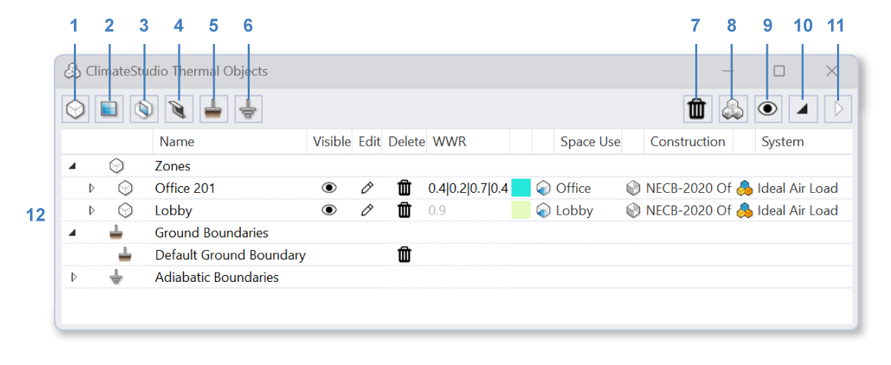
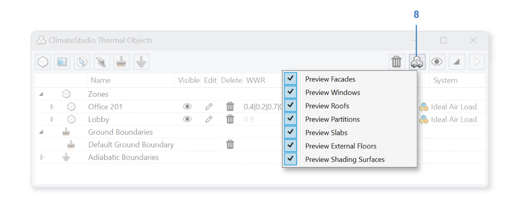
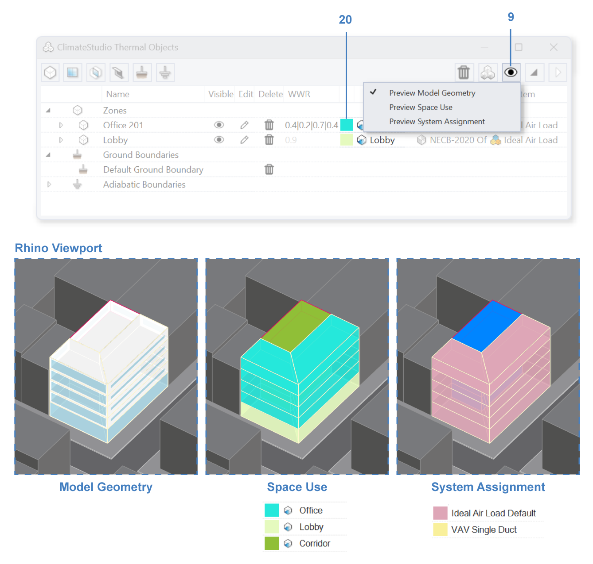
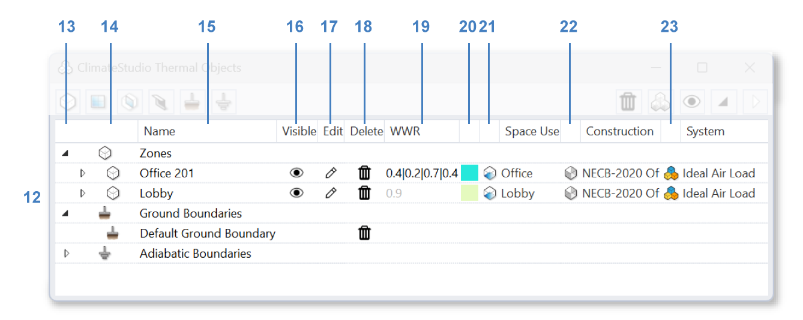
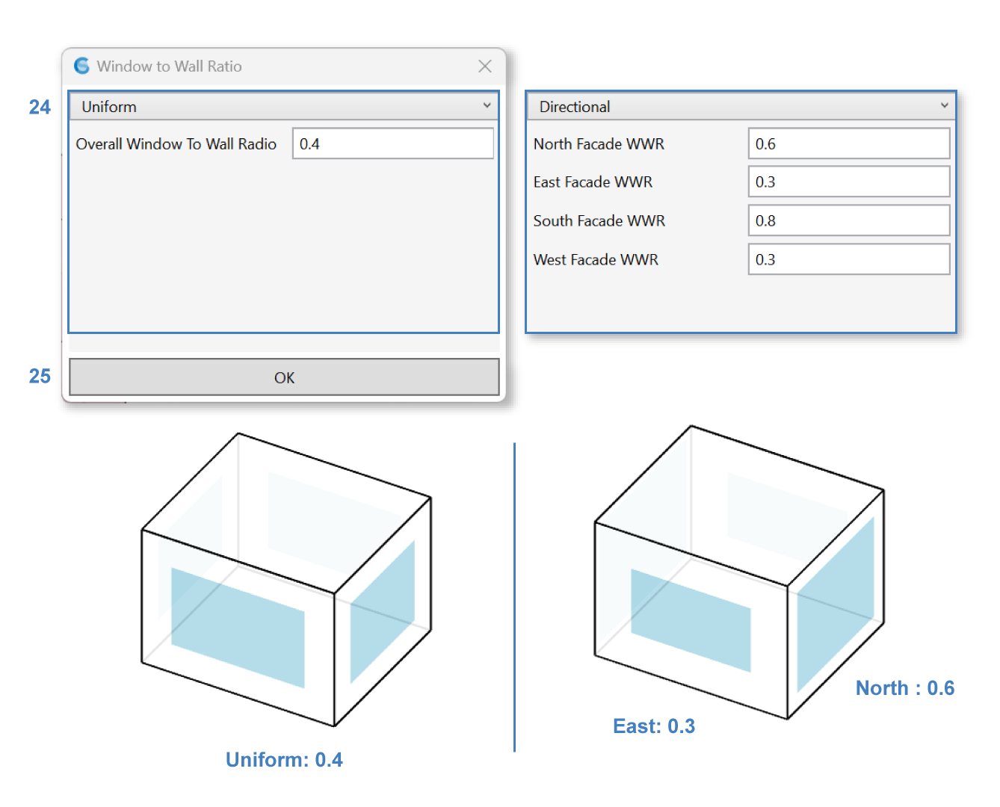
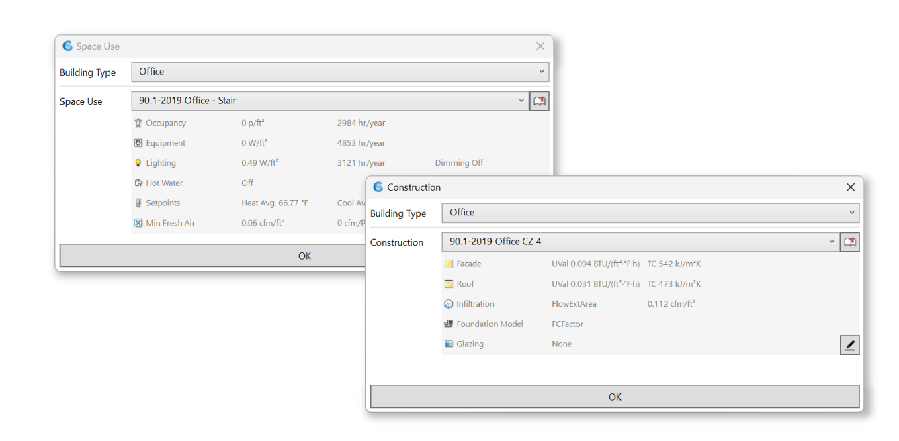
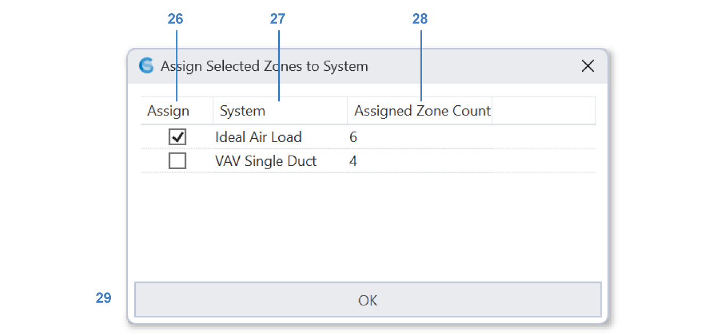

Thermal Model
================================================

This panel is used to build a multi-zone EnergyPlus model for `Thermal Analysis`_. It is worthwhile pointing out that the thermal model is assumed to be built separately from the daylighting model in ClimateStudio. Both models can be stored on separate layers in the same Rhino file. 

.. _Thermal Analysis: thermalAnalysis.html

Add the following geometric objects to ClimateStudio by clicking on the respective buttons: 

- `Zone`_
- `Exterior Window`_ (openings to outside)
- `Interior Window`_ (openings between zones)
- `Shading`_
- `Ground Surface`_
- `Adiabatic Surface`_

.. _Zone: thermal_zone.html
.. _Exterior Window: thermal_window.html
.. _Interior Window: thermal_window.html
.. _Shading: thermal_shading.html#shading
.. _Ground Surface: thermal_boundaryConditions.html#ground
.. _Adiabatic Surface: thermal_boundaryConditions.html#adiabatic

Use the Buttons on the top right to control the Rhino viewport preview and navigate the Thermal Model Table (**12**). 

Change the **Preview Settings** (**8**) of the model to hide or show components of a thermal model. For example, hiding all the roofs and floors is a good way to check if all the partitions and interior windows are created correctly. 

Changing the **Preview Mode** switches between viewing the **Model Geometry**, coloring the zones by **Space Use** (**20**), or coloring the zones by `system`_ assignments. This is useful for creating diagrams or quickly checking model settings.  

.. _system: thermal_system.html

Thermal Model Table
----------------

The Thermal Model Table (**12**) organizes `zones`_, faces and `windows`_ in a nested tree structure that allows **editing** (**17**), 
**deleting** (**18**) and temporarily **hiding** (**16**) model objects. 
The table supports multi-select for convenient batch editing. 
Any operation will be performed to all applicable items selected. 

.. _zones: thermal_zone.html
.. _windows: thermal_window.html

A Default `Ground Boundary`_ object is created for any new thermal model at z = 0. This can be turned off or deleted (**7**). 

.. _Ground Boundary: thermal_shadingGroundAdiabatic#Ground.html

Use the **expand all** (**10**) and **collapse all** (**11**) buttons to help navigate the table: 

| 13 - Expand or collapse  
| 14 - Item **Icon**  
| 15 - Item **Name**, double click to rename  
| 16 - **Visibility**, click to toggle  
| 17 - **Edit All Properties**, click to open an editor dialog
| 18 - **Delete**, Or click the Delete button (**7**) above the table
| 19 - **Window-to-wall Ratio** for auto-generated windows (Zones only). This column will be greyed out if the zone has any custom windows assigned, and ClimateStudio will not auto-generate any windows using the WWR settings. Click to edit window the window-to-wall ratio. Either a Uniform (**24**) ratio can be applied to all cardinal directions, or each Direction (**24**) can have different ratios. Click OK (**25**) to confirm the edit. The thermal model will auto-rebuild to reflect any of these changes. 

| 20 - **Space Use color** (Zones only), this color will be used to color the zone in **Space Use Preview Mode**. Click to edit color
| 21 - Edit **Space Use** (Zones only), click to open the editor
| 22 - Edit **Construction** (Zones only), click to open the editor. See Thermal `Zone`_

| 23 - Edit **System** (Zones only), click to open the editor. Click on the checkbox (**26**) of the respective system (**27**) and click OK (**29**) to confirm the `system`_ assignment. Only one system may be selected. 

|

Back to `Thermal Analysis`_. 

.. _Thermal Analysis: thermalAnalysis.html