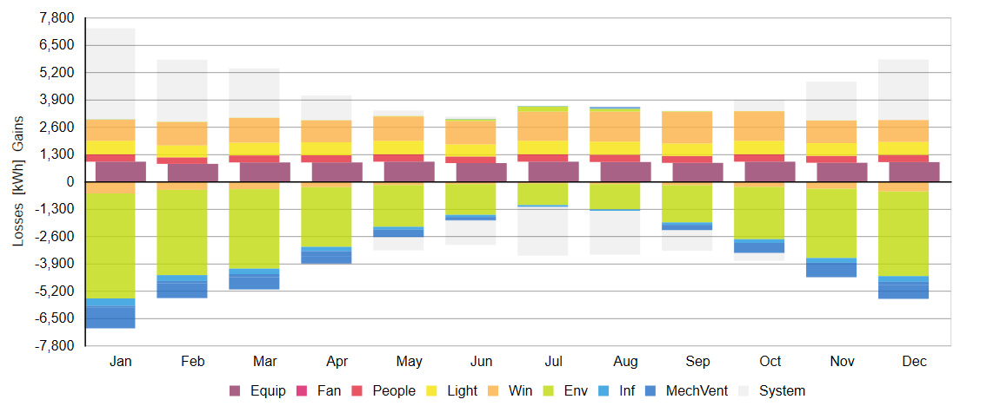

Thermal Model
================================================
Climate Studio supports multi zone thermal simulations using the US Department of Energy’s `EnergyPlus`_ whole building simulation program. The workflow has two simulation subpanels plus a detailed *Manage Library* menu and *EnergyPlus Simulation Settings.*

.. _EnergyPlus: https://energyplus.net/

.. figure:: images/ThermalModel_GUI.jpg
   :width: 900px
   :align: center
   
- The `Location Subpanel`_ 

- The `Add Objects Subpanel`_

- The `Manage Library Menu`_

- The `EnergyPlus Simulation Settings`_

.. _Location Subpanel: Location.html

.. _Add Objects Subpanel: addObjects.html

.. _Manage Library Menu: manageLibrary.html 

.. _EnergyPlus Simulation settings: EnergyPlus.html 

Once all required input subpanels have been populated, a simulation is invoked by pressing the start button. A DOS window should appear that is running the EnergyPlus simulation.  This takes several minutes and the progress of the simulation is visible on screen.

Simulation Results
------------------------
Upon completion of the simulation the DOS window disappears and ClimateStudio automatically switches into the `results panel.`_ The image below shows an annual thermal loads simulation of the two zone ClimateStudio demo model located in Boston The Viewport to the left shows all objects that make us the thermal model The energy results are shown in the lower results panel of the right.

.. _results panel.: results.html

   
The top panel shows some summary results for the whole building including the site energy use intensity (EUI) as well as annual carbon emissions and costs from operational energy use.  

   
The results below are organized at the whole building and zone level.

Building
--------------
- **Energy Use Intensity** shows monthly EUI levels for the whole building for heating, cooling, lighting and equipment

- **Energy Use** shows total monthly energy use for the whole building for heating, cooling, lighting and equipment

- **Zone Temperature Curves** show the number of hours for each zone that the operative temperature is below (red) or abor (blue) a given temperature. In the example below, the operative temperature Open Office zone is 73h per year above 26oC indicating a potential propensity for overheating. 

   
- **Energy Flow** indicates the monthly sum of heat flows into and out of a zone. Heat from equipment, people and electric lighting is always positive. System loads may be positive (heating) or negative (cooling).    

   
Zone
---------
At the zone level ClimateStudio reports hourly dry bulb, mean radiant and operative temperature as well as relative humidity at the center of a zone.

   
   
   
   
   
   
   
   
   
   
   
   
   