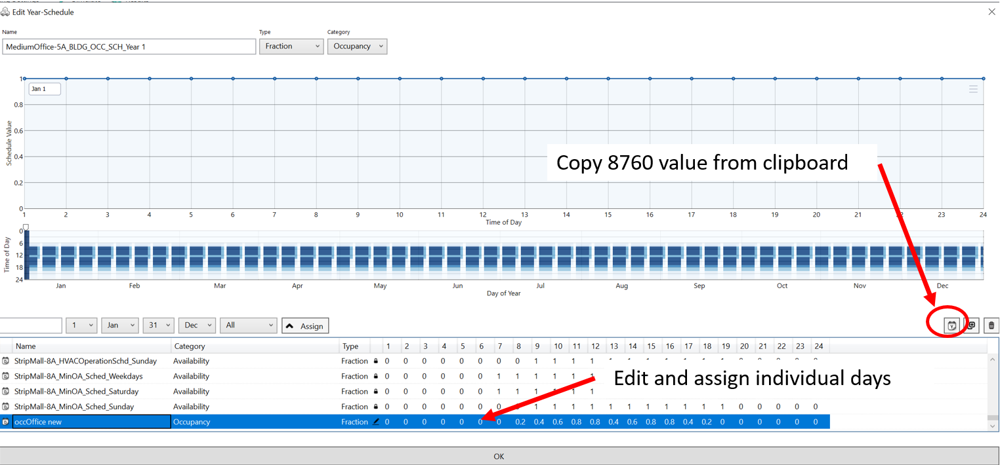
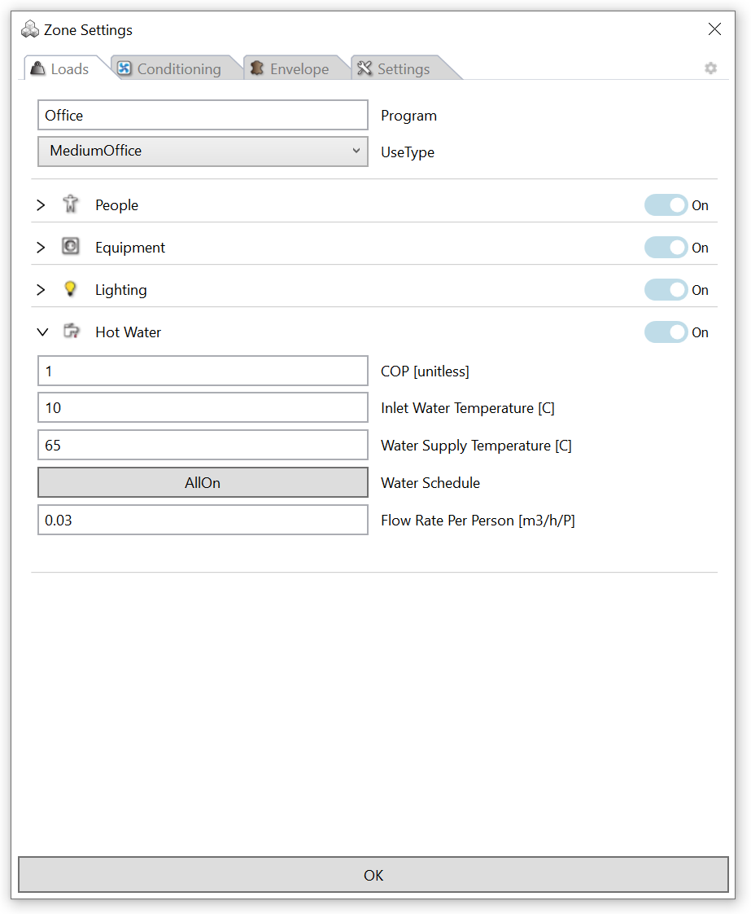

Thermal Zone Settings
================================================
When a zone template is first assigned to a zone object (brep), hundreds of zone settings are assigned to the zone based on the template. All zone information can be reviewed and edited by selecting the edit button in the thermal model object table. 

   
The Zone Settings panel is organized into six tabs: Loads, HVAC, Ventilation, Water, Material and Settings. 

.. figure:: images/thermalZoneSettings2.png
   :width: 600px
   :align: center
   
Loads
-----------
Under this tab, the internal loads of a zone are specified due to people, equipment and electric lighting. The user should make sure that the numbers selected for a given zone constitute a meaningful approximation of how a modeled space is being used or will most likely be used in the case of a design model. For each internal load type, there is a peak load (density) normalized by floor area that indicates the heat added to a space at maximum occupancy or when all equipment and lighting is being switched on. Each internal load is further described by a schedule that consists of 8760 values for each hour of the year between zero and one. The figure below shows the Schedules Editor with the default occupancy schedule for a medium office.  The top figure shows the hourly schedule for the first day of the year. The lower figure shows the schedule for all hours in the year. Clearly visible is the high occupancy on weekdays from 8am to 6pm, with a lunch period from noon until 2pm. A schedule value of 0.5 at 1pm on weekdays shows that half of the occupants are at lunch at that time. Between the weekdays, the weekends with markedly lower occupancy are clearly visible.

.. figure:: images/thermalZoneSettings3.png
   :width: 900px
   :align: center
   
Schedules that come with the ClimateStudio library are locked. To modify a schedule, create a copy and rename it. Select the edit icon to modify the new schedule (see image below).

.. figure:: images/thermalZoneSettings4.png
   :width: 900px
   :align: center
   
As shown below, year schedules can be edited in two ways:

- Based on individual days that can then be assigned to any particular day in the year or to all weekdays/weekends, etc. Same as for annual schedules, to modify a day schedule, create a copy of an existing day schedule and modify the 24 hours values for the day as needed. 

- Another option is to import a custom series of 8760 values from the clipboard. 

HVAC
-----------
Comming soon.

.. figure:: images/ZoneHVAC.PNG
   :width: 900px
   :align: center

Ventilation
-----------

.. figure:: images/ZoneVentilation.PNG
   :width: 900px
   :align: center

This section controls three different approaches to model natural ventilation or infiltration. Note: These controls do not have an effect when you select the “AirflowNetwork” options in the advances Simulation Settings. 
Scheduled Ventilation:
Scheduled ventilation allows modelers to control hourly air change rates using a schedule.
This option is useful if you know the flow rate already (i.e., because you ran an external CFD or CONTAM simulation). Otherwise, it is advisable to refer to the modeling approach below.
Natural Ventilation:
The natural ventilation section provides a simple approach to simulate natural ventilation. You can select the driving force for the flow to be either buoyancy-driven flow only, wind-driven, or both together. A conservative, worst-case scenario is to assess natural ventilation with just buoyancy-driven flow. This driving force is more reliable than wind. Wind patterns can fluctuate drastically based on the location and context of the site. When “wind-driven flow” is selected, the simulation model assumes an ideal exhaust and that you can cross-ventilate. You can read more about these models in the EnergyPlus InputOutput reference in the “ZoneVentilation:WindandStackOpenArea” section.
Infiltration:
This section models infiltration rates using the “ZoneInfiltration:DesignFlowRate” model.
The question of typical values for these coefficients is subject to debate. Ideally, one should do a detailed analysis of the infiltration situation and then determine a custom set of coefficients using methods such as those laid out in Chapter 26 of the ASHRAE Handbook of Fundamentals. The EnergyPlus defaults are 1,0,0,0 which give a constant volume flow of infiltration under all conditions [EnergyPlus InputOutput reference].

Water
-----------

Comming soon.

Materials
-----------

.. figure:: images/ZoneMaterials.PNG
   :width: 900px
   :align: center

Comming soon.

Settings
-----------

.. figure:: images/ZoneSettings.PNG
   :width: 900px
   :align: center

Comming soon.

**Carbon And Cost Factors**

Under the settings tab the user can specify carbon and cost factors for heating, cooling, hot water use and electricity. These conversion factors are then used to translate the different loads into equivalent 
carbon emissions or energy costs. For example, an electricity price of 0.106 $/kWh corresponds to the 2019 average US retail price for electricity. At the same time, the approximate US retail price for natural 
gas was 0.04 $/kWh. The ClimateStudio default values for electricity (cooling and electricity) of 0.612 CO2e kg/kWh correspond to the 2017 average value for the US grid. It is worth pointing out that these 
numbers are highly variable both over time and regionally. Up to date numbers for different US zip codes are provided by the Energy Protection Agency’s Power Profiler https://www.epa.gov/energy/power-profiler#/.
