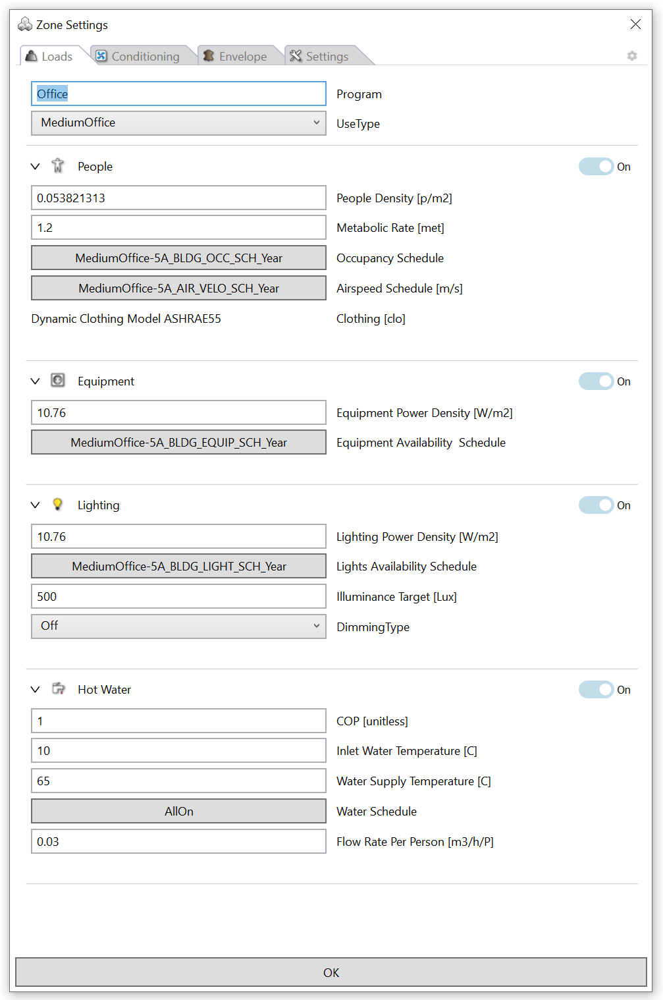
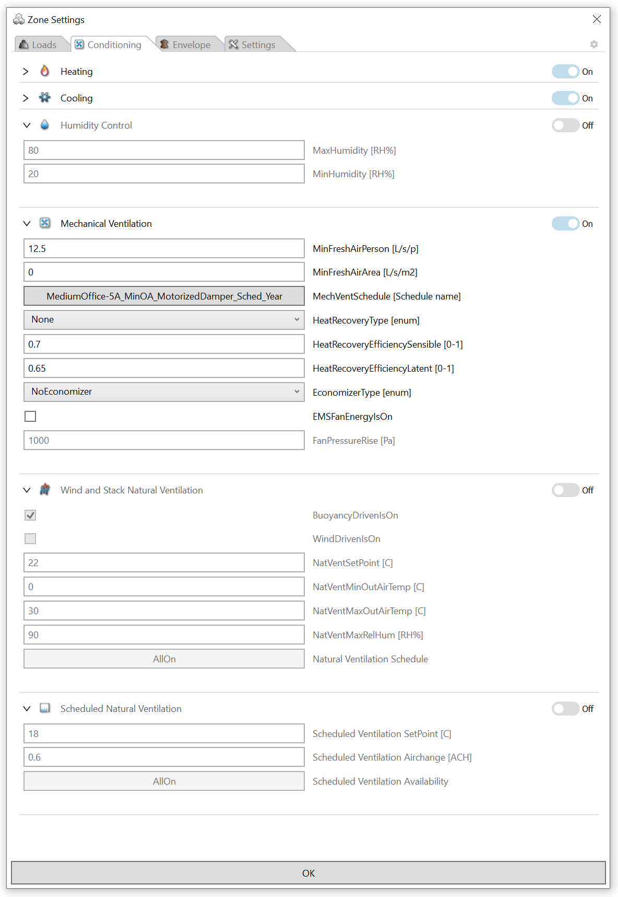

Thermal Zone Settings
================================================
When a zone template is first assigned to a zone object (brep), hundreds of zone settings are set based on a zone template. 
ClimateStudio comes with hundreds of pre-populated zone templates based on vetted data sets such as the US Department of Energy's Commercial Prototype Building Models that are stored in a `Template Libary`_. 
Once assigned to a zone, all zone information can be reviewed and edited by selecting the edit button in the thermal model object table. 

.. _Template Libary: manageLibrary.html

.. figure:: images/thermalZoneSettings.png
   :width: 900px
   :align: center
   
Zone infomation are assigned to each zone individually, meaning that if the user changes the properties of one zone from the default template value, those properties remain unchanges for other zones in the model with the same base template. 
To edit multiple zones at a time, select those zones using control or shift in the thermal model properties tab before selecting the edit button. 

As shown below, the Zone Settings panel is organized into four tabs: Loads, Conditioning, Envelope, and Settings. 

   

Loads
-----------
Under this tab, the internal loads of a zone are specified due to people, equipment, electric lighting, and hot water. The user should make sure that the numbers selected for a given zone constitute a meaningful approximation of how a modeled space is being used or will most likely be used in the case of a design model. For each internal load type, there is a peak load (density) normalized by floor area that indicates the heat added to a space at maximum occupancy or when all equipment and lighting is being switched on. Each internal load is further described by a schedule that consists of 8760 values for each hour of the year between zero and one. 
To visualize/edit a schedule, left-click on the schdule name to open the `Schedules Editor`_. The different load entry fields are described below.

.. _Schedules Editor: ScheduleEditor.html

**Zone Name** is a unique string to define the name of the zone. The same name will be attached to a zone's thermal results. It is recommended to name zones based its orientation, floor and program type such as "South Office 1stFloor".  

**Program Description** is a string that describes the general nature of the zone. This input is not used in the actual simulation. 

**Use Type** acts as a tag to describe the programmtic use of a zone. Zones can be grouped in the template libary based on their program type.  

**People Density** is a positive number that describes the number of occupants per m2 at peak density. 

**Metabolic Rate** A person’s metabolic rate corresponds to the speed at which chemical energy that is converted into heat. Metabolic rate depends on activity level (sitting, walking,…) as well as environmental factors such as ambient temperature and relative humidity. Metabolic rate is expressed in a unit called "met" with 1 met = 58.2 W/m2, which roughly corresponds to the heat emitted per unit surface area of an average person seated at rest. The body surface area of an average adult is 1.8m2 meaning that a sitting adult emits around 58.2 W/m2 x 1.8m2 = 104W. Metabolic rates range from about 0.7met for sleeping to 2.0met or more for walking, lifting heavy objects etc. 

**Occupancy Schedule** is the schedule used to describe occupancy in the zone over time. Occupancy can range from zero to peak occupancy. 

**Airspeed Schedule** is the schedule used to local air movement in m/s within the zone which may be caused be caused by a combination of natural air movement from open windows, personal comfort fans or nearby air outlets. This air speed has not impact on energy use but modifies thermal comfort metrics such as Predicted Mean Vote and Adaptive Thermal Comfort for the zone.    

**Equipment Power Density** is a positive number that describes the peak energy emitted from all equipment in the zone such as computers, printers, coffee machines etc. It is provided in W per unit of floor area.

**Equipment Schedule** is the schedule used to describe equipment load in the zone over time. 

**Lighting Power Density** is a positive number that describes the peak electricity load per unit of floor area when all luminaires in the zone are switched on.

**Lighting Schedule** is the schedule used to describe when the electric light is switched on. A fraction such as 0.3 indicates that 30% of the luminaires in the zone are turned on.
 
**Target Illuminance** sets the work plane illuminance used if the zone has a photocell controlled dimming system. EnergyPlus places an upward facing photosensor in the center of the zone and calculates indoor illuminance levels due to daylight at every simulation time step using the so-called "split flux method."

**Dimming Type** is used to specify the presence of a photocell controlled dimming system. When switched "off," the electric lighting energy corresponds to the product of the zone's lighting power density and the schedule value for that hour. If a dimming system is switched on, the value is further scaled down depending on the horizontal work plane illuminance due to daylight: If it is above the target illuminance, the lighting gets switched off. For a "stepped" dimming system it is fully on once the daylighting level falls below the target illuminance. For "continuous dimming," the level linearly scales down from one at  night to zero at target illuminance.
  

Conditioning
-----------
Heating, Cooling, Humidity, and Ventilation Controls are all under the Conditioning tab. 

This section controls three different approaches to model natural ventilation or infiltration. Note: These controls do not have an effect when you select the “AirflowNetwork” options in the advances Simulation Settings. 

1. Scheduled Ventilation
   
   Scheduled ventilation allows modelers to control hourly air change rates using a schedule.
   This option is useful if you know the flow rate already (i.e., because you ran an external CFD or CONTAM simulation). Otherwise, it is advisable to refer to the modeling approach below.

2. Natural Ventilation
  
   The natural ventilation section provides a simple approach to simulate natural ventilation. You can select the driving force for the flow to be either buoyancy-driven flow only, wind-driven, or both together. A conservative, worst-case scenario is to assess natural ventilation with just buoyancy-driven flow. This driving force is more reliable than wind. Wind patterns can fluctuate drastically based on the location and context of the site. When “wind-driven flow” is selected, the simulation model assumes an ideal exhaust and that you can cross-ventilate. You can read more about these models in the EnergyPlus InputOutput reference in the “ZoneVentilation:WindandStackOpenArea” section.

3. Infiltration
   
   This section models infiltration rates using the “ZoneInfiltration:DesignFlowRate” model.
   The question of typical values for these coefficients is subject to debate. Ideally, one should do a detailed analysis of the infiltration situation and then determine a custom set of coefficients using methods such as those laid out in Chapter 26 of the ASHRAE Handbook of Fundamentals. The EnergyPlus defaults are 1,0,0,0 which give a constant volume flow of infiltration under all conditions [EnergyPlus InputOutput reference].

Envelope
-----------

This tab defines the construction of each zone. 

A **Construction** meterial is set for the different types of surfaces each zone may have: 

- **Roof**: exterior top surfaces
- **Facade**: exterior side surfaces
- **Partition**: interior walls
- **Slab**: interior floors (this will be used for interior floors and interior ceilings)
- **External Floor**: exterior bottom surfaces (that does not touch the ground)
- **Ground Salb**: exterior bottom surfaces that touches the ground surface
- **Ground Wall**: exterior surfaces that is below the ground surface that is not a ground slab. 

Any other **internal masses** will also has it's material. Internal thermal walls or large beams and columns will be accounted for here. 

**Foundation** settings for the ground is calculated based on 3 different methods. 

1. Ground
	If a surface is defined as `ground`, it is assumed that it touches ground at the constant monthy temperature set under `Advanced EnergyPlus settings`_. Ground surfaces are colored in green. Please note that nearly every thermal model needs ground surfaces as the building otherwise floats above the ground as if on stilts.

.. _Advanced EnergyPlus settings: EnergyPlus.html	

2. Ground FC
	If a surface is defined as `ground FC`, it is assumed that it touches if uses the so-called FC method from the ASHRAE Handbook of Fundamental as explained in the `EnergyPlus Engineering Reference`_.   
	
.. _EnergyPlus Engineering Reference: https://bigladdersoftware.com/epx/docs/8-7/engineering-reference/ground-heat-transfer-calculations-using-c.html	

.. figure:: images/addObjects17.png
   :width: 500px
   :align: center

3. Ground in KIVA (Grasshopper only)
	If a surface is assigned a 'KIVA' boundary condition object, it uses the KIVA source ground heat transfer calculation tool in EnergyPlus as documented under
	https://bigladdersoftware.com/epx/docs/8-7/engineering-reference/ground-heat-transfer-calculations-using-kiva.html and https://kiva.readthedocs.io/en/stable/.

.. figure:: images/addObjects16.png
   :width: 500px
   :align: center

Settings
-----------

**Carbon And Cost Factors**

Under the settings tab the user can specify carbon and cost factors for heating, cooling, hot water use and electricity. 
These conversion factors are then used to translate the different loads into equivalent 
carbon emissions or energy costs. 

For example, an electricity price of 0.106 $/kWh corresponds to the 2019 average US retail price for electricity. 
At the same time, the approximate US retail price for natural gas was 0.04 $/kWh. 

The ClimateStudio default values for electricity (cooling and electricity) of 0.612 CO2e kg/kWh correspond to the 2017 average value for the US grid. It is worth pointing out that these 
numbers are highly variable both over time and regionally. Up to date numbers for different US zip codes are provided by the Energy Protection Agency’s Power Profiler https://www.epa.gov/energy/power-profiler#/.
