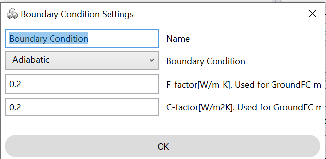

Boundary Conditions
================
Boundary conditions are surfaces such as interior adiabatic surfaces or the ground. 
They have to be defined as 3 or 4 corner surface objects in Rhino that are coincident with a `thermal zone`_ surface. 

.. _thermal zone: thermal_zone.html

Adiabatic
-----------------
If a surface is defined as `adiabatic`, no heat flow will go through it during a simulation. Adiabatic surfaces are colored in orange in the `thermal model`_.

   
.. _thermal model: thermalModel.html

In the case of the ClimateStudio demo file, one may assume that the model only represents part of a larger building and that the three surfaces towards the West and North are adiabatic. The figure below shows how this would be modeled in ClimateStudio.

  .. figure:: images/thermal_ExampleAdiabatic.png
     :width: 900px
     :align: center
     
.. _Thermal Analysis: thermalAnalysis.html

Ground
------------------
If a surface is defined as `ground`, it is assumed that it touches ground at the constant monthly temperature set under `Advanced EnergyPlus settings`_. Ground surfaces are colored in green in the `thermal model`_. Please note that nearly every thermal model needs ground surfaces as the building otherwise floats above the ground as if on stilts.

A default ground is provided for any new thermal model at z = 0. This can be deleted or turned off. 

.. _Advanced EnergyPlus settings: energyPlus.html	

  .. figure:: images/thermal_ExampleGround.png
     :width: 900px
     :align: center