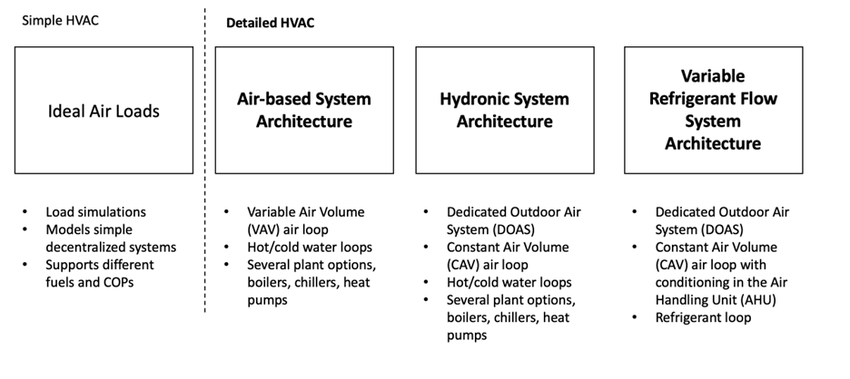
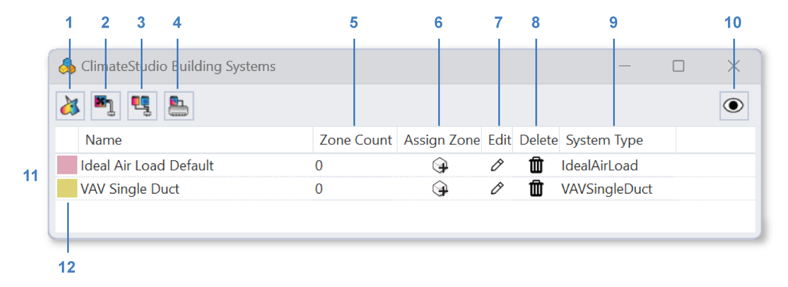
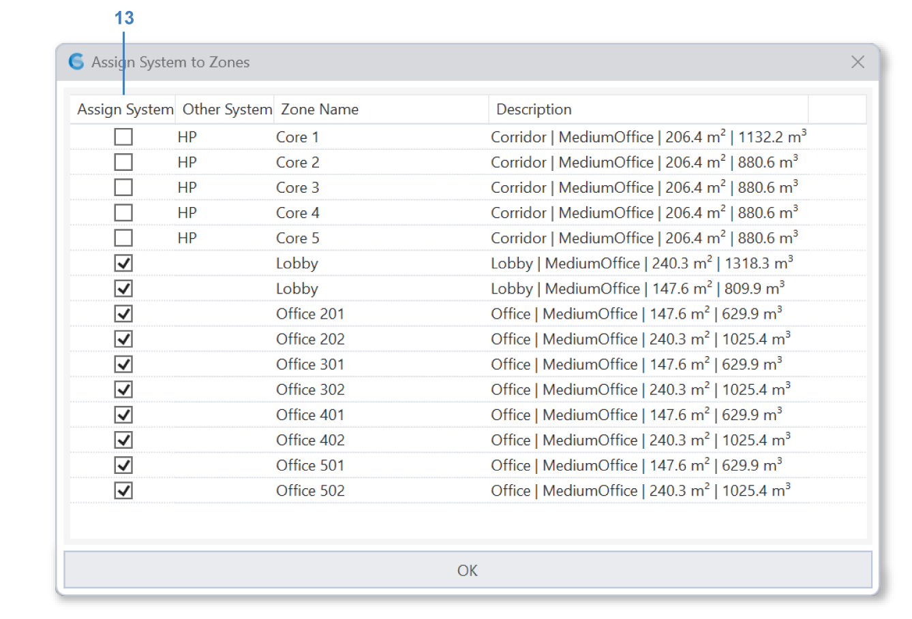
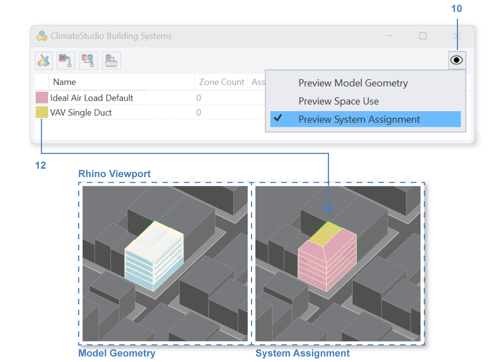

HVAC Systems in ClimateStudio 
================================================
ClimateStudio offers both early design energy load modeling using the **Ideal Air Loads System** and common system archetypes that allow modelers to `simulate`_ the effects of real HVAC systems. 
ClimateStudio supports three widely used HVAC system types that distinguish themselves mainly through the **medium used to transport energy** to and from the zones — air, water, or refrigerant.

.. _simulate: thermalAnalysis.html

In the Rhino user interface, 
systems are assigned in the systems tab in the energy modeling workflow. 
Buttons **1-4** allow users to add a system of a specific type: 

| 1 - `Ideal Air Loads`_
| 2 - `VAV`_ (Variable Air Volume)
| 3 - `Fan Coils with DOAS`_ (Dedicated outdoor Air System)
| 4 -  `VRF`_ (Variable Refrigerant Flow) with DOAS

.. _Ideal Air Loads: thermal_system_IAL.html
.. _VAV: thermal_system_VAV.html
.. _Fan Coils with DOAS: thermal_system_DOAS.html
.. _VRF: thermal_system_DOAS.html#variable-refrigerant-flow-vrf-system-with-dedicated-outdoor-air-system-doas

The system table below allows modelers to manage and edit system configurations within the model. The **edit** column (**7**) allows modelers to configure detailed settings of a system archetype once it has been added to the model, (**8**) **deletes** column removes the system from the model, and **system type** column (**9**) reports the system type. 

The table further shows the **zone count** assigned to a specific system (**5**), 
and the user can manage zone-to-system assignment by clicking on the icon in column (**6**). 
This opens the **Assign System to Zones dialog** shown below. 
The dialog allows modelers to assign zones to a system. 
When a zone is already served by a system, it will be passed over to the new system. 
Zones can only be served by one system. 

To allow for a better spatial overview on which zone is served by which system, 
modelers can toggle the **Preview System Assignment** mode(**10**) above the systems table and 
zones will be rendered with the **system color** (**12**) in the Rhino viewport. 
The color can be customized by clicking on the color swatch (**12**). 

