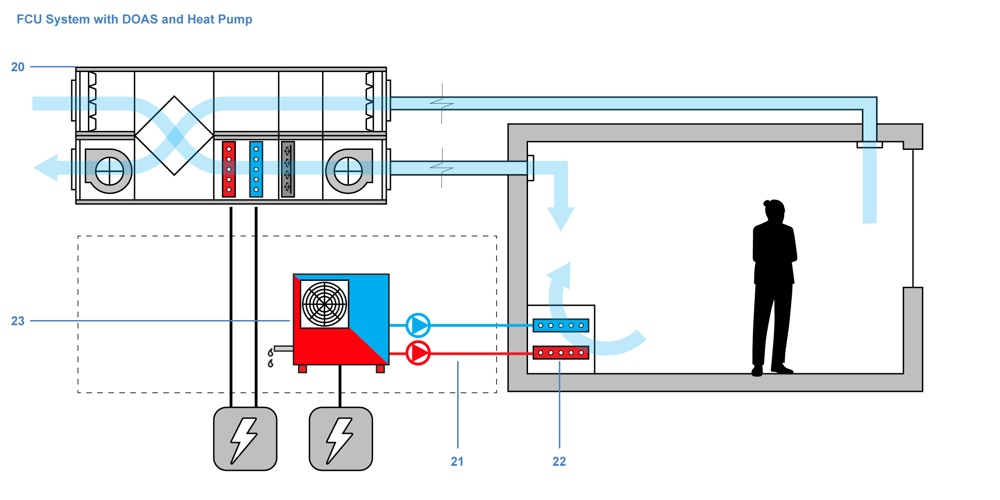
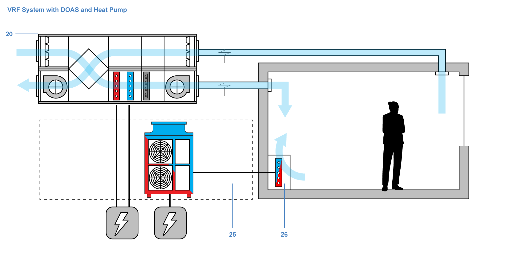
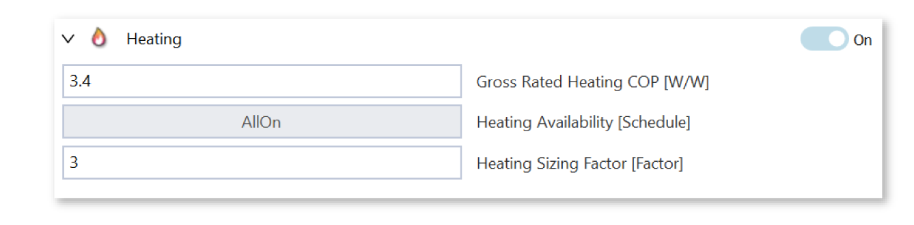

Fan Coil Units (FCUs) with Dedicated Outdoor Air System (DOAS) 
================

This `system`_  uses a **hot and cold-water loop** (**21**) to transport heating and cooling energy to the zones. 
**Fan Coil Units** (FCU) (**22**) then distribute the energy within the zone by blowing air over a zone-level cooling or heating coil. 
To provide fresh air and control humidity within the zone, a **dedicated outdoor air system** (**20**) is installed. 
The benefit of a DOAS is that the duct dimensions can be significantly smaller in comparison to a VAV system, 
where both energy load and outdoor air requirements are met with the supply air stream. 

The **plant options** (**23**) for the cold and hot water loops are identical to the ones offered in the VAV system archetype.

.. _system: thermal_system.html

Variable Refrigerant Flow (VRF) System with Dedicated Outdoor Air System (DOAS)
================

**VRF** (Variable Refrigerant Flow) air conditioning systems use **refrigerants** (**25**) to modulate the amount of cooling or heating delivered to various **indoor units** (**26**) within a building. 
VRF systems can adjust the refrigerant flow to each indoor unit based on demand and thus allows multiple zones to be individually controlled, 
offering varying degrees of cooling or heating in different areas. 
Additionally, VRF systems can recover and redistribute heat between zones, making them a highly efficient solution for large buildings that require simultaneous heating and cooling. Further, VRF systems are ductless, relying on smaller refrigerant pipes instead of extensive ductwork. 
Their key advantages include energy efficiency and dual operation for both cooling and heating in large spaces.

A **DOAS** (**20**) system provides fresh air and control humidity within the zone. The heating and cooling coils in the VRF system archetype are separate pieces of equipment that are not connected to the VRF system.

   .. figure:: images/system_VRF_Cooling.png
   :width: 900px
   :align: center

   .. figure:: images/system_VRF_humidity.png
   :width: 900px
   :align: center

   .. figure:: images/system_VRF_airloop.png
   :width: 900px
   :align: center

|

Back to `System`_. 

.. _System: thermal_system.html