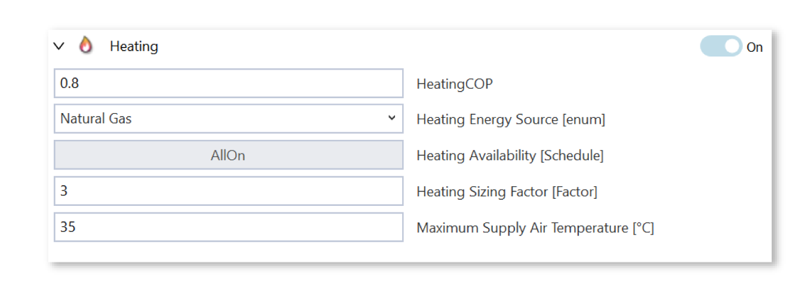
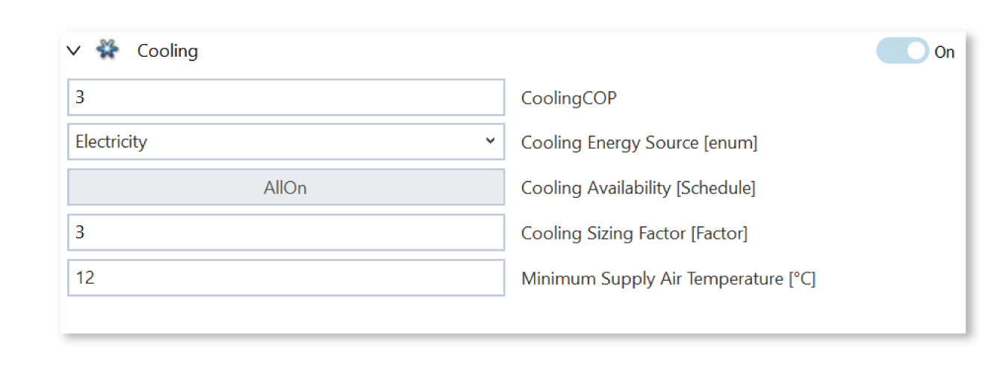
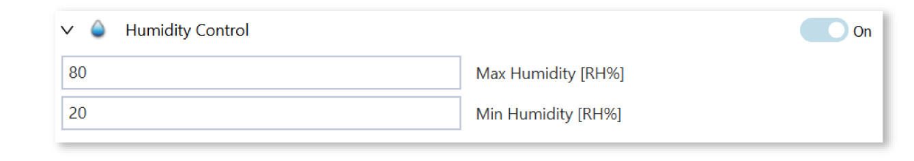
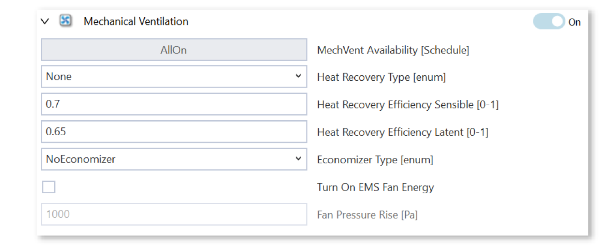
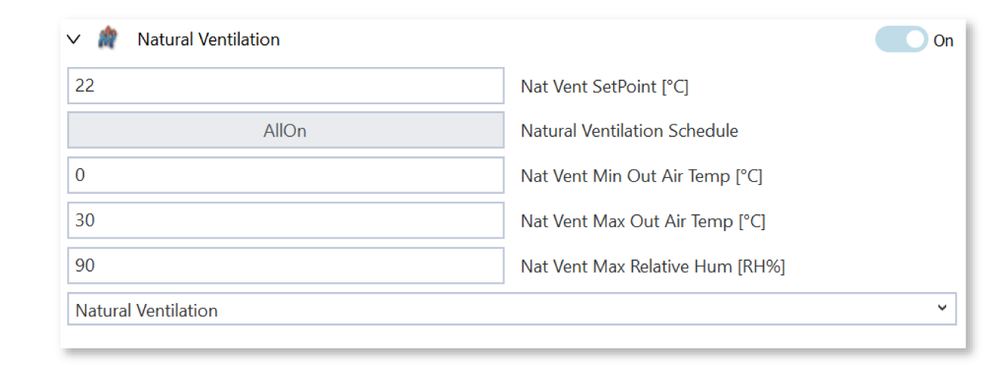

Simple HVAC with the Ideal Air Loads System
==============

The Ideal Air Loads `system`_ is a simplified model used primarily for **preliminary analysis and design optimization**. It provides perfect temperature and humidity control without simulating the actual mechanical equipment.

•	Perfectly meets the heating and cooling loads.

•	It is ideal for assessing thermal loads in early design.

•	It allows users to set the fuel sources and COPs for heating, cooling, and hot water equipment to approximate real system performance without modeling HVAC details.

•	Each zone is equipped with its own idealized system, and thus, this model configuration behaves like a decentralized HVAC system.

Despite being a simplified model, detailed input controls are provided in the heating, cooling, humidity control, mechanical and natural ventilation sections.

.. _system: thermal_system.html

IAL Settings
------------------

Heating / Cooling
~~~~~~~~~~~~~

The ideal **heating** system efficiency is controlled by a constant **COP** or efficiency. Together with the COP, modelers can specify a fuel source to approximate real systems. For example, setting the COP to 0.8 and the fuel source to Natural Gas is a decent approach to simulating a gas boiler. Setting the COP to 2.5 and the fuel source to electricity could be an approach to simulate an air source heat pump as the heating plant. 

The **fuel source** selection governs the CO2 emissions and cost calculation using the model-specific emission and cost factors.

The availability **schedule** controls system availability. Usually, this will be set to “AllOn”; however, in some cases, modelers may want to specify when the heating system should not turn on.

**Sizing factors** can be used to modify the auto-sized capacity and flow rates of the plant. Typically, modelers add a 10-20% safety margin and set a sizing factor of 1.1-1.2. 

The maximum **supply air temperature** controls the maximum temperature at which air can be introduced into the zone to provide heating. Typical settings range between 30-50 degrees. A higher number reduces the volumetric airflow to the zone. This, however, only matters if fan energy is estimated by checking “Turn On EMS Fan Energy”.

For the **cooling** plant equivalent settings are provided: 

Humidity
~~~~~~~~~~~~~

The **humidity** control section defines the upper and lower bound of relative humidity (RH) to which outdoor air is conditioned before it is introduced to the zone. 

Mechanical Ventilation
~~~~~~~~~~~~~

The **mechanical ventilation** section allows modelers to configure the system's air handling strategy. 
When turned on, mechanical ventilation will take the **minimum fresh air** requirements that are specified at the zone level and provide the necessary outdoor air stream through the Ideal Air Loads system. 

Modelers can configure a **heat recovery system** and can specify an **economizer** mode where outdoor air flow rates can be increased to cool the building without the cooling systems kicking in. 

To estimate the fan energy needed by the system configuration, modelers can turn on the **EMS Fan Energy** option and specify a **pressure rise**. 
In early design, the fan pressure rise can be approximated using typical Specific Fan Power (SFP) [W/l-s] data as provided in the table below: 

.. math::
    ΔP = 1000 * \mathit{SFP} * \mathit{Fan\ total\ efficiency}

.. list-table:: Table 1: Typical values for various system types are shown in the table below:  
    Reference: https://designbuilder.co.uk/helpv7.0/Content/CalculatingFanPressureRise.htm
   :widths: 300 50
   :header-rows: 1

   * - System Type
     - SFP
   * - Central mechanical ventilation including heating, cooling and heat recovery
     - 2.5
   * - Central mechanical ventilation including heating and cooling
     - 2.0
   * - All other central HVAC systems
     - 1.8
   * - Decentralized ventilation such as window/wall/roof units, serving one zone
     - 0.5
   * - Decentralized ventilation further away from the zone, such as ceiling void or roof mounted units, serving one zone
     - 1.2
   * - Fan coil units
     - 0.8

Natural Ventilation
~~~~~~~~~~~~~~~~~~~~

The **natural ventilation** section allows modelers to estimate the energy savings potential of natural ventilation. 
The settings allow modelers to orchestrate when the zones of the designated system will be cooled via natural ventilation and when the active cooling system will kick in to remove excess heat from the zones.

The **setpoint** specifies the desired zone temperature during natural ventilation; once the setpoint is met, the system closes windows and stops outdoor air entering the zone. 

The **minimum and maximum outdoor temperature** bounds and the upper threshold for RH control the ambient temperature range in which natural ventilation is available. 

In the example below where Min =0, Max=30 and max RH=90%, the natural ventilation system will only be able to open windows if the outdoor ambient air is below 30 degrees and below an RH of 90%. If the ambient conditions are above the defined thresholds, no natural ventilation will be performed, and the active cooling system will be turned on automatically if available. 

